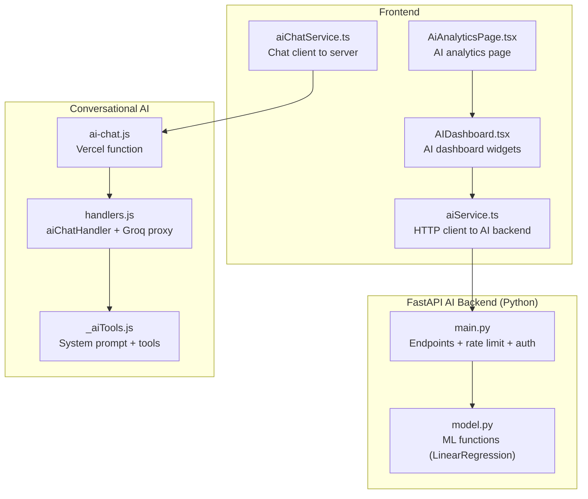
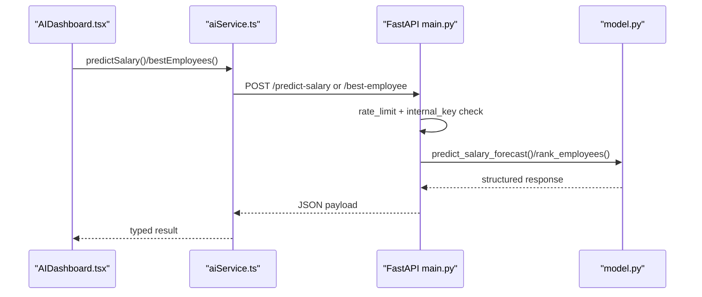
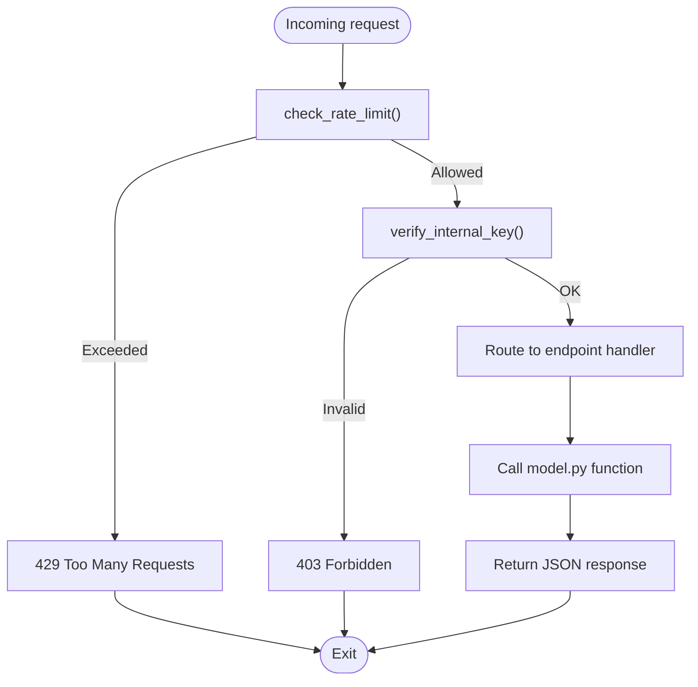
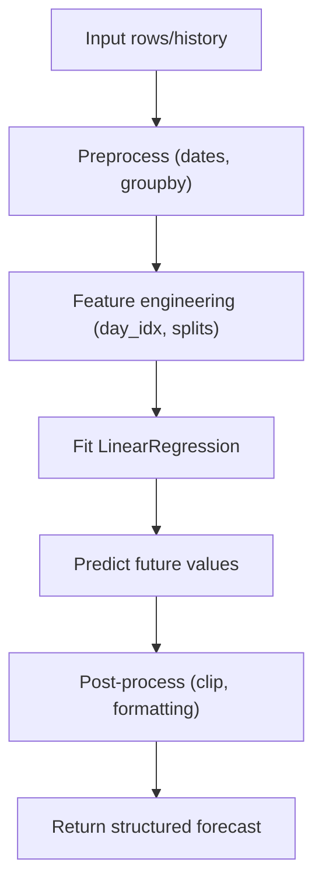
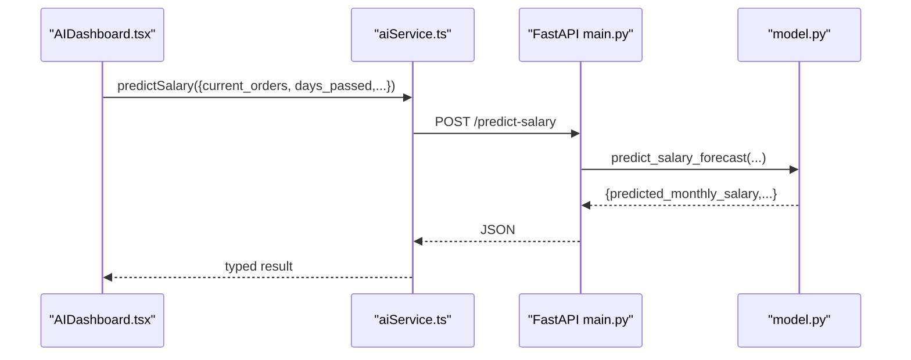
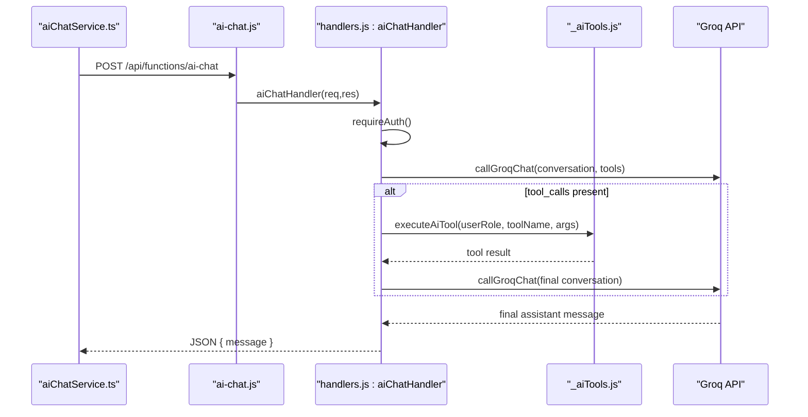
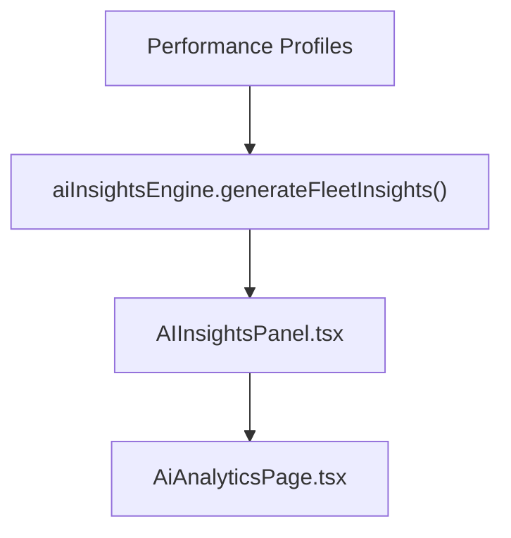
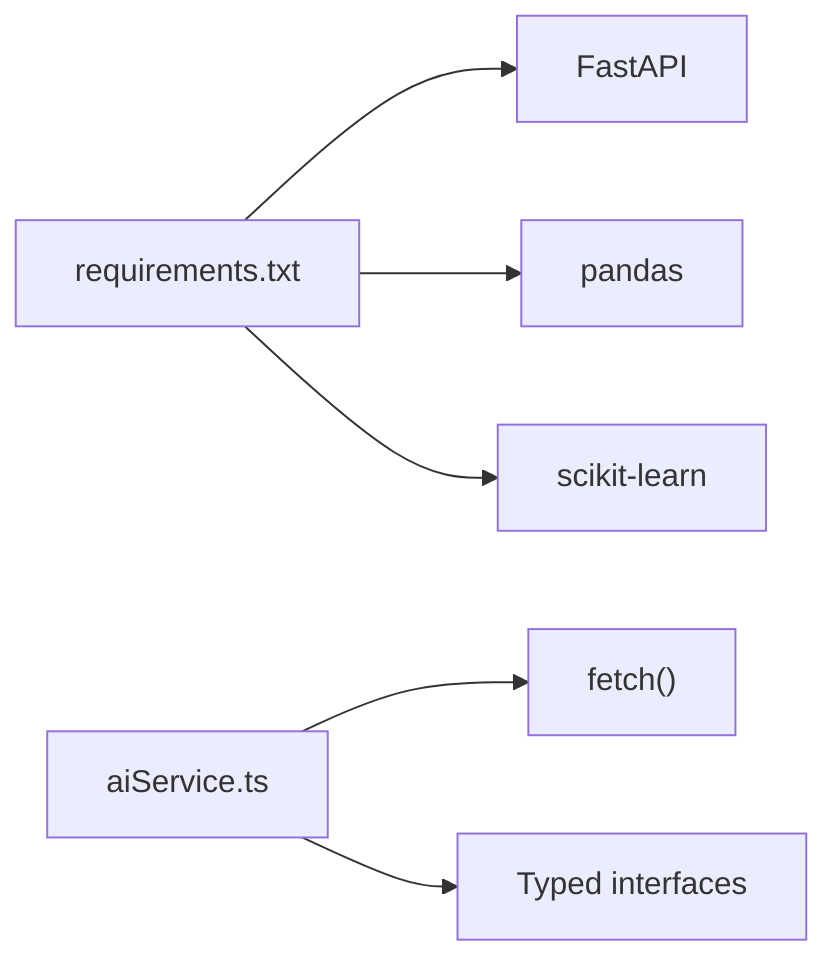

# AI & Machine Learning

<cite>
**Referenced Files in This Document**
- [README.md](file://README.md)
- [ARCHITECTURE.md](file://frontend/ARCHITECTURE.md)
- [requirements.txt](file://ai-backend/requirements.txt)
- [main.py](file://ai-backend/main.py)
- [model.py](file://ai-backend/model.py)
- [test_smoke.py](file://ai-backend/test_smoke.py)
- [aiService.ts](file://frontend/services/aiService.ts)
- [AIDashboard.tsx](file://frontend/modules/ai-dashboard/components/AIDashboard.tsx)
- [AiAnalyticsPage.tsx](file://frontend/modules/pages/AiAnalyticsPage.tsx)
- [aiChatService.ts](file://frontend/services/aiChatService.ts)
- [_aiTools.js](file://api/_aiTools.js)
- [handlers.js](file://server/lib/handlers.js)
- [ai-chat.js](file://api/functions/ai-chat.js)
- [aiInsightsEngine.ts](file://frontend/modules/dashboard/lib/aiInsightsEngine.ts)
- [AIInsightsPanel.tsx](file://frontend/modules/dashboard/components/AIInsightsPanel.tsx)
</cite>

## Table of Contents
1. [Introduction](#introduction)
2. [Project Structure](#project-structure)
3. [Core Components](#core-components)
4. [Architecture Overview](#architecture-overview)
5. [Detailed Component Analysis](#detailed-component-analysis)
6. [Dependency Analysis](#dependency-analysis)
7. [Performance Considerations](#performance-considerations)
8. [Troubleshooting Guide](#troubleshooting-guide)
9. [Conclusion](#conclusion)
10. [Appendices](#appendices)

## Introduction
This document explains the AI and machine learning capabilities of MuhimmatAltawseel, focusing on the FastAPI backend analytics server, Python dependencies, ML model implementations, rate limiting, authentication, and the AI dashboard and chat systems. It also covers AI-powered analytics, predictive modeling, anomaly detection, and automated insights generation, along with training/inference considerations and deployment guidance.

## Project Structure
The AI/ML stack spans three layers:
- FastAPI analytics server (Python) under ai-backend/
- Frontend React services and dashboards under frontend/
- Conversational AI and tool integration under server/ and api/

**Diagram sources**
- [main.py:149-170](file://ai-backend/main.py#L149-L170)
- [model.py:57-109](file://ai-backend/model.py#L57-L109)
- [aiService.ts:169-238](file://frontend/services/aiService.ts#L169-L238)
- [AIDashboard.tsx:164-247](file://frontend/modules/ai-dashboard/components/AIDashboard.tsx#L164-L247)
- [AiAnalyticsPage.tsx:65-220](file://frontend/modules/pages/AiAnalyticsPage.tsx#L65-L220)
- [ai-chat.js:1-9](file://api/functions/ai-chat.js#L1-L9)
- [handlers.js:273-329](file://server/lib/handlers.js#L273-L329)
- [_aiTools.js:3-26](file://api/_aiTools.js#L3-L26)

**Section sources**
- [README.md:77-101](file://README.md#L77-L101)

## Core Components
- FastAPI AI backend: exposes analytics endpoints, enforces rate limits and internal-key auth, and returns structured responses.
- ML model layer: implements LinearRegression-based forecasting, ranking, anomaly detection, and alert generation.
- Frontend AI service: typed client to FastAPI endpoints with timeouts and error handling.
- AI dashboard: renders salary forecasts, best employees, and data summaries.
- Conversational AI: integrates Groq LLM with system tools and Supabase data queries.

**Section sources**
- [main.py:346-403](file://ai-backend/main.py#L346-L403)
- [model.py:57-544](file://ai-backend/model.py#L57-L544)
- [aiService.ts:169-238](file://frontend/services/aiService.ts#L169-L238)
- [AIDashboard.tsx:164-247](file://frontend/modules/ai-dashboard/components/AIDashboard.tsx#L164-L247)
- [_aiTools.js:3-26](file://api/_aiTools.js#L3-L26)

## Architecture Overview
The system separates concerns across layers:
- Frontend React components call aiService.ts to request analytics from the FastAPI backend.
- The FastAPI app validates requests, applies rate limiting, and invokes model.py functions.
- The conversational AI pipeline authenticates via Supabase, builds a system prompt and tool list, calls Groq, and executes tools against Supabase Edge Functions.

**Diagram sources**
- [AIDashboard.tsx:180-234](file://frontend/modules/ai-dashboard/components/AIDashboard.tsx#L180-L234)
- [aiService.ts:208-221](file://frontend/services/aiService.ts#L208-L221)
- [main.py:381-396](file://ai-backend/main.py#L381-L396)
- [model.py:322-360](file://ai-backend/model.py#L322-L360)

## Detailed Component Analysis

### FastAPI AI Backend (main.py)
- Endpoints:
  - POST /predict-orders: time-series forecasting using LinearRegression on daily totals.
  - POST /best-driver: driver ranking by total orders, consistency, and trend.
  - POST /top-platform: platform ranking by volume, share, and growth.
  - POST /smart-alerts: operational alerts for demand/driver drops/spikes.
  - POST /analyze: salary benchmark analysis.
  - POST /predict-salary: monthly salary forecast with confidence and trend.
  - POST /best-employee: composite scoring and ranking.
  - POST /detect-anomalies: salary/order/deduction anomaly detection.
  - GET /health: liveness check.
- Security:
  - Internal API key via X-Internal-Key header (constant-time HMAC compare).
  - Production guard: requires AI_INTERNAL_KEY.
  - CORS restricted to configured origins.
- Rate limiting:
  - In-memory per-IP sliding window with periodic cleanup.
  - Configurable via environment variables.

**Diagram sources**
- [main.py:106-144](file://ai-backend/main.py#L106-L144)
- [main.py:130-139](file://ai-backend/main.py#L130-L139)
- [main.py:352-403](file://ai-backend/main.py#L352-L403)

**Section sources**
- [main.py:14-19](file://ai-backend/main.py#L14-L19)
- [main.py:44-70](file://ai-backend/main.py#L44-L70)
- [main.py:106-128](file://ai-backend/main.py#L106-L128)
- [main.py:346-403](file://ai-backend/main.py#L346-L403)

### ML Model Layer (model.py)
- LinearRegression-based forecasting:
  - predict_orders: fits a linear trend on daily aggregated orders; returns daily forecast, monthly total, trend, and confidence.
- Driver ranking:
  - find_best_driver: groups by employee, computes totals, daily averages, half-series trend, and consistency (CV).
- Platform ranking:
  - rank_platforms: aggregates by app, computes share, growth, and average daily volume.
- Smart alerts:
  - generate_smart_alerts: detects overall demand spikes/drops and per-driver anomalies using thresholds.
- Salary analysis:
  - analyze_salary: compares actual vs expected salary using enterprise benchmarks.
- Salary forecast:
  - predict_salary_forecast: projects monthly salary given current progress and base salary.
- Employee ranking:
  - rank_employees: composite score with weights for orders, attendance, error rate, and punctuality; tiers classification.
- Anomaly detection:
  - detect_anomalies: combines salary shortfall, order drop, and deduction thresholds into severity scores and risk level.

**Diagram sources**
- [model.py:57-109](file://ai-backend/model.py#L57-L109)

**Section sources**
- [model.py:57-110](file://ai-backend/model.py#L57-L110)
- [model.py:115-154](file://ai-backend/model.py#L115-L154)
- [model.py:160-190](file://ai-backend/model.py#L160-L190)
- [model.py:239-282](file://ai-backend/model.py#L239-L282)
- [model.py:288-316](file://ai-backend/model.py#L288-L316)
- [model.py:322-360](file://ai-backend/model.py#L322-L360)
- [model.py:366-434](file://ai-backend/model.py#L366-L434)
- [model.py:520-544](file://ai-backend/model.py#L520-L544)

### Frontend AI Service and Dashboard
- aiService.ts:
  - Typed request/response interfaces for all AI endpoints.
  - Centralized fetch with timeout and error normalization.
  - Exposes functions: predictOrders, bestDrivers, topPlatforms, smartAlerts, analyzeSalary, predictSalary, bestEmployees, detectAnomalies, health.
- AIDashboard.tsx:
  - Renders salary forecast card, current data summary, and best employees list.
  - Integrates aiService.predictSalary and aiService.bestEmployees.
  - Provides refresh button and loading states.
- AiAnalyticsPage.tsx:
  - Orchestrates AI analytics page, composes AIDashboard with performance data.

**Diagram sources**
- [AIDashboard.tsx:180-204](file://frontend/modules/ai-dashboard/components/AIDashboard.tsx#L180-L204)
- [aiService.ts:208-210](file://frontend/services/aiService.ts#L208-L210)
- [main.py:381-396](file://ai-backend/main.py#L381-L396)
- [model.py:322-360](file://ai-backend/model.py#L322-L360)

**Section sources**
- [aiService.ts:169-238](file://frontend/services/aiService.ts#L169-L238)
- [AIDashboard.tsx:164-247](file://frontend/modules/ai-dashboard/components/AIDashboard.tsx#L164-L247)
- [AiAnalyticsPage.tsx:214-219](file://frontend/modules/pages/AiAnalyticsPage.tsx#L214-L219)

### Conversational AI and Tool Integration
- ai-chat.js (Vercel function):
  - Bridges client requests to server-side handler.
- handlers.js aiChatHandler:
  - Validates auth, constructs system + user messages, calls Groq with tools.
  - Executes tools against Supabase Edge Functions and returns final assistant reply.
- _aiTools.js:
  - Defines system prompt, available tools, and permissions.
  - Implements tool handlers for riders, vehicles, orders, salary, advances, attendance, alerts, platform accounts, maintenance, and top/bottom riders.
  - Calls Groq chat completion with tool_choice and tool_calls resolution.
- aiChatService.ts:
  - Sends messages to /api/functions/ai-chat with Supabase auth header.

**Diagram sources**
- [ai-chat.js:1-9](file://api/functions/ai-chat.js#L1-L9)
- [handlers.js:273-329](file://server/lib/handlers.js#L273-L329)
- [_aiTools.js:65-78](file://api/_aiTools.js#L65-L78)
- [_aiTools.js:240-253](file://api/_aiTools.js#L240-L253)

**Section sources**
- [ai-chat.js:1-9](file://api/functions/ai-chat.js#L1-L9)
- [handlers.js:273-329](file://server/lib/handlers.js#L273-L329)
- [_aiTools.js:3-26](file://api/_aiTools.js#L3-L26)
- [aiChatService.ts:20-42](file://frontend/services/aiChatService.ts#L20-L42)

### AI-Powered Analytics and Automated Insights
- Frontend insights engine:
  - aiInsightsEngine.ts generates fleet-level insights, alerts, and recommendations from performance profiles.
  - AIInsightsPanel.tsx renders severity-tagged cards and expandable lists.
- Integration:
  - AiAnalyticsPage.tsx composes AI dashboard and charts with performance data.

**Diagram sources**
- [aiInsightsEngine.ts:74-84](file://frontend/modules/dashboard/lib/aiInsightsEngine.ts#L74-L84)
- [AIInsightsPanel.tsx:32-89](file://frontend/modules/dashboard/components/AIInsightsPanel.tsx#L32-L89)
- [AiAnalyticsPage.tsx:206-220](file://frontend/modules/pages/AiAnalyticsPage.tsx#L206-L220)

**Section sources**
- [aiInsightsEngine.ts:74-525](file://frontend/modules/dashboard/lib/aiInsightsEngine.ts#L74-L525)
- [AIInsightsPanel.tsx:1-92](file://frontend/modules/dashboard/components/AIInsightsPanel.tsx#L1-L92)
- [AiAnalyticsPage.tsx:206-220](file://frontend/modules/pages/AiAnalyticsPage.tsx#L206-L220)

## Dependency Analysis
- Python dependencies (ai-backend/requirements.txt):
  - fastapi, uvicorn, pandas, scikit-learn, pydantic.
- Frontend dependencies:
  - React Query for caching, Recharts for visualization, Tailwind/shadcn/ui for UI.

**Diagram sources**
- [requirements.txt:1-6](file://ai-backend/requirements.txt#L1-L6)
- [aiService.ts:139-165](file://frontend/services/aiService.ts#L139-L165)

**Section sources**
- [requirements.txt:1-6](file://ai-backend/requirements.txt#L1-L6)
- [ARCHITECTURE.md:7-28](file://frontend/ARCHITECTURE.md#L7-L28)

## Performance Considerations
- Inference characteristics:
  - LinearRegression is lightweight and deterministic; suitable for frequent requests.
  - Forecasts clip negative values and cap confidence by sample size.
- Rate limiting:
  - Sliding window per IP with periodic cleanup prevents memory growth.
- Frontend:
  - React Query caching reduces redundant network calls.
  - Timeouts protect against slow endpoints.
- Recommendations:
  - Scale horizontally behind a reverse proxy.
  - Consider model versioning and A/B testing for new algorithms.
  - Monitor latency and 429 rates; tune MAX_REQUESTS_PER_WINDOW accordingly.

[No sources needed since this section provides general guidance]

## Troubleshooting Guide
- Authentication failures:
  - Missing or invalid X-Internal-Key leads to 401/403.
  - Production requires AI_INTERNAL_KEY; otherwise startup fails.
- Rate limiting:
  - 429 responses indicate exceeding MAX_REQUESTS_PER_WINDOW per window; adjust environment variables.
- Network errors:
  - aiService.ts throws normalized errors for non-2xx responses and timeouts.
- Conversational AI:
  - Ensure GROQ_API_KEY and GROQ_BASE_URL are configured; aiChatHandler returns 500 if missing.
  - Tool permission checks restrict sensitive data access.

**Section sources**
- [main.py:54-70](file://ai-backend/main.py#L54-L70)
- [main.py:106-127](file://ai-backend/main.py#L106-L127)
- [aiService.ts:139-165](file://frontend/services/aiService.ts#L139-L165)
- [handlers.js:273-278](file://server/lib/handlers.js#L273-L278)

## Conclusion
MuhimmatAltawseel’s AI/ML stack combines a FastAPI analytics server with LinearRegression-based forecasting and ranking, a robust frontend service layer, and a conversational AI pipeline with tool integration. The system emphasizes security (internal API key, rate limiting), maintainability (typed interfaces, tests), and user-facing insights (dashboards, alerts, recommendations).

[No sources needed since this section summarizes without analyzing specific files]

## Appendices

### Endpoint Reference (FastAPI)
- POST /predict-orders: request includes history (list of day records) and forecast_days; response includes daily_forecast, monthly_total_predicted, trend, trend_percent, confidence.
- POST /best-driver: request includes history and top_n; response includes drivers list.
- POST /top-platform: request includes history; response includes platforms list.
- POST /smart-alerts: request includes history and thresholds; response includes alerts list.
- POST /analyze: request includes base_salary, orders, bonus; response includes expected_salary, risk, diff_percent.
- POST /predict-salary: request includes current_orders, days_passed, avg_order_value, base_salary, working_days_per_month; response includes predicted_monthly_salary, current_daily_avg, projected_monthly_orders, confidence, trend, days_remaining.
- POST /best-employee: request includes employees list and top_n; response includes employees list and best_employee.
- POST /detect-anomalies: request includes employee metrics and thresholds; response includes anomalies list, overall_risk_score, risk_level.
- GET /health: returns status and version.

**Section sources**
- [main.py:176-341](file://ai-backend/main.py#L176-L341)
- [main.py:352-403](file://ai-backend/main.py#L352-L403)

### Testing Coverage (Python)
- Smoke tests validate endpoint shapes, request validation, and handler acceptance of Pydantic models.

**Section sources**
- [test_smoke.py:41-201](file://ai-backend/test_smoke.py#L41-L201)