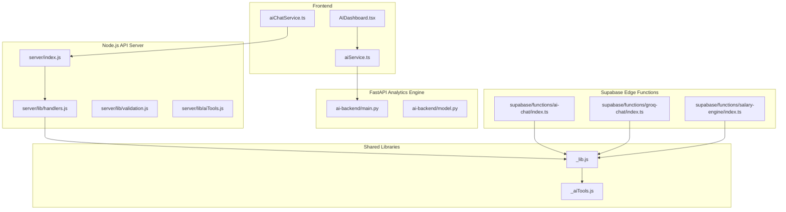
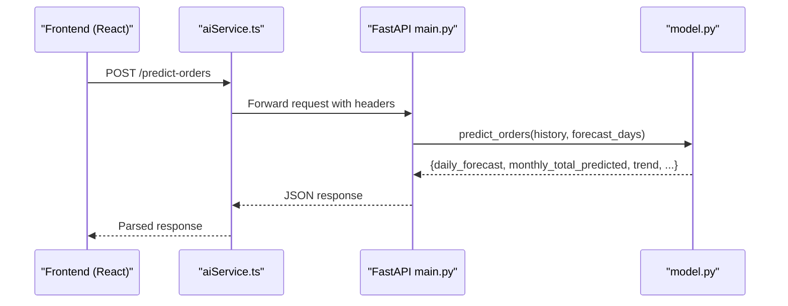
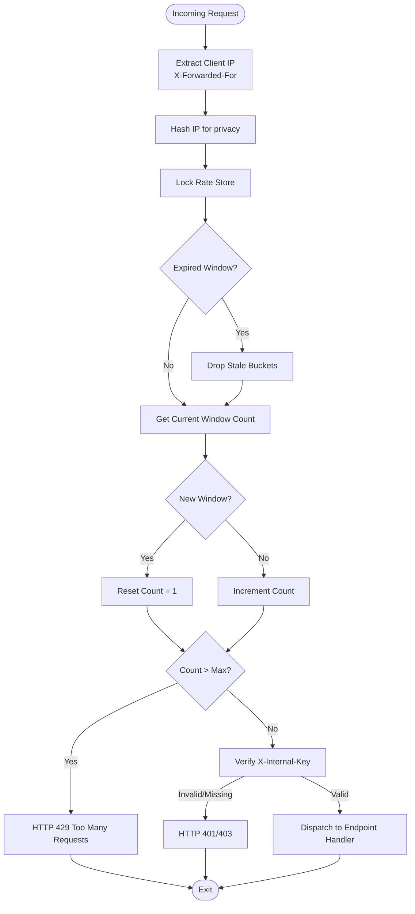
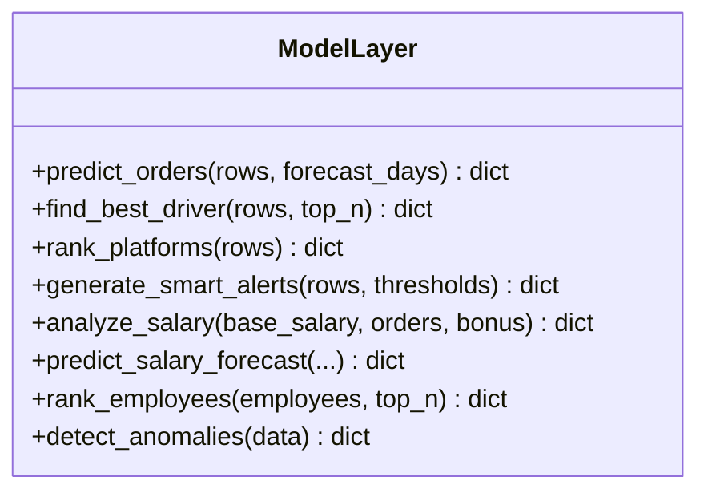
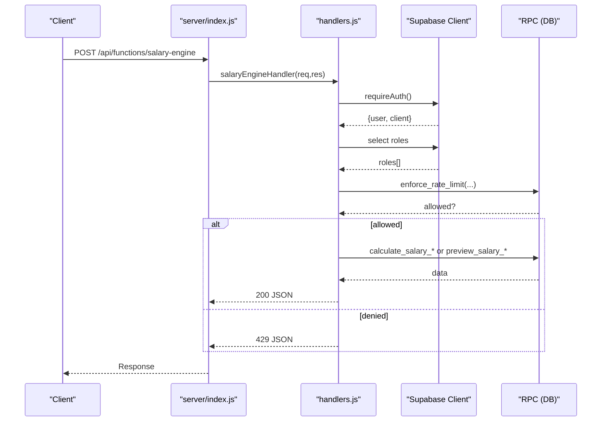
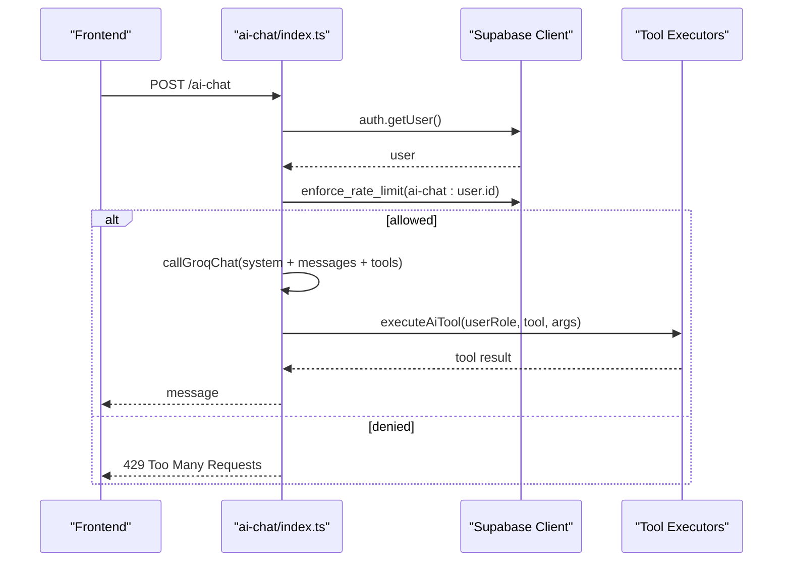
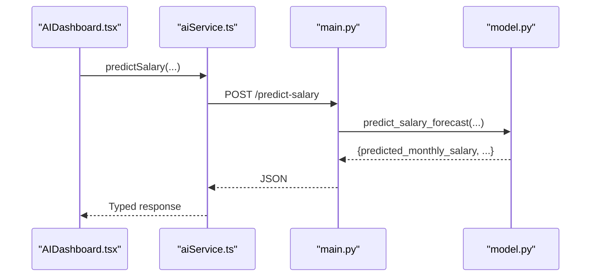
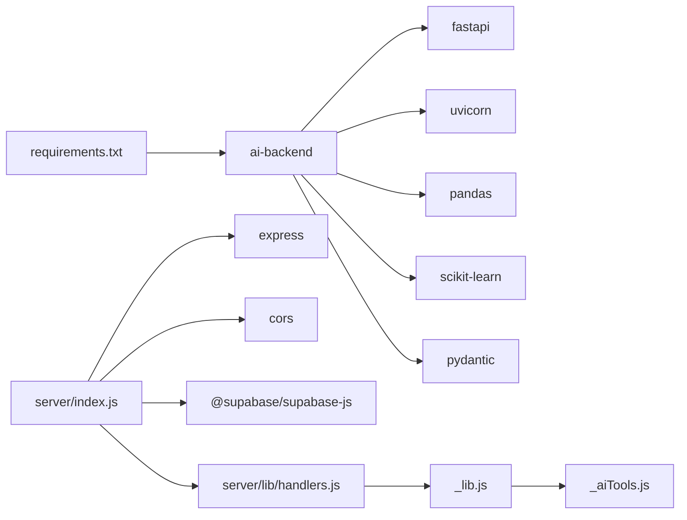

# AI Backend Server

<cite>
**Referenced Files in This Document**
- [main.py](file://ai-backend/main.py)
- [model.py](file://ai-backend/model.py)
- [requirements.txt](file://ai-backend/requirements.txt)
- [test_smoke.py](file://ai-backend/test_smoke.py)
- [index.js](file://server/index.js)
- [handlers.js](file://server/lib/handlers.js)
- [validation.js](file://server/lib/validation.js)
- [aiTools.js](file://server/lib/aiTools.js)
- [aiService.ts](file://frontend/services/aiService.ts)
- [AIDashboard.tsx](file://frontend/modules/ai-dashboard/components/AIDashboard.tsx)
- [aiChatService.ts](file://frontend/services/aiChatService.ts)
- [_lib.js](file://api/_lib.js)
- [_aiTools.js](file://api/_aiTools.js)
- [ai-chat/index.ts](file://supabase/functions/ai-chat/index.ts)
- [groq-chat/index.ts](file://supabase/functions/groq-chat/index.ts)
- [salary-engine/index.ts](file://supabase/functions/salary-engine/index.ts)
</cite>

## Table of Contents
1. [Introduction](#introduction)
2. [Project Structure](#project-structure)
3. [Core Components](#core-components)
4. [Architecture Overview](#architecture-overview)
5. [Detailed Component Analysis](#detailed-component-analysis)
6. [Dependency Analysis](#dependency-analysis)
7. [Performance Considerations](#performance-considerations)
8. [Troubleshooting Guide](#troubleshooting-guide)
9. [Conclusion](#conclusion)
10. [Appendices](#appendices)

## Introduction
This document describes the AI backend server architecture and implementation for the Muhimmat logistics platform. It covers the FastAPI application structure, route definitions, middleware, authentication, rate limiting, and security measures. It also explains the server startup process, dependency management, environment configuration, API endpoint examples, request/response handling, error management, deployment considerations, scaling strategies, performance optimization, and the testing framework with smoke tests.

## Project Structure
The system comprises:
- A FastAPI analytics engine under ai-backend that exposes AI-powered endpoints for forecasting, ranking, alerts, and anomaly detection.
- A Node.js Express server under server that hosts additional API functions (salary engine, admin updates, Groq chat, AI chat) with Supabase integration.
- Frontend services under frontend that consume the AI backend and other APIs.
- Supabase Edge Functions under supabase/functions that provide serverless capabilities for AI chat, Groq chat, and salary engine with robust authentication and rate limiting.

**Diagram sources**
- [main.py:149-170](file://ai-backend/main.py#L149-L170)
- [model.py:1-544](file://ai-backend/model.py#L1-L544)
- [index.js:1-69](file://server/index.js#L1-L69)
- [handlers.js:1-330](file://server/lib/handlers.js#L1-L330)
- [ai-chat/index.ts:1-890](file://supabase/functions/ai-chat/index.ts#L1-L890)
- [groq-chat/index.ts:1-159](file://supabase/functions/groq-chat/index.ts#L1-L159)
- [salary-engine/index.ts:1-218](file://supabase/functions/salary-engine/index.ts#L1-L218)
- [_lib.js:1-79](file://api/_lib.js#L1-L79)
- [_aiTools.js:1-265](file://api/_aiTools.js#L1-L265)

**Section sources**
- [main.py:1-170](file://ai-backend/main.py#L1-L170)
- [index.js:1-69](file://server/index.js#L1-L69)

## Core Components
- FastAPI application with:
  - Health endpoint and nine analytics endpoints.
  - Pydantic request/response models.
  - In-memory per-IP rate limiting and HMAC-based API key verification.
  - CORS middleware with configurable allowed origins.
- Machine learning model layer using pandas and scikit-learn for forecasting, ranking, alerts, and anomaly detection.
- Node.js Express server hosting salary engine, admin user updates, Groq chat, and AI chat functions with Supabase authentication and rate limiting.
- Supabase Edge Functions implementing serverless logic for AI chat, Groq chat, and salary engine with enforced rate limits and role-based access control.

**Section sources**
- [main.py:346-403](file://ai-backend/main.py#L346-L403)
- [model.py:57-544](file://ai-backend/model.py#L57-L544)
- [index.js:34-68](file://server/index.js#L34-L68)
- [handlers.js:36-329](file://server/lib/handlers.js#L36-L329)
- [ai-chat/index.ts:734-890](file://supabase/functions/ai-chat/index.ts#L734-L890)
- [groq-chat/index.ts:31-159](file://supabase/functions/groq-chat/index.ts#L31-L159)
- [salary-engine/index.ts:43-218](file://supabase/functions/salary-engine/index.ts#L43-L218)

## Architecture Overview
The AI backend server integrates three primary layers:
- Frontend services communicate with the FastAPI analytics engine via aiService.ts.
- The Node.js server provides additional business functions and proxies to Supabase Edge Functions.
- Supabase Edge Functions encapsulate AI chat, Groq chat, and salary engine logic with Supabase authentication and rate limiting.

**Diagram sources**
- [aiService.ts:171-175](file://frontend/services/aiService.ts#L171-L175)
- [main.py:352-355](file://ai-backend/main.py#L352-L355)
- [model.py:57-109](file://ai-backend/model.py#L57-L109)

**Section sources**
- [aiService.ts:1-239](file://frontend/services/aiService.ts#L1-L239)
- [main.py:346-403](file://ai-backend/main.py#L346-L403)
- [model.py:57-544](file://ai-backend/model.py#L57-L544)

## Detailed Component Analysis

### FastAPI Application (ai-backend/main.py)
- Application initialization:
  - Title and version set; docs/redoc hidden in production when internal key is enabled.
  - CORS configured from environment with allowed methods and headers.
- Authentication and rate limiting:
  - Internal API key verification via HMAC comparison to prevent timing attacks.
  - Per-IP in-memory rate limiter with configurable window and max requests; periodic cleanup.
- Endpoint definitions:
  - /health: liveness check.
  - /predict-orders, /best-driver, /top-platform, /smart-alerts, /analyze, /predict-salary, /best-employee, /detect-anomalies: analytics endpoints with shared security dependency.
- Request/response models:
  - Pydantic models define input/output schemas with field constraints and descriptions.

**Diagram sources**
- [main.py:80-128](file://ai-backend/main.py#L80-L128)
- [main.py:130-144](file://ai-backend/main.py#L130-L144)

**Section sources**
- [main.py:149-170](file://ai-backend/main.py#L149-L170)
- [main.py:346-403](file://ai-backend/main.py#L346-L403)

### Machine Learning Model Layer (ai-backend/model.py)
- Core algorithms:
  - predict_orders: linear regression on daily time-index for forecasting.
  - find_best_driver: driver ranking by total orders, daily average, trend, and consistency.
  - rank_platforms: platform ranking by total orders, share, growth, and average daily volume.
  - generate_smart_alerts: demand and driver-level alerts with configurable thresholds.
  - analyze_salary: enterprise benchmark comparison with risk classification.
  - predict_salary_forecast: monthly salary projection with confidence and trend.
  - rank_employees: composite scoring with weights for orders, attendance, error rate, punctuality.
  - detect_anomalies: salary, order drop, and deduction anomaly detection with risk scoring.
- Data handling:
  - Pandas DataFrame processing, time-series grouping, and trend analysis.
  - Confidence tiers based on sample sizes; trend classification thresholds.

**Diagram sources**
- [model.py:57-544](file://ai-backend/model.py#L57-L544)

**Section sources**
- [model.py:57-544](file://ai-backend/model.py#L57-L544)

### Node.js API Server (server/index.js and server/lib/handlers.js)
- Server bootstrap:
  - Environment validation for Supabase keys, AI internal key, and GROQ API key.
  - CORS enforcement with allowed origins list and credentials support.
  - JSON body parsing with 2MB limit.
- Handlers:
  - salaryEngineHandler: role-based access (admin/finance), mode validation, RPC calls to calculate or preview salary.
  - adminUpdateUserHandler: user lifecycle actions with role checks and validation.
  - groqChatHandler: forwards chat completions to Groq with rate limiting and error handling.
  - aiChatHandler: orchestrates Groq chat with tool execution and role-based permissions.

**Diagram sources**
- [index.js:34-48](file://server/index.js#L34-L48)
- [handlers.js:36-99](file://server/lib/handlers.js#L36-L99)
- [salary-engine/index.ts:94-118](file://supabase/functions/salary-engine/index.ts#L94-L118)

**Section sources**
- [index.js:1-69](file://server/index.js#L1-L69)
- [handlers.js:36-329](file://server/lib/handlers.js#L36-L329)

### Supabase Edge Functions
- ai-chat/index.ts:
  - Validates Authorization header and authenticates via Supabase.
  - Enforces rate limit per user via RPC.
  - Executes tools with role-based permissions and returns structured results.
- groq-chat/index.ts:
  - Validates Authorization header and authenticates via Supabase.
  - Enforces rate limit per user via RPC.
  - Calls Groq API and returns assistant message.
- salary-engine/index.ts:
  - Validates Authorization header and checks roles (admin/finance).
  - Enforces rate limit per user and mode.
  - Invokes stored procedures for salary calculations and previews.

**Diagram sources**
- [ai-chat/index.ts:734-890](file://supabase/functions/ai-chat/index.ts#L734-L890)
- [_lib.js:25-38](file://api/_lib.js#L25-L38)
- [_aiTools.js:240-253](file://api/_aiTools.js#L240-L253)

**Section sources**
- [ai-chat/index.ts:1-890](file://supabase/functions/ai-chat/index.ts#L1-L890)
- [groq-chat/index.ts:1-159](file://supabase/functions/groq-chat/index.ts#L1-L159)
- [salary-engine/index.ts:1-218](file://supabase/functions/salary-engine/index.ts#L1-L218)

### Frontend Integration
- aiService.ts:
  - Defines request/response types and posts to FastAPI endpoints.
  - Implements timeouts and error handling.
- AIDashboard.tsx:
  - Renders AI insights and triggers analytics calls.
- aiChatService.ts:
  - Sends messages to server-side AI chat function with Bearer token.

**Diagram sources**
- [AIDashboard.tsx:180-204](file://frontend/modules/ai-dashboard/components/AIDashboard.tsx#L180-L204)
- [aiService.ts:208-210](file://frontend/services/aiService.ts#L208-L210)
- [main.py:381-390](file://ai-backend/main.py#L381-L390)
- [model.py:322-360](file://ai-backend/model.py#L322-L360)

**Section sources**
- [aiService.ts:1-239](file://frontend/services/aiService.ts#L1-L239)
- [AIDashboard.tsx:164-248](file://frontend/modules/ai-dashboard/components/AIDashboard.tsx#L164-L248)
- [aiChatService.ts:1-43](file://frontend/services/aiChatService.ts#L1-L43)

## Dependency Analysis
- Python dependencies (ai-backend):
  - FastAPI, Uvicorn, pandas, scikit-learn, pydantic.
- Node.js dependencies (server):
  - Express, cors, @supabase/supabase-js, shared validation and AI tools.
- Frontend dependencies:
  - React, TypeScript, service abstractions for AI and chat.

**Diagram sources**
- [requirements.txt:1-6](file://ai-backend/requirements.txt#L1-L6)
- [index.js:1-6](file://server/index.js#L1-L6)
- [handlers.js:12-21](file://server/lib/handlers.js#L12-L21)
- [_lib.js:1-7](file://api/_lib.js#L1-L7)
- [_aiTools.js:1-10](file://api/_aiTools.js#L1-L10)

**Section sources**
- [requirements.txt:1-6](file://ai-backend/requirements.txt#L1-L6)
- [index.js:1-6](file://server/index.js#L1-L6)
- [_lib.js:1-79](file://api/_lib.js#L1-L79)

## Performance Considerations
- In-memory rate limiting:
  - Thread-safe dictionary with periodic cleanup to prevent unbounded growth.
  - SHA-256 hashing of IPs avoids storing raw identifiers.
- Model inference:
  - Linear regression for forecasting reduces computational overhead compared to ensemble methods.
  - Confidence scoring based on sample size to inform reliability.
- Network and timeouts:
  - Frontend service enforces 20-second timeout for AI requests.
  - Supabase Edge Functions enforce rate limits per user and mode.
- Recommendations:
  - Scale horizontally behind a reverse proxy with sticky sessions if persistence is needed.
  - Consider Redis-backed rate limiting for distributed deployments.
  - Cache frequent queries at the edge where appropriate.

[No sources needed since this section provides general guidance]

## Troubleshooting Guide
- Authentication failures:
  - Missing or invalid Authorization header leads to 401.
  - Role checks (admin/finance) for salary engine return 403.
- Rate limiting:
  - Exceeding configured limits returns 429 with Retry-After header.
- Validation errors:
  - Invalid payloads or missing fields cause 400 responses.
- Environment configuration:
  - Missing Supabase keys or GROQ API key results in server startup warnings or runtime errors.
- Testing:
  - Smoke tests validate endpoint shapes, request validation, and basic model outputs.

**Section sources**
- [main.py:122-127](file://ai-backend/main.py#L122-L127)
- [handlers.js:25-32](file://server/lib/handlers.js#L25-L32)
- [salary-engine/index.ts:193-215](file://supabase/functions/salary-engine/index.ts#L193-L215)
- [test_smoke.py:94-201](file://ai-backend/test_smoke.py#L94-L201)

## Conclusion
The AI backend server combines a FastAPI analytics engine with a Node.js API server and Supabase Edge Functions to deliver secure, scalable AI-powered insights. Robust authentication, rate limiting, and CORS configuration protect endpoints, while Pydantic models and unit tests ensure correctness. The architecture supports horizontal scaling and can be extended with additional analytics and tool integrations.

[No sources needed since this section summarizes without analyzing specific files]

## Appendices

### API Endpoints Overview
- GET /health: Liveness check.
- POST /predict-orders: Forecast orders with trend and confidence.
- POST /best-driver: Rank drivers by performance metrics.
- POST /top-platform: Rank platforms by volume and growth.
- POST /smart-alerts: Generate operational alerts.
- POST /analyze: Analyze salary against benchmarks.
- POST /predict-salary: Predict monthly salary based on current performance.
- POST /best-employee: Rank employees by composite score.
- POST /detect-anomalies: Detect anomalies in salary, orders, and deductions.

**Section sources**
- [main.py:346-403](file://ai-backend/main.py#L346-L403)

### Environment Variables
- FastAPI server:
  - AI_INTERNAL_KEY: Internal API key for endpoint protection.
  - RATE_LIMIT_MAX, RATE_LIMIT_WINDOW, RATE_LIMIT_CLEANUP_EVERY: Rate limiting configuration.
  - CORS_ALLOWED_ORIGINS: Comma-separated allowed origins.
  - ENV: Environment mode (production requires AI_INTERNAL_KEY).
- Node.js server:
  - SUPABASE_URL, SUPABASE_ANON_KEY, SUPABASE_SERVICE_ROLE_KEY: Supabase credentials.
  - GROQ_API_KEY: OpenAI-compatible API key for Groq.
  - ALLOWED_ORIGINS: CORS origins list.
- Supabase Edge Functions:
  - SUPABASE_URL, SUPABASE_ANON_KEY, SUPABASE_SERVICE_ROLE_KEY: Supabase credentials.
  - GROQ_API_KEY: OpenAI-compatible API key for Groq.

**Section sources**
- [main.py:44-70](file://ai-backend/main.py#L44-L70)
- [index.js:10-13](file://server/index.js#L10-L13)
- [ai-chat/index.ts:741-761](file://supabase/functions/ai-chat/index.ts#L741-L761)
- [groq-chat/index.ts:58-63](file://supabase/functions/groq-chat/index.ts#L58-L63)
- [salary-engine/index.ts:35-41](file://supabase/functions/salary-engine/index.ts#L35-L41)

### Testing Framework
- Unit tests validate:
  - Health endpoint shape.
  - OpenAPI schema exposure of expected paths.
  - Model outputs for forecasting, ranking, alerts, and anomaly detection.
  - Pydantic validation constraints on request models.
  - Handler acceptance of validated Pydantic inputs.

**Section sources**
- [test_smoke.py:41-201](file://ai-backend/test_smoke.py#L41-L201)