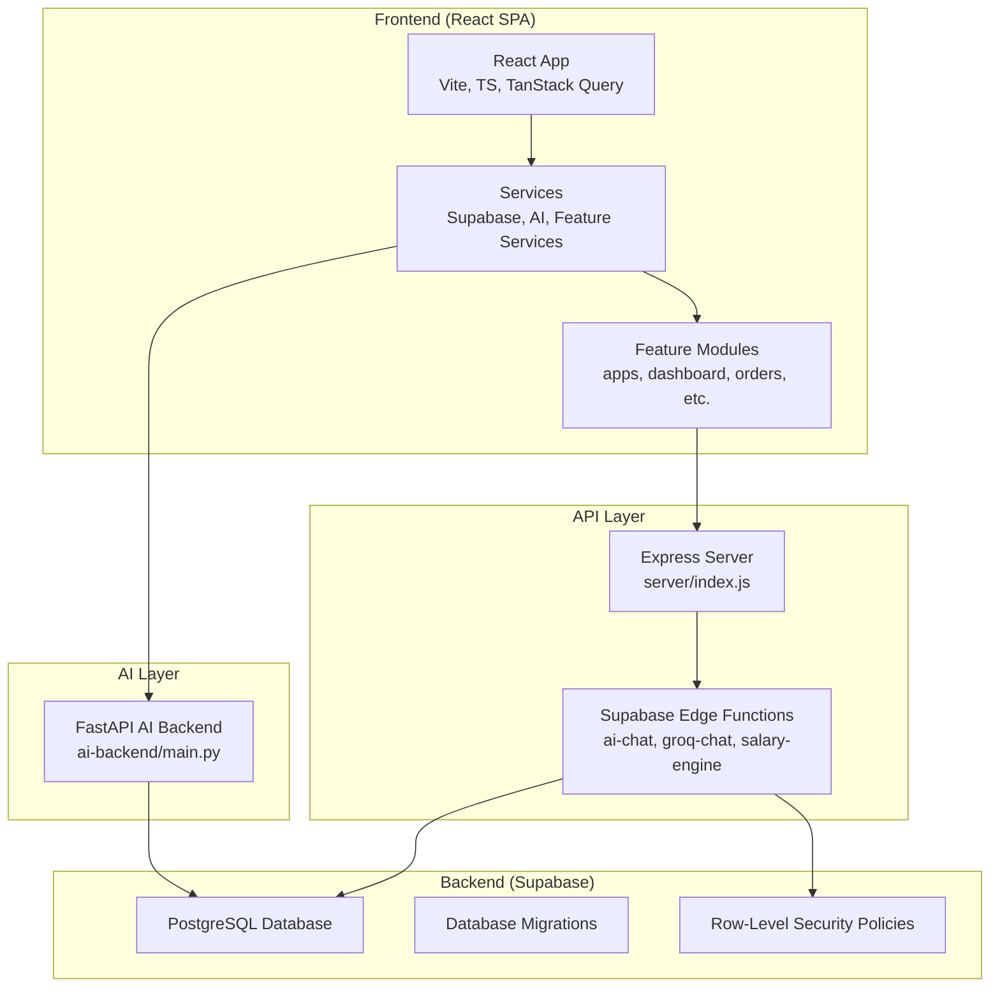
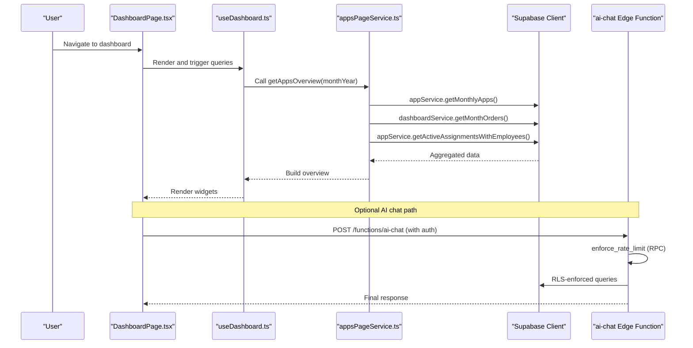
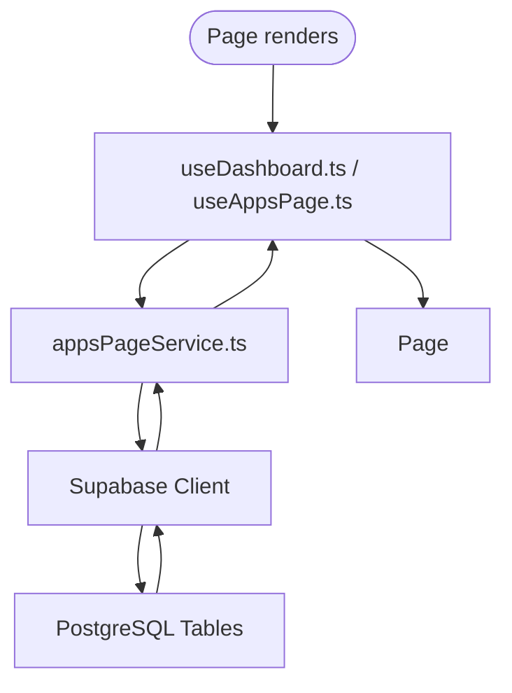
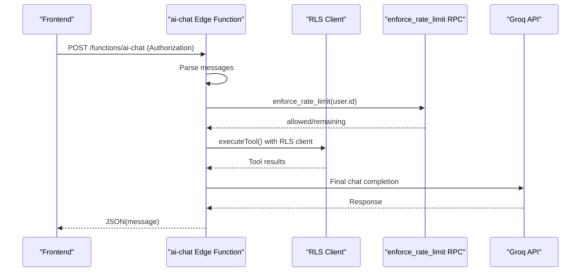
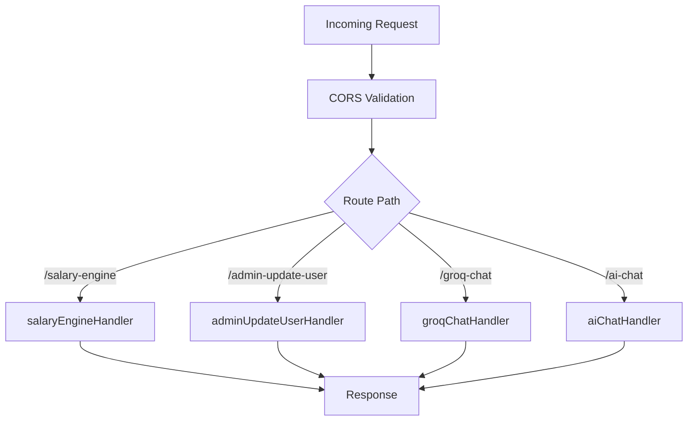
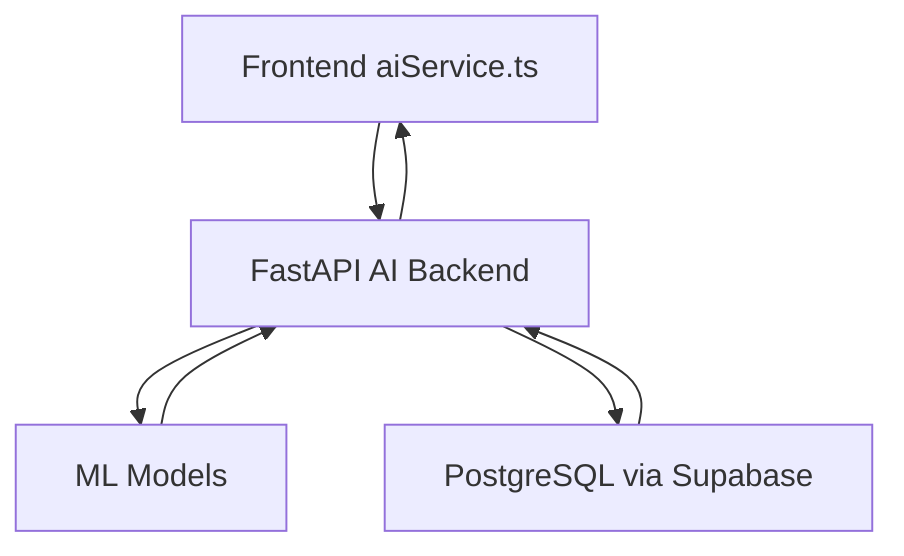
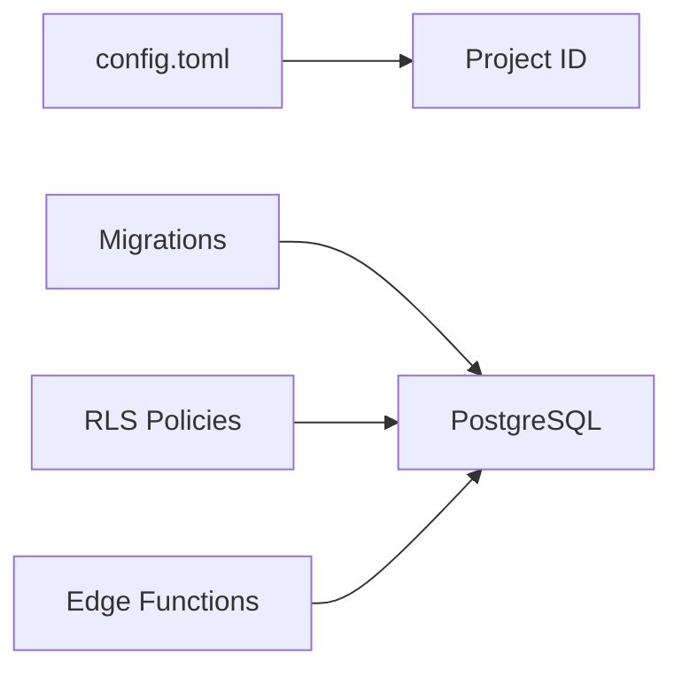
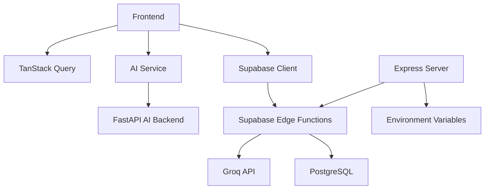

# Architecture Overview

<cite>
**Referenced Files in This Document**
- [frontend/package.json](file://frontend/package.json)
- [frontend/ARCHITECTURE.md](file://frontend/ARCHITECTURE.md)
- [frontend/services/supabase/client.ts](file://frontend/services/supabase/client.ts)
- [frontend/services/aiService.ts](file://frontend/services/aiService.ts)
- [frontend/modules/apps/services/appsPageService.ts](file://frontend/modules/apps/services/appsPageService.ts)
- [frontend/modules/dashboard/lib/aiInsightsEngine.ts](file://frontend/modules/dashboard/lib/aiInsightsEngine.ts)
- [frontend/modules/dashboard/pages/DashboardPage.tsx](file://frontend/modules/dashboard/pages/DashboardPage.tsx)
- [server/index.js](file://server/index.js)
- [api/_lib.js](file://api/_lib.js)
- [api/_aiTools.js](file://api/_aiTools.js)
- [supabase/functions/ai-chat/index.ts](file://supabase/functions/ai-chat/index.ts)
- [supabase/config.toml](file://supabase/config.toml)
- [supabase/TENANT_RLS_ROLLOUT_CHECKLIST.md](file://supabase/TENANT_RLS_ROLLOUT_CHECKLIST.md)
- [ai-backend/main.py](file://ai-backend/main.py)
- [vercel.json](file://vercel.json)
</cite>

## Table of Contents
1. [Introduction](#introduction)
2. [Project Structure](#project-structure)
3. [Core Components](#core-components)
4. [Architecture Overview](#architecture-overview)
5. [Detailed Component Analysis](#detailed-component-analysis)
6. [Dependency Analysis](#dependency-analysis)
7. [Performance Considerations](#performance-considerations)
8. [Troubleshooting Guide](#troubleshooting-guide)
9. [Conclusion](#conclusion)

## Introduction
This document describes the system architecture of MuhimmatAltawseel, a logistics and workforce management platform. The system comprises:
- React SPA frontend (TypeScript, Vite, TanStack Query, Tailwind CSS, shadcn/ui)
- Express API server proxying to Supabase Edge Functions and local serverless handlers
- FastAPI AI backend for analytics and forecasting
- Supabase backend (PostgreSQL, Row-Level Security, Edge Functions, migrations)

It emphasizes a modular frontend architecture, a three-tier backend (Edge Functions, database, serverless), and clear data flow from Page → Hook → Service → Supabase.

## Project Structure
The repository is organized into four primary areas:
- frontend: React SPA with modular feature modules, services, and shared utilities
- server: Express server that proxies to Supabase Edge Functions and local handlers
- api: Legacy Edge Function helpers and tooling (Node runtime)
- supabase: Edge Functions (Deno runtime), migrations, and configuration
- ai-backend: FastAPI analytics engine
- Root configs: Vercel deployment, Supabase project config, and RLS rollout checklist

**Diagram sources**
- [frontend/package.json:1-103](file://frontend/package.json#L1-L103)
- [server/index.js:1-69](file://server/index.js#L1-L69)
- [supabase/functions/ai-chat/index.ts:1-890](file://supabase/functions/ai-chat/index.ts#L1-L890)
- [ai-backend/main.py:1-403](file://ai-backend/main.py#L1-L403)
- [supabase/config.toml:1-2](file://supabase/config.toml#L1-L2)

**Section sources**
- [frontend/package.json:1-103](file://frontend/package.json#L1-L103)
- [vercel.json:1-68](file://vercel.json#L1-L68)

## Core Components
- Frontend (React SPA)
  - Technology stack: React 18, TypeScript, Vite, TanStack Query, Tailwind CSS, shadcn/ui
  - Modular feature modules with services and hooks
  - Single source of truth for architectural rules (data fetching, UI, forms, Supabase logic)
- Express API server
  - Proxies to Supabase Edge Functions and local handlers
  - CORS, JSON limits, and environment-driven configuration
- Supabase backend
  - Edge Functions (Deno) for AI chat, Groq integration, and salary engine
  - PostgreSQL with RLS policies and extensive migrations
- FastAPI AI backend
  - Analytics endpoints for forecasting, ranking, anomaly detection, and salary analysis
  - Internal API key auth, rate limiting, and CORS configuration

**Section sources**
- [frontend/ARCHITECTURE.md:1-35](file://frontend/ARCHITECTURE.md#L1-L35)
- [frontend/package.json:25-68](file://frontend/package.json#L25-L68)
- [server/index.js:1-69](file://server/index.js#L1-L69)
- [supabase/functions/ai-chat/index.ts:1-890](file://supabase/functions/ai-chat/index.ts#L1-L890)
- [ai-backend/main.py:1-403](file://ai-backend/main.py#L1-L403)

## Architecture Overview
The system follows a three-tier backend design:
- Edge Functions (Supabase): AI chat, Groq integration, and salary engine
- Database: PostgreSQL with RLS, stored procedures, and migrations
- Serverless Handlers (Express): Local handlers for salary engine, admin updates, and chat

Data flow pattern:
- Page → Hook → Service → Supabase (direct client or Edge Function)
- AI features: Page/Hook → Service → FastAPI AI backend

**Diagram sources**
- [frontend/modules/dashboard/pages/DashboardPage.tsx:1-4](file://frontend/modules/dashboard/pages/DashboardPage.tsx#L1-L4)
- [frontend/modules/apps/services/appsPageService.ts:13-59](file://frontend/modules/apps/services/appsPageService.ts#L13-L59)
- [frontend/services/supabase/client.ts:38-76](file://frontend/services/supabase/client.ts#L38-L76)
- [supabase/functions/ai-chat/index.ts:734-890](file://supabase/functions/ai-chat/index.ts#L734-L890)

**Section sources**
- [frontend/ARCHITECTURE.md:30-35](file://frontend/ARCHITECTURE.md#L30-L35)
- [frontend/modules/apps/services/appsPageService.ts:13-59](file://frontend/modules/apps/services/appsPageService.ts#L13-L59)

## Detailed Component Analysis

### Frontend: Modular Architecture and Data Flow
- Modular feature modules encapsulate components, hooks, services, and types
- Services orchestrate data fetching and transformations
- Hooks coordinate TanStack Query and pass results to components
- Supabase client handles authentication and network retries

**Diagram sources**
- [frontend/modules/apps/services/appsPageService.ts:13-59](file://frontend/modules/apps/services/appsPageService.ts#L13-L59)
- [frontend/services/supabase/client.ts:38-76](file://frontend/services/supabase/client.ts#L38-L76)

**Section sources**
- [frontend/ARCHITECTURE.md:30-35](file://frontend/ARCHITECTURE.md#L30-L35)
- [frontend/modules/apps/services/appsPageService.ts:13-59](file://frontend/modules/apps/services/appsPageService.ts#L13-L59)
- [frontend/services/supabase/client.ts:12-76](file://frontend/services/supabase/client.ts#L12-L76)

### Supabase Edge Functions: AI Chat and Tools
- Edge Function: ai-chat
  - Authentication via Supabase Auth
  - Rate limiting via RPC
  - Tool execution with RLS-enforced client
  - Integration with Groq for chat completions
- Tool catalog includes employee stats, orders summary, attendance, alerts, and more
- Role-based gating for sensitive tools

**Diagram sources**
- [supabase/functions/ai-chat/index.ts:734-890](file://supabase/functions/ai-chat/index.ts#L734-L890)

**Section sources**
- [supabase/functions/ai-chat/index.ts:1-890](file://supabase/functions/ai-chat/index.ts#L1-L890)
- [api/_aiTools.js:1-265](file://api/_aiTools.js#L1-L265)

### Express Server: Proxy and Local Handlers
- Accepts CORS-configured POST requests
- Routes to:
  - /api/functions/salary-engine
  - /api/functions/admin-update-user
  - /api/functions/groq-chat
  - /api/functions/ai-chat
- Validates environment variables and logs warnings for missing keys

**Diagram sources**
- [server/index.js:37-47](file://server/index.js#L37-L47)

**Section sources**
- [server/index.js:1-69](file://server/index.js#L1-L69)
- [api/_lib.js:1-79](file://api/_lib.js#L1-L79)

### FastAPI AI Backend: Analytics Engine
- Endpoints:
  - /health (no auth)
  - /predict-orders, /best-driver, /top-platform, /smart-alerts
  - /analyze, /predict-salary, /best-employee, /detect-anomalies
- Security: API key header (X-Internal-Key), in-memory per-IP rate limiting, CORS, request size cap
- Environment-driven behavior (production requires AI_INTERNAL_KEY)

**Diagram sources**
- [ai-backend/main.py:346-403](file://ai-backend/main.py#L346-L403)
- [frontend/services/aiService.ts:169-238](file://frontend/services/aiService.ts#L169-L238)

**Section sources**
- [ai-backend/main.py:1-403](file://ai-backend/main.py#L1-L403)
- [frontend/services/aiService.ts:1-239](file://frontend/services/aiService.ts#L1-L239)

### Supabase Backend: RLS, Migrations, and Config
- Project ID configured for Supabase client generation
- Extensive migrations for tenant RLS rollout, RPCs, triggers, and security hardening
- Edge Functions deployed via Supabase CLI

**Diagram sources**
- [supabase/config.toml:1-2](file://supabase/config.toml#L1-L2)
- [supabase/TENANT_RLS_ROLLOUT_CHECKLIST.md:1-77](file://supabase/TENANT_RLS_ROLLOUT_CHECKLIST.md#L1-L77)

**Section sources**
- [supabase/config.toml:1-2](file://supabase/config.toml#L1-L2)
- [supabase/TENANT_RLS_ROLLOUT_CHECKLIST.md:1-77](file://supabase/TENANT_RLS_ROLLOUT_CHECKLIST.md#L1-L77)

## Dependency Analysis
- Frontend depends on:
  - Supabase client for database access
  - TanStack Query for caching and server state
  - AI service for analytics endpoints
- Express server depends on:
  - Supabase Edge Functions
  - Environment variables for keys and origins
- Supabase Edge Functions depend on:
  - Supabase Auth and RLS
  - Groq API for chat completions
  - Rate-limit RPC for enforcement
- FastAPI AI backend depends on:
  - Supabase for data access
  - Environment variables for security and CORS

**Diagram sources**
- [frontend/services/supabase/client.ts:38-76](file://frontend/services/supabase/client.ts#L38-L76)
- [frontend/services/aiService.ts:169-238](file://frontend/services/aiService.ts#L169-L238)
- [server/index.js:1-69](file://server/index.js#L1-L69)
- [supabase/functions/ai-chat/index.ts:734-890](file://supabase/functions/ai-chat/index.ts#L734-L890)

**Section sources**
- [frontend/services/supabase/client.ts:12-76](file://frontend/services/supabase/client.ts#L12-L76)
- [frontend/services/aiService.ts:1-239](file://frontend/services/aiService.ts#L1-L239)
- [server/index.js:1-69](file://server/index.js#L1-L69)
- [supabase/functions/ai-chat/index.ts:1-890](file://supabase/functions/ai-chat/index.ts#L1-L890)

## Performance Considerations
- Frontend
  - TanStack Query for efficient caching and background refetching
  - Vite build with immutable asset caching headers
- Backend
  - Edge Functions minimize cold starts and latency for AI chat and salary engine
  - Rate limiting in Edge Functions and FastAPI prevents abuse
  - Supabase RLS ensures minimal over-fetching by scoping queries per user
- Scalability
  - Supabase managed Postgres scales with workload
  - Edge Functions scale automatically with demand
  - Express server acts as a thin proxy; offload heavy logic to Edge Functions/AI backend

[No sources needed since this section provides general guidance]

## Troubleshooting Guide
- Frontend
  - Supabase client silent refresh on 401; logs errors for failed refresh attempts
  - AI service throws descriptive errors for timeouts and non-OK responses
- Express server
  - Logs fatal errors for missing environment variables
  - Warns when required keys are missing (AI internal key, GROQ API key)
- Edge Functions
  - Rate limit RPC failures are handled gracefully (fail-open)
  - Role fetch failures are non-blocking for tool gating
- AI Backend
  - Requires AI_INTERNAL_KEY in production; otherwise exits early
  - Rate limiter uses hashed IPs to avoid storing raw PII

**Section sources**
- [frontend/services/supabase/client.ts:29-62](file://frontend/services/supabase/client.ts#L29-L62)
- [frontend/services/aiService.ts:139-165](file://frontend/services/aiService.ts#L139-L165)
- [server/index.js:51-68](file://server/index.js#L51-L68)
- [supabase/functions/ai-chat/index.ts:800-813](file://supabase/functions/ai-chat/index.ts#L800-L813)
- [ai-backend/main.py:63-70](file://ai-backend/main.py#L63-L70)

## Conclusion
MuhimmatAltawseel employs a clean, modular frontend architecture with a three-tier backend leveraging Supabase Edge Functions, PostgreSQL with RLS, and a dedicated FastAPI analytics engine. The system prioritizes security (internal API keys, rate limiting, RLS), observability (logging and validation), and scalability (managed Postgres, serverless functions). The documented data flow from Page → Hook → Service → Supabase ensures maintainability and separation of concerns across feature modules.