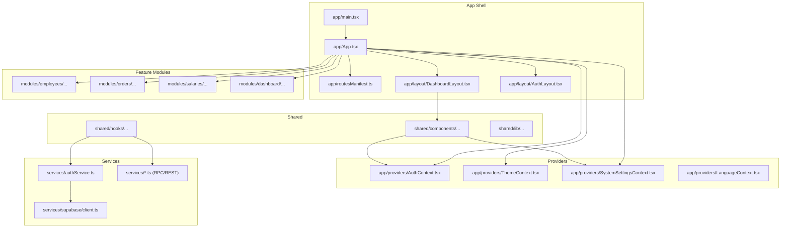
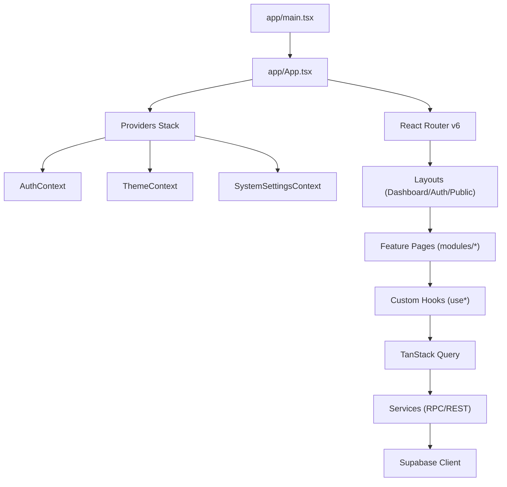
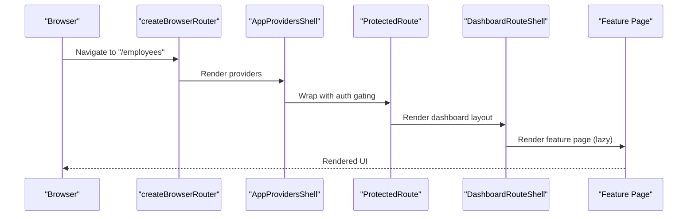
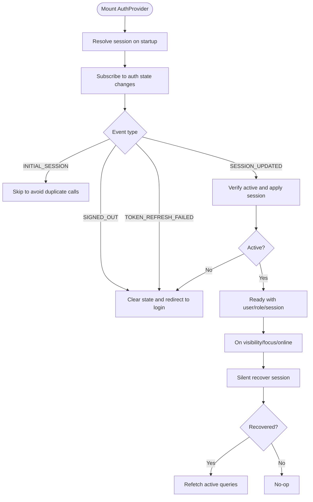
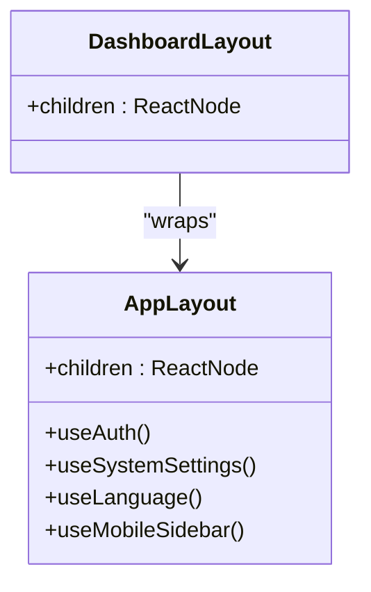
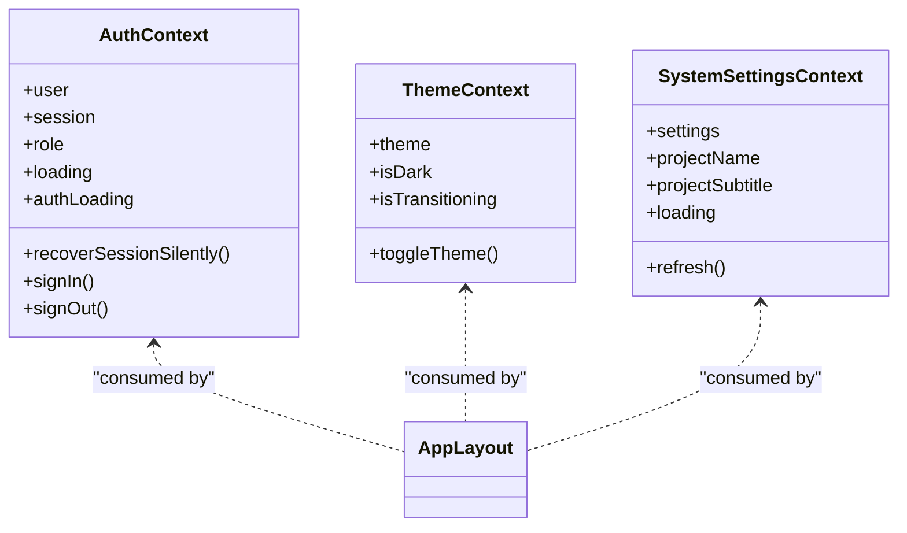
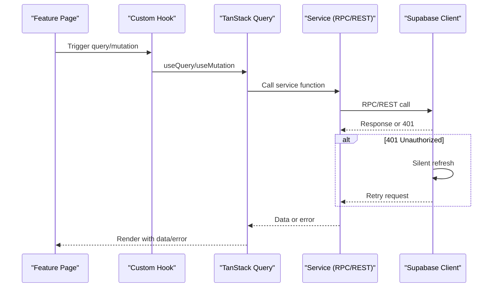
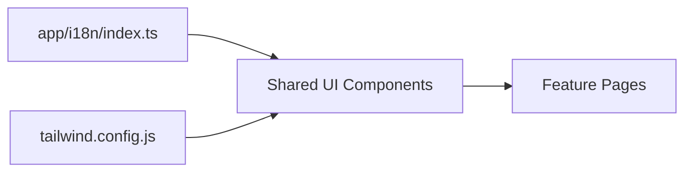
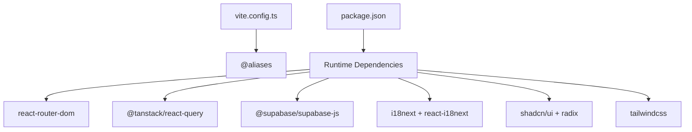

# Frontend Architecture

<cite>
**Referenced Files in This Document**
- [frontend/app/main.tsx](file://frontend/app/main.tsx)
- [frontend/app/App.tsx](file://frontend/app/App.tsx)
- [frontend/app/layout/DashboardLayout.tsx](file://frontend/app/layout/DashboardLayout.tsx)
- [frontend/app/layout/AuthLayout.tsx](file://frontend/app/layout/AuthLayout.tsx)
- [frontend/app/providers/AuthContext.tsx](file://frontend/app/providers/AuthContext.tsx)
- [frontend/app/providers/ThemeContext.tsx](file://frontend/app/providers/ThemeContext.tsx)
- [frontend/app/providers/SystemSettingsContext.tsx](file://frontend/app/providers/SystemSettingsContext.tsx)
- [frontend/app/i18n/index.ts](file://frontend/app/i18n/index.ts)
- [frontend/app/routesManifest.ts](file://frontend/app/routesManifest.ts)
- [frontend/shared/components/AppLayout.tsx](file://frontend/shared/components/AppLayout.tsx)
- [frontend/services/authService.ts](file://frontend/services/authService.ts)
- [frontend/services/supabase/client.ts](file://frontend/services/supabase/client.ts)
- [frontend/tailwind.config.js](file://frontend/tailwind.config.js)
- [frontend/vite.config.ts](file://frontend/vite.config.ts)
- [frontend/package.json](file://frontend/package.json)
</cite>

## Table of Contents
1. [Introduction](#introduction)
2. [Project Structure](#project-structure)
3. [Core Components](#core-components)
4. [Architecture Overview](#architecture-overview)
5. [Detailed Component Analysis](#detailed-component-analysis)
6. [Dependency Analysis](#dependency-analysis)
7. [Performance Considerations](#performance-considerations)
8. [Troubleshooting Guide](#troubleshooting-guide)
9. [Conclusion](#conclusion)
10. [Appendices](#appendices)

## Introduction
This document describes the frontend architecture of MuhimmatAltawseel’s React Single Page Application. The system follows a feature-based modular organization, a layered provider pattern for global state, React Router v6 for navigation, and TanStack Query for client-side state management. It integrates Supabase for authentication and real-time data, uses Tailwind CSS with a custom design system and shadcn/ui primitives, and supports internationalization with Arabic and English locales. The build system leverages Vite with code-splitting strategies and development tooling.

## Project Structure
The frontend is organized into:
- app: Application shell, routing, providers, and layouts
- modules: Feature-based modules (e.g., employees, orders, salaries)
- shared: Cross-cutting components, hooks, and utilities
- services: Backend service wrappers (Supabase, RPCs, and internal APIs)
- public: Static assets and manifests

**Diagram sources**
- [frontend/app/main.tsx:1-107](file://frontend/app/main.tsx#L1-L107)
- [frontend/app/App.tsx:1-200](file://frontend/app/App.tsx#L1-L200)
- [frontend/app/routesManifest.ts:1-85](file://frontend/app/routesManifest.ts#L1-L85)
- [frontend/app/layout/DashboardLayout.tsx:1-18](file://frontend/app/layout/DashboardLayout.tsx#L1-L18)
- [frontend/app/layout/AuthLayout.tsx:1-19](file://frontend/app/layout/AuthLayout.tsx#L1-L19)
- [frontend/app/providers/AuthContext.tsx:1-411](file://frontend/app/providers/AuthContext.tsx#L1-L411)
- [frontend/app/providers/ThemeContext.tsx:1-82](file://frontend/app/providers/ThemeContext.tsx#L1-L82)
- [frontend/app/providers/SystemSettingsContext.tsx:1-98](file://frontend/app/providers/SystemSettingsContext.tsx#L1-L98)
- [frontend/shared/components/AppLayout.tsx:1-340](file://frontend/shared/components/AppLayout.tsx#L1-L340)
- [frontend/services/authService.ts:1-226](file://frontend/services/authService.ts#L1-L226)
- [frontend/services/supabase/client.ts:1-76](file://frontend/services/supabase/client.ts#L1-L76)

**Section sources**
- [frontend/app/main.tsx:1-107](file://frontend/app/main.tsx#L1-L107)
- [frontend/app/App.tsx:1-200](file://frontend/app/App.tsx#L1-L200)
- [frontend/app/routesManifest.ts:1-85](file://frontend/app/routesManifest.ts#L1-L85)

## Core Components
- Application bootstrap and error boundaries: Initializes Sentry, environment validation, global error monitoring, and chunk recovery.
- Routing and navigation: React Router v6 with lazy-loaded routes, protected routes, and nested layouts.
- Provider stack: Authentication, theme, system settings, language, temporal, and error contexts.
- Layout system: DashboardLayout wraps feature pages; AppLayout composes sidebar, header, and content.
- State management: TanStack Query for caching, invalidation, and optimistic updates; Supabase for auth and real-time.
- Services: Typed Supabase client with silent refresh; RPC wrappers for domain services.
- Design system: Tailwind CSS with custom tokens and animations; shadcn/ui primitives via Radix UI.

**Section sources**
- [frontend/app/main.tsx:1-107](file://frontend/app/main.tsx#L1-L107)
- [frontend/app/App.tsx:1-200](file://frontend/app/App.tsx#L1-L200)
- [frontend/app/layout/DashboardLayout.tsx:1-18](file://frontend/app/layout/DashboardLayout.tsx#L1-L18)
- [frontend/shared/components/AppLayout.tsx:1-340](file://frontend/shared/components/AppLayout.tsx#L1-L340)
- [frontend/app/providers/AuthContext.tsx:1-411](file://frontend/app/providers/AuthContext.tsx#L1-L411)
- [frontend/app/providers/ThemeContext.tsx:1-82](file://frontend/app/providers/ThemeContext.tsx#L1-L82)
- [frontend/app/providers/SystemSettingsContext.tsx:1-98](file://frontend/app/providers/SystemSettingsContext.tsx#L1-L98)
- [frontend/services/supabase/client.ts:1-76](file://frontend/services/supabase/client.ts#L1-L76)
- [frontend/services/authService.ts:1-226](file://frontend/services/authService.ts#L1-L226)
- [frontend/tailwind.config.js:1-193](file://frontend/tailwind.config.js#L1-L193)

## Architecture Overview
The runtime flow:
- app/main.tsx bootstraps the app, sets up Sentry, and mounts ErrorBoundary and App.
- app/App.tsx defines routes, providers, TanStack Query client, and layout shells.
- Providers supply auth state, theme, system settings, and language to the tree.
- Pages are feature-based modules lazily loaded via React Router.
- Hooks orchestrate TanStack Query queries and mutations; services encapsulate backend calls.
- Supabase handles authentication and real-time channels; services wrap RPCs and REST endpoints.

**Diagram sources**
- [frontend/app/main.tsx:1-107](file://frontend/app/main.tsx#L1-L107)
- [frontend/app/App.tsx:1-200](file://frontend/app/App.tsx#L1-L200)
- [frontend/app/providers/AuthContext.tsx:1-411](file://frontend/app/providers/AuthContext.tsx#L1-L411)
- [frontend/app/providers/ThemeContext.tsx:1-82](file://frontend/app/providers/ThemeContext.tsx#L1-L82)
- [frontend/app/providers/SystemSettingsContext.tsx:1-98](file://frontend/app/providers/SystemSettingsContext.tsx#L1-L98)
- [frontend/services/supabase/client.ts:1-76](file://frontend/services/supabase/client.ts#L1-L76)

## Detailed Component Analysis

### Routing and Navigation
- Routes are declared in a manifest and rendered with React Router v6.
- Public routes (e.g., login) are wrapped with AuthLayout; protected routes are wrapped with DashboardLayout and guarded by ProtectedRoute/PageGuard.
- Lazy loading ensures code-split bundles per page.
- Redirects normalize legacy paths to canonical ones.

**Diagram sources**
- [frontend/app/App.tsx:109-178](file://frontend/app/App.tsx#L109-L178)
- [frontend/app/App.tsx:92-107](file://frontend/app/App.tsx#L92-L107)
- [frontend/app/App.tsx:82-90](file://frontend/app/App.tsx#L82-L90)

**Section sources**
- [frontend/app/App.tsx:109-178](file://frontend/app/App.tsx#L109-L178)
- [frontend/app/routesManifest.ts:1-85](file://frontend/app/routesManifest.ts#L1-L85)

### Authentication and Session Management
- AuthContext manages session lifecycle, role caching, and redirects to login when unauthenticated.
- Silent recovery attempts refresh on wake/online and cancels/refetches queries upon transitions.
- Real-time channel listens for profile activation changes; deactivations trigger sign-out.
- authService wraps Supabase auth operations and exposes RPC helpers.

**Diagram sources**
- [frontend/app/providers/AuthContext.tsx:227-340](file://frontend/app/providers/AuthContext.tsx#L227-L340)
- [frontend/services/authService.ts:169-195](file://frontend/services/authService.ts#L169-L195)

**Section sources**
- [frontend/app/providers/AuthContext.tsx:1-411](file://frontend/app/providers/AuthContext.tsx#L1-L411)
- [frontend/services/authService.ts:1-226](file://frontend/services/authService.ts#L1-L226)

### Layout Composition
- DashboardLayout delegates to AppLayout, which composes sidebar, header, notifications, theme toggle, month picker, and page content area.
- AppLayout reads system settings and user profile to render branding and user menu.
- Responsive behavior adapts to RTL/LTR and mobile sidebar toggles.

**Diagram sources**
- [frontend/app/layout/DashboardLayout.tsx:1-18](file://frontend/app/layout/DashboardLayout.tsx#L1-L18)
- [frontend/shared/components/AppLayout.tsx:43-312](file://frontend/shared/components/AppLayout.tsx#L43-L312)

**Section sources**
- [frontend/app/layout/DashboardLayout.tsx:1-18](file://frontend/app/layout/DashboardLayout.tsx#L1-L18)
- [frontend/shared/components/AppLayout.tsx:1-340](file://frontend/shared/components/AppLayout.tsx#L1-L340)

### Provider Pattern and Global State
- AuthContext: user, session, role, loading flags, sign-in/out, silent recovery.
- ThemeContext: theme state, toggle, transition indicator.
- SystemSettingsContext: fetches system-wide settings, synchronizes document title, and exposes refresh.
- LanguageContext: used by AuthLayout to set directionality.

**Diagram sources**
- [frontend/app/providers/AuthContext.tsx:13-41](file://frontend/app/providers/AuthContext.tsx#L13-L41)
- [frontend/app/providers/ThemeContext.tsx:5-11](file://frontend/app/providers/ThemeContext.tsx#L5-L11)
- [frontend/app/providers/SystemSettingsContext.tsx:22-28](file://frontend/app/providers/SystemSettingsContext.tsx#L22-L28)

**Section sources**
- [frontend/app/providers/AuthContext.tsx:1-411](file://frontend/app/providers/AuthContext.tsx#L1-L411)
- [frontend/app/providers/ThemeContext.tsx:1-82](file://frontend/app/providers/ThemeContext.tsx#L1-L82)
- [frontend/app/providers/SystemSettingsContext.tsx:1-98](file://frontend/app/providers/SystemSettingsContext.tsx#L1-L98)

### Data Flow: Page → Hook → Service → Supabase
- Pages import feature-specific hooks (e.g., useEmployees, useSalaryData).
- Hooks use TanStack Query to fetch and mutate data; they call service functions.
- Services encapsulate RPC calls and REST endpoints; Supabase client handles auth and transport.
- On 401, the wrapped fetch attempts a silent token refresh before retrying.

**Diagram sources**
- [frontend/services/supabase/client.ts:29-62](file://frontend/services/supabase/client.ts#L29-L62)
- [frontend/services/authService.ts:101-111](file://frontend/services/authService.ts#L101-L111)

**Section sources**
- [frontend/services/supabase/client.ts:1-76](file://frontend/services/supabase/client.ts#L1-L76)
- [frontend/services/authService.ts:1-226](file://frontend/services/authService.ts#L1-L226)

### Internationalization and Design System
- i18n initializes Arabic as default with English fallback; keys map to localized strings.
- Tailwind CSS provides a design system with custom tokens for surfaces, brand colors, shadows, and animations.
- shadcn/ui components are used via Radix UI primitives integrated through shared/ui components.

**Diagram sources**
- [frontend/app/i18n/index.ts:1-192](file://frontend/app/i18n/index.ts#L1-L192)
- [frontend/tailwind.config.js:1-193](file://frontend/tailwind.config.js#L1-L193)

**Section sources**
- [frontend/app/i18n/index.ts:1-192](file://frontend/app/i18n/index.ts#L1-L192)
- [frontend/tailwind.config.js:1-193](file://frontend/tailwind.config.js#L1-L193)

## Dependency Analysis
- Build and tooling: Vite with React plugin, aliases, and manual chunking for vendor libraries.
- Runtime dependencies: React Router, TanStack Query, Supabase, i18next, shadcn/ui (Radix UI), Tailwind, and utilities.
- Aliases: @app, @services, @modules, @shared simplify imports across the codebase.

**Diagram sources**
- [frontend/vite.config.ts:1-76](file://frontend/vite.config.ts#L1-L76)
- [frontend/package.json:1-103](file://frontend/package.json#L1-L103)

**Section sources**
- [frontend/vite.config.ts:1-76](file://frontend/vite.config.ts#L1-L76)
- [frontend/package.json:1-103](file://frontend/package.json#L1-L103)

## Performance Considerations
- Code splitting: React.lazy with Suspense per page; Vite manualChunks groups large vendor libraries (e.g., recharts, xlsx, pdf libs, @supabase, @tanstack, react).
- Query caching: TanStack Query configured with staleTime, gcTime, and retries; mutation/query caches centralize auth error handling.
- Silent refresh: Wrapped fetch attempts a single token refresh on 401 to reduce rejections.
- Theme transitions: CSS class-based transitions with a short duration to avoid layout thrash.
- Chunk recovery: Global listeners detect stale chunk errors and reload once.

**Section sources**
- [frontend/app/App.tsx:64-80](file://frontend/app/App.tsx#L64-L80)
- [frontend/services/supabase/client.ts:29-62](file://frontend/services/supabase/client.ts#L29-L62)
- [frontend/app/providers/ThemeContext.tsx:13-63](file://frontend/app/providers/ThemeContext.tsx#L13-L63)
- [frontend/app/main.tsx:70-91](file://frontend/app/main.tsx#L70-L91)
- [frontend/vite.config.ts:55-74](file://frontend/vite.config.ts#L55-L74)

## Troubleshooting Guide
- Environment validation: Missing Supabase env vars cause immediate startup error with clear messaging.
- Sentry integration: Initialized with replay masking and environment metadata; Sentry fallback UI for Arabic.
- Global error monitoring: Setup of global error monitoring and chunk load recovery.
- Auth failures: Centralized handling via QueryClient mutation/query cache onError; emits auth failure bus to force sign-out.
- Supabase 401 handling: Silent refresh attempt before returning error to React Query.
- Layout and RTL: AuthLayout respects language directionality; AppLayout syncs document title and renders profile avatar/name.

**Section sources**
- [frontend/app/main.tsx:10-26](file://frontend/app/main.tsx#L10-L26)
- [frontend/app/main.tsx:28-49](file://frontend/app/main.tsx#L28-L49)
- [frontend/app/App.tsx:59-62](file://frontend/app/App.tsx#L59-L62)
- [frontend/services/supabase/client.ts:29-62](file://frontend/services/supabase/client.ts#L29-L62)
- [frontend/app/layout/AuthLayout.tsx:8-16](file://frontend/app/layout/AuthLayout.tsx#L8-L16)
- [frontend/shared/components/AppLayout.tsx:76-78](file://frontend/shared/components/AppLayout.tsx#L76-L78)

## Conclusion
The frontend employs a robust, modular architecture with feature-based organization, a layered provider pattern, and a clear separation of concerns. React Router and TanStack Query drive navigation and state, while Supabase underpins authentication and real-time capabilities. The design system and i18n enable a consistent, localized user experience. Performance is addressed through code splitting, intelligent caching, and silent refresh strategies, supported by Vite’s optimized build pipeline.

## Appendices

### Component Composition Patterns
- Layout shells: AppProvidersShell nests providers; DashboardRouteShell wraps pages with DashboardLayout and ErrorBoundary.
- Feature pages: Imported lazily; rely on hooks for data fetching and services for backend communication.
- Shared components: AppLayout composes sidebar/header/content; reusable UI primitives from shared/components/ui.

**Section sources**
- [frontend/app/App.tsx:92-107](file://frontend/app/App.tsx#L92-L107)
- [frontend/app/App.tsx:82-90](file://frontend/app/App.tsx#L82-L90)
- [frontend/shared/components/AppLayout.tsx:1-340](file://frontend/shared/components/AppLayout.tsx#L1-L340)

### Data Flow from Page to Service to Supabase
- Pages call hooks; hooks use TanStack Query; services call Supabase RPC/REST; wrapped fetch handles auth and retries.

**Section sources**
- [frontend/services/supabase/client.ts:1-76](file://frontend/services/supabase/client.ts#L1-L76)
- [frontend/services/authService.ts:1-226](file://frontend/services/authService.ts#L1-L226)