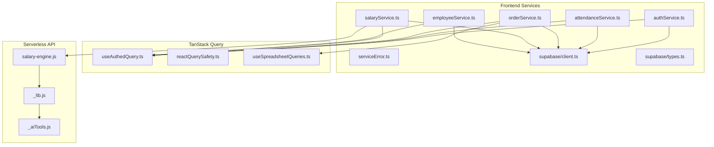
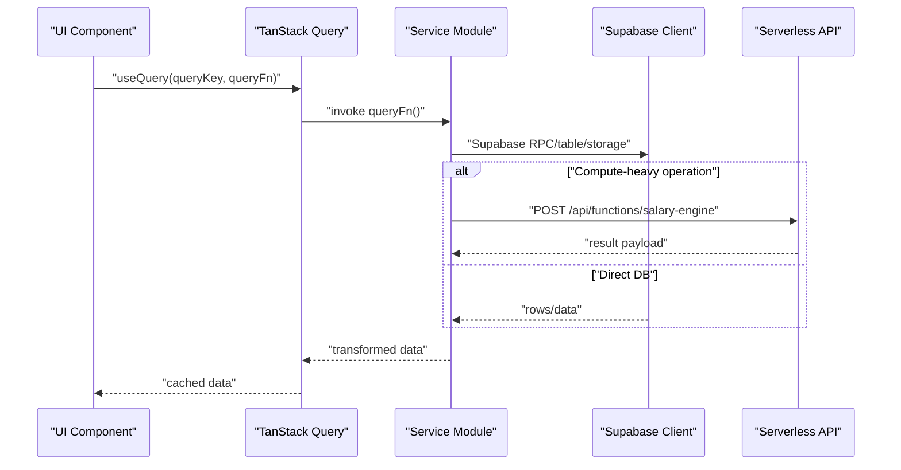
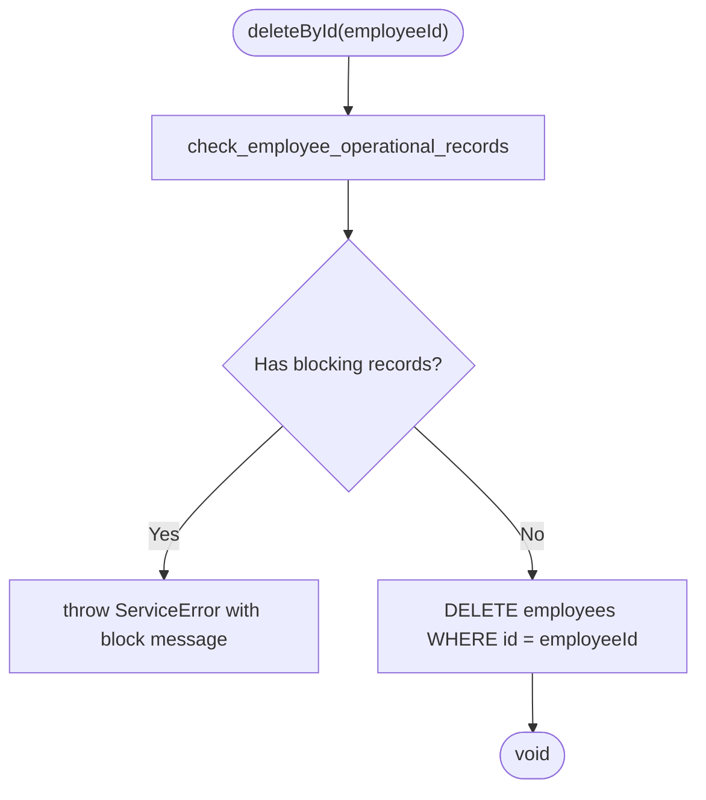
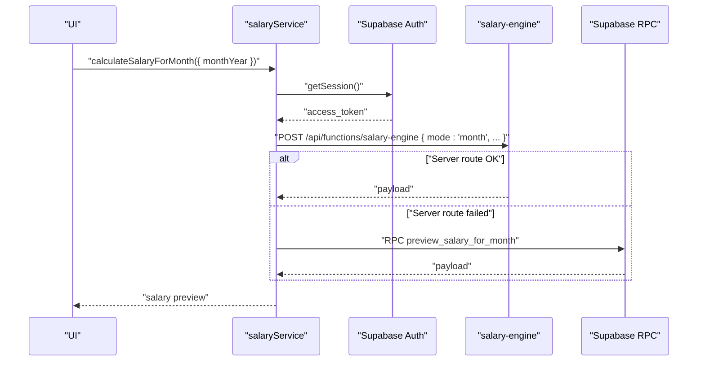
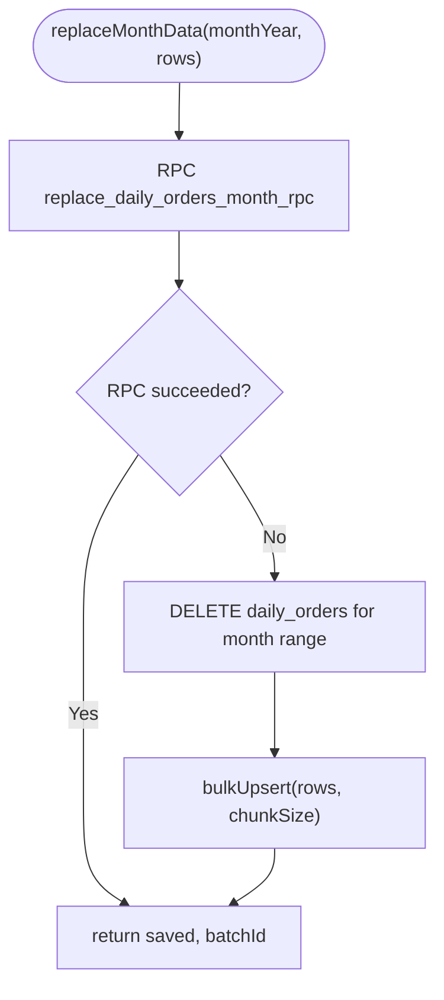
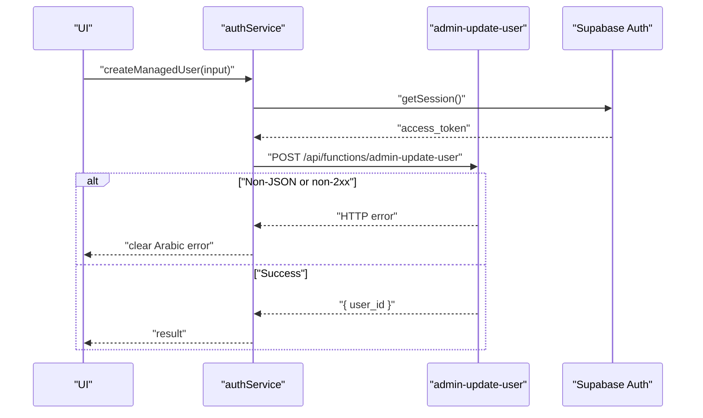
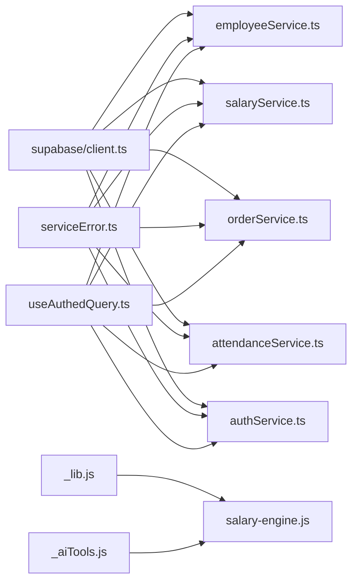

# Backend Services

<cite>
**Referenced Files in This Document**
- [employeeService.ts](file://frontend/services/employeeService.ts)
- [salaryService.ts](file://frontend/services/salaryService.ts)
- [orderService.ts](file://frontend/services/orderService.ts)
- [attendanceService.ts](file://frontend/services/attendanceService.ts)
- [authService.ts](file://frontend/services/authService.ts)
- [serviceError.ts](file://frontend/services/serviceError.ts)
- [client.ts](file://frontend/services/supabase/client.ts)
- [types.ts](file://frontend/services/supabase/types.ts)
- [useAuthedQuery.ts](file://frontend/shared/hooks/useAuthedQuery.ts)
- [reactQuerySafety.ts](file://frontend/shared/lib/reactQuerySafety.ts)
- [useSpreadsheetQueries.ts](file://frontend/modules/orders/hooks/useSpreadsheetQueries.ts)
- [_lib.js](file://api/_lib.js)
- [_aiTools.js](file://api/_aiTools.js)
- [salary-engine.js](file://api/functions/salary-engine.js)
</cite>

## Table of Contents
1. [Introduction](#introduction)
2. [Project Structure](#project-structure)
3. [Core Components](#core-components)
4. [Architecture Overview](#architecture-overview)
5. [Detailed Component Analysis](#detailed-component-analysis)
6. [Dependency Analysis](#dependency-analysis)
7. [Performance Considerations](#performance-considerations)
8. [Troubleshooting Guide](#troubleshooting-guide)
9. [Conclusion](#conclusion)

## Introduction
This document describes the backend service layer for MuhimmatAltawseel, focusing on the frontend service modules that abstract Supabase API calls, implement TanStack Query caching, and manage business logic. It covers five core services: employeeService, salaryService, orderService, attendanceService, and authService. The document explains service patterns, error handling strategies, data transformation, caching mechanisms, and integration with the frontend state management system via TanStack Query.

## Project Structure
The service layer lives under frontend/services and integrates with:
- Supabase client for database and storage operations
- TanStack Query for caching, retries, and invalidation
- Serverless API functions for compute-heavy tasks (e.g., salary engine)
- Shared utilities for error handling, security, and query safety

**Diagram sources**
- [employeeService.ts:1-367](file://frontend/services/employeeService.ts#L1-L367)
- [salaryService.ts:1-651](file://frontend/services/salaryService.ts#L1-L651)
- [orderService.ts:1-504](file://frontend/services/orderService.ts#L1-L504)
- [attendanceService.ts:1-205](file://frontend/services/attendanceService.ts#L1-L205)
- [authService.ts:1-226](file://frontend/services/authService.ts#L1-L226)
- [serviceError.ts:1-74](file://frontend/services/serviceError.ts#L1-L74)
- [client.ts:1-76](file://frontend/services/supabase/client.ts#L1-L76)
- [types.ts:1-800](file://frontend/services/supabase/types.ts#L1-L800)
- [useAuthedQuery.ts:1-53](file://frontend/shared/hooks/useAuthedQuery.ts#L1-L53)
- [reactQuerySafety.ts:1-23](file://frontend/shared/lib/reactQuerySafety.ts#L1-L23)
- [useSpreadsheetQueries.ts:1-126](file://frontend/modules/orders/hooks/useSpreadsheetQueries.ts#L1-L126)
- [_lib.js:1-79](file://api/_lib.js#L1-L79)
- [_aiTools.js:1-265](file://api/_aiTools.js#L1-L265)
- [salary-engine.js:1-9](file://api/functions/salary-engine.js#L1-L9)

**Section sources**
- [employeeService.ts:1-367](file://frontend/services/employeeService.ts#L1-L367)
- [salaryService.ts:1-651](file://frontend/services/salaryService.ts#L1-L651)
- [orderService.ts:1-504](file://frontend/services/orderService.ts#L1-L504)
- [attendanceService.ts:1-205](file://frontend/services/attendanceService.ts#L1-L205)
- [authService.ts:1-226](file://frontend/services/authService.ts#L1-L226)
- [serviceError.ts:1-74](file://frontend/services/serviceError.ts#L1-L74)
- [client.ts:1-76](file://frontend/services/supabase/client.ts#L1-L76)
- [types.ts:1-800](file://frontend/services/supabase/types.ts#L1-L800)
- [useAuthedQuery.ts:1-53](file://frontend/shared/hooks/useAuthedQuery.ts#L1-L53)
- [reactQuerySafety.ts:1-23](file://frontend/shared/lib/reactQuerySafety.ts#L1-L23)
- [useSpreadsheetQueries.ts:1-126](file://frontend/modules/orders/hooks/useSpreadsheetQueries.ts#L1-L126)
- [_lib.js:1-79](file://api/_lib.js#L1-L79)
- [_aiTools.js:1-265](file://api/_aiTools.js#L1-L265)
- [salary-engine.js:1-9](file://api/functions/salary-engine.js#L1-L9)

## Core Components
- Supabase client encapsulated in a singleton with automatic token refresh and production safety checks.
- ServiceError wrapper for consistent error propagation across services.
- TanStack Query integration via useAuthedQuery for authenticated, gated queries with retry and error toast support.
- Serverless API helpers for authentication, CORS, and request validation.

Key responsibilities:
- employeeService: CRUD, app assignment, document storage, blocking-delete guard.
- salaryService: pricing rules, salary preview/calculation, RPC fallback, upsert, export helpers.
- orderService: daily orders CRUD, month replace/import, app targets, base data for grids.
- attendanceService: check-in/out RPCs, daily/monthly attendance, status configs.
- authService: sign-in/sign-out, session management, admin user ops via serverless functions.

**Section sources**
- [client.ts:1-76](file://frontend/services/supabase/client.ts#L1-L76)
- [serviceError.ts:1-74](file://frontend/services/serviceError.ts#L1-L74)
- [useAuthedQuery.ts:1-53](file://frontend/shared/hooks/useAuthedQuery.ts#L1-L53)
- [_lib.js:1-79](file://api/_lib.js#L1-L79)

## Architecture Overview
The service layer follows a layered architecture:
- Presentation/UI uses TanStack Query to cache and invalidate data.
- Services encapsulate Supabase operations and transform data for UI needs.
- Serverless functions handle compute-heavy tasks (e.g., salary engine) and enforce auth.

**Diagram sources**
- [useAuthedQuery.ts:1-53](file://frontend/shared/hooks/useAuthedQuery.ts#L1-L53)
- [salaryService.ts:353-380](file://frontend/services/salaryService.ts#L353-L380)
- [salary-engine.js:1-9](file://api/functions/salary-engine.js#L1-L9)
- [_lib.js:25-38](file://api/_lib.js#L25-L38)

## Detailed Component Analysis

### Employee Service
Responsibilities:
- List/get/create/update/delete employees with pagination and filters.
- Manage employee ↔ app assignments with safe upsert/cleanup.
- Upload/delete employee documents to private storage.
- Guard deletion against employees with operational records.

Patterns:
- Pagination loop to bypass Supabase default limits.
- Safe path sanitization for storage operations.
- Upsert-then-cleanup pattern for app assignments to prevent data loss.

Error handling:
- Throws ServiceError with context-specific messages.

Data transformation:
- Transforms nested employee_apps into platform_apps for UI.

**Diagram sources**
- [employeeService.ts:182-191](file://frontend/services/employeeService.ts#L182-L191)

**Section sources**
- [employeeService.ts:1-367](file://frontend/services/employeeService.ts#L1-L367)
- [serviceError.ts:1-74](file://frontend/services/serviceError.ts#L1-L74)

### Salary Service
Responsibilities:
- Pricing rules retrieval and grouping for multiple apps.
- Order counting per employee/app/month.
- Salary calculation by rules and tier schemes.
- Preview and calculation via serverless salary-engine with fallback to RPC.
- CRUD for salary_records with approval and export helpers.
- Fixed monthly salary proration by attendance.

Patterns:
- Parallel fetch for pricing rules and order counts.
- RPC fallback for preview when server route fails.
- Defensive column availability detection for sheet_snapshot.

**Diagram sources**
- [salaryService.ts:364-418](file://frontend/services/salaryService.ts#L364-L418)
- [salary-engine.js:1-9](file://api/functions/salary-engine.js#L1-L9)
- [_lib.js:25-38](file://api/_lib.js#L25-L38)

**Section sources**
- [salaryService.ts:1-651](file://frontend/services/salaryService.ts#L1-L651)
- [salary-engine.js:1-9](file://api/functions/salary-engine.js#L1-L9)
- [_lib.js:1-79](file://api/_lib.js#L1-L79)

### Order Service
Responsibilities:
- Daily orders CRUD with conflict handling.
- Month-level replace/import with RPC fallback and bulk upsert.
- App targets CRUD and retrieval.
- Base data for spreadsheets: employees, apps, and assignments.
- Month lock/unlock with visibility-aware queries.

Patterns:
- Chunked replaceMonthData with RPC and fallback to bulkUpsert.
- Pagination loop to fetch large monthly datasets.
- Deduplication of RPC calls for base data.

**Diagram sources**
- [orderService.ts:354-404](file://frontend/services/orderService.ts#L354-L404)

**Section sources**
- [orderService.ts:1-504](file://frontend/services/orderService.ts#L1-L504)
- [useSpreadsheetQueries.ts:1-126](file://frontend/modules/orders/hooks/useSpreadsheetQueries.ts#L1-L126)

### Attendance Service
Responsibilities:
- Daily attendance base: employees, apps, and assignments.
- Check-in/out via RPCs with timestamps.
- Attendance status range and monthly aggregation.
- Status configurations management.

Patterns:
- Parallel fetch for base data.
- Input validation for month/year and UUIDs.
- Visibility filtering for operationally relevant employees.

**Section sources**
- [attendanceService.ts:1-205](file://frontend/services/attendanceService.ts#L1-L205)

### Authentication Service
Responsibilities:
- Sign-in/sign-out with Supabase auth.
- Session management and refresh.
- Role and active status lookup via RPC or table fallback.
- Admin-managed user operations via serverless function with robust error handling.
- Realtime subscription for profile changes.

Patterns:
- In-flight deduplication for role/active status queries.
- Robust admin API wrapper with clear user-facing errors.
- Realtime channel management.

**Diagram sources**
- [authService.ts:205-224](file://frontend/services/authService.ts#L205-L224)
- [_lib.js:25-38](file://api/_lib.js#L25-L38)

**Section sources**
- [authService.ts:1-226](file://frontend/services/authService.ts#L1-L226)
- [_lib.js:1-79](file://api/_lib.js#L1-L79)

## Dependency Analysis
Service dependencies and coupling:
- All services depend on the Supabase client and share error handling via ServiceError.
- Services depend on shared utilities for security, pagination, and logging.
- TanStack Query is the primary integration point for caching and invalidation.
- Serverless functions centralize auth and request validation.

**Diagram sources**
- [client.ts:1-76](file://frontend/services/supabase/client.ts#L1-L76)
- [serviceError.ts:1-74](file://frontend/services/serviceError.ts#L1-L74)
- [useAuthedQuery.ts:1-53](file://frontend/shared/hooks/useAuthedQuery.ts#L1-L53)
- [_lib.js:1-79](file://api/_lib.js#L1-L79)
- [_aiTools.js:1-265](file://api/_aiTools.js#L1-L265)
- [salary-engine.js:1-9](file://api/functions/salary-engine.js#L1-L9)

**Section sources**
- [client.ts:1-76](file://frontend/services/supabase/client.ts#L1-L76)
- [serviceError.ts:1-74](file://frontend/services/serviceError.ts#L1-L74)
- [useAuthedQuery.ts:1-53](file://frontend/shared/hooks/useAuthedQuery.ts#L1-L53)
- [_lib.js:1-79](file://api/_lib.js#L1-L79)
- [_aiTools.js:1-265](file://api/_aiTools.js#L1-L265)
- [salary-engine.js:1-9](file://api/functions/salary-engine.js#L1-L9)

## Performance Considerations
- Pagination loops: Services intentionally bypass Supabase’s default 1000-row limit by iterating with range queries for large datasets (employees, daily orders, salary records).
- Chunked bulk operations: orderService.bulkUpsert uses configurable chunk sizes to improve reliability and reduce timeouts.
- RPC fallbacks: salaryService.getSalaryPreviewForMonth attempts server route first, falling back to RPC to ensure availability.
- Caching and staleTime: useAuthedQuery sets conservative staleTime and disabled refetchOnWindowFocus/refetchOnReconnect to balance freshness and performance.
- Query timeouts: reactQuerySafety.withQueryTimeout provides a hard cap to avoid long hangs.
- Silent refresh: supabase client attempts a single silent refresh on 401 to minimize user interruption.

[No sources needed since this section provides general guidance]

## Troubleshooting Guide
Common issues and resolutions:
- Supabase errors: All service methods throw ServiceError with context. Use getErrorMessage to present user-friendly messages.
- Authentication failures: authService wraps non-JSON proxy errors into clear Arabic messages; ensure Vercel environment variables are configured.
- Rate limiting and edge functions: _lib.js enforces POST-only requests and sets CORS; verify serverless function health.
- Column availability: salaryService.upsertMany logs a critical error if sheet_snapshot is missing; run the pending migration.
- Storage path validation: employeeService.uploadEmployeeDocument validates paths; ensure sanitized paths are used.

**Section sources**
- [serviceError.ts:1-74](file://frontend/services/serviceError.ts#L1-L74)
- [authService.ts:10-48](file://frontend/services/authService.ts#L10-L48)
- [_lib.js:46-57](file://api/_lib.js#L46-L57)
- [salaryService.ts:586-592](file://frontend/services/salaryService.ts#L586-L592)
- [employeeService.ts:285-297](file://frontend/services/employeeService.ts#L285-L297)

## Conclusion
The MuhimmatAltawseel backend service layer cleanly separates concerns between Supabase operations, business logic, and frontend caching. Services consistently wrap errors, implement pagination and chunking for large datasets, and integrate tightly with TanStack Query for caching and invalidation. Serverless functions handle compute-heavy tasks securely, with robust fallbacks and clear error messaging. This architecture supports scalability, maintainability, and a responsive user experience.