# Service Layer Architecture

<cite>
**Referenced Files in This Document**
- [client.ts](file://frontend/services/supabase/client.ts)
- [serviceError.ts](file://frontend/services/serviceError.ts)
- [useAuthedQuery.ts](file://frontend/shared/hooks/useAuthedQuery.ts)
- [useAuthedPagedQuery.ts](file://frontend/shared/hooks/useAuthedPagedQuery.ts)
- [useAuthQueryGate.ts](file://frontend/shared/hooks/useAuthQueryGate.ts)
- [useQueryErrorToast.ts](file://frontend/shared/hooks/useQueryErrorToast.ts)
- [query.ts](file://frontend/shared/lib/query.ts)
- [reactQuerySafety.ts](file://frontend/shared/lib/reactQuerySafety.ts)
- [toastMessages.ts](file://frontend/shared/lib/toastMessages.ts)
- [employeeService.ts](file://frontend/services/employeeService.ts)
- [authService.ts](file://frontend/services/authService.ts)
- [dashboardService.ts](file://frontend/services/dashboardService.ts)
- [appsPageService.ts](file://frontend/modules/apps/services/appsPageService.ts)
- [queryKeys.ts](file://frontend/modules/apps/queryKeys.ts)
</cite>

## Table of Contents
1. [Introduction](#introduction)
2. [Project Structure](#project-structure)
3. [Core Components](#core-components)
4. [Architecture Overview](#architecture-overview)
5. [Detailed Component Analysis](#detailed-component-analysis)
6. [Dependency Analysis](#dependency-analysis)
7. [Performance Considerations](#performance-considerations)
8. [Troubleshooting Guide](#troubleshooting-guide)
9. [Conclusion](#conclusion)
10. [Appendices](#appendices)

## Introduction
This document explains the service layer architecture used in MuhimmatAltawseel. It describes how the frontend isolates Supabase API interactions behind typed services, how TanStack Query is integrated for caching, error handling, and state management, and how authentication and real-time capabilities are wrapped consistently. It also covers query composition utilities, service error handling, separation of concerns between UI and services, dependency injection patterns, and service lifecycle management.

## Project Structure
The service layer is organized under frontend/services and frontend/shared. Supabase client initialization and auth wrappers live in the services/supabase folder. Services encapsulate domain-specific logic and data access. Shared hooks and libraries provide reusable TanStack Query patterns and error handling utilities. Module-specific services and query keys live alongside their feature modules.

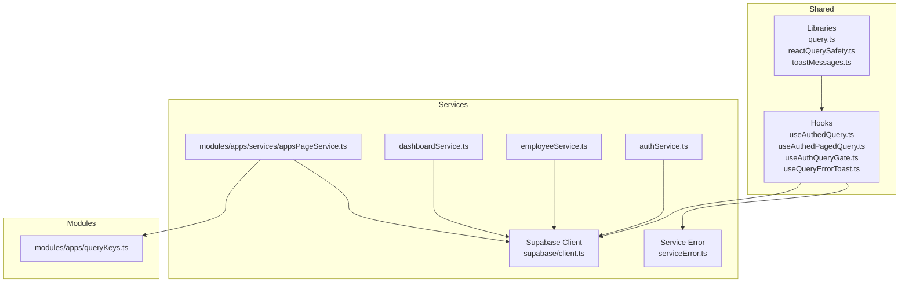

**Diagram sources**
- [client.ts:1-76](file://frontend/services/supabase/client.ts#L1-L76)
- [serviceError.ts:1-74](file://frontend/services/serviceError.ts#L1-L74)
- [useAuthedQuery.ts:1-53](file://frontend/shared/hooks/useAuthedQuery.ts#L1-L53)
- [useAuthedPagedQuery.ts:1-37](file://frontend/shared/hooks/useAuthedPagedQuery.ts#L1-L37)
- [useAuthQueryGate.ts:1-22](file://frontend/shared/hooks/useAuthQueryGate.ts#L1-L22)
- [useQueryErrorToast.ts:1-27](file://frontend/shared/hooks/useQueryErrorToast.ts#L1-L27)
- [query.ts:1-48](file://frontend/shared/lib/query.ts#L1-L48)
- [reactQuerySafety.ts:1-23](file://frontend/shared/lib/reactQuerySafety.ts#L1-L23)
- [toastMessages.ts:1-18](file://frontend/shared/lib/toastMessages.ts#L1-L18)
- [employeeService.ts:1-367](file://frontend/services/employeeService.ts#L1-L367)
- [authService.ts:1-226](file://frontend/services/authService.ts#L1-L226)
- [dashboardService.ts:1-892](file://frontend/services/dashboardService.ts#L1-L892)
- [appsPageService.ts](file://frontend/modules/apps/services/appsPageService.ts)
- [queryKeys.ts:1-8](file://frontend/modules/apps/queryKeys.ts#L1-L8)

**Section sources**
- [client.ts:1-76](file://frontend/services/supabase/client.ts#L1-L76)
- [serviceError.ts:1-74](file://frontend/services/serviceError.ts#L1-L74)
- [useAuthedQuery.ts:1-53](file://frontend/shared/hooks/useAuthedQuery.ts#L1-L53)
- [useAuthedPagedQuery.ts:1-37](file://frontend/shared/hooks/useAuthedPagedQuery.ts#L1-L37)
- [useAuthQueryGate.ts:1-22](file://frontend/shared/hooks/useAuthQueryGate.ts#L1-L22)
- [useQueryErrorToast.ts:1-27](file://frontend/shared/hooks/useQueryErrorToast.ts#L1-L27)
- [query.ts:1-48](file://frontend/shared/lib/query.ts#L1-L48)
- [reactQuerySafety.ts:1-23](file://frontend/shared/lib/reactQuerySafety.ts#L1-L23)
- [toastMessages.ts:1-18](file://frontend/shared/lib/toastMessages.ts#L1-L18)
- [employeeService.ts:1-367](file://frontend/services/employeeService.ts#L1-L367)
- [authService.ts:1-226](file://frontend/services/authService.ts#L1-L226)
- [dashboardService.ts:1-892](file://frontend/services/dashboardService.ts#L1-L892)
- [appsPageService.ts](file://frontend/modules/apps/services/appsPageService.ts)
- [queryKeys.ts:1-8](file://frontend/modules/apps/queryKeys.ts#L1-L8)

## Core Components
- Supabase client with built-in auth and silent refresh
- Service error wrapper and centralized error handling
- TanStack Query hooks for authenticated queries and paged queries
- Query safety utilities for timeouts and retries
- Service implementations for domain areas (authentication, employees, dashboard)
- Query key factories scoped to the authenticated user

Key responsibilities:
- Abstraction: Hide Supabase specifics behind typed service methods.
- Authentication gating: Ensure queries run only when authenticated.
- Caching and refetch policies: Configure staleTime, GC, and retry behavior.
- Error normalization: Convert raw errors into user-friendly messages.
- Real-time and auth state: Subscribe to auth changes and real-time channels via services.

**Section sources**
- [client.ts:1-76](file://frontend/services/supabase/client.ts#L1-L76)
- [serviceError.ts:1-74](file://frontend/services/serviceError.ts#L1-L74)
- [useAuthedQuery.ts:1-53](file://frontend/shared/hooks/useAuthedQuery.ts#L1-L53)
- [useAuthedPagedQuery.ts:1-37](file://frontend/shared/hooks/useAuthedPagedQuery.ts#L1-L37)
- [reactQuerySafety.ts:1-23](file://frontend/shared/lib/reactQuerySafety.ts#L1-L23)
- [employeeService.ts:1-367](file://frontend/services/employeeService.ts#L1-L367)
- [authService.ts:1-226](file://frontend/services/authService.ts#L1-L226)
- [dashboardService.ts:1-892](file://frontend/services/dashboardService.ts#L1-L892)
- [queryKeys.ts:1-8](file://frontend/modules/apps/queryKeys.ts#L1-L8)

## Architecture Overview
The service layer sits between UI components and Supabase. UI components depend on shared hooks and services. Services depend on the Supabase client and shared error utilities. TanStack Query manages caching, retries, and invalidation. Services centralize Supabase client error handling and transform raw data into domain models.

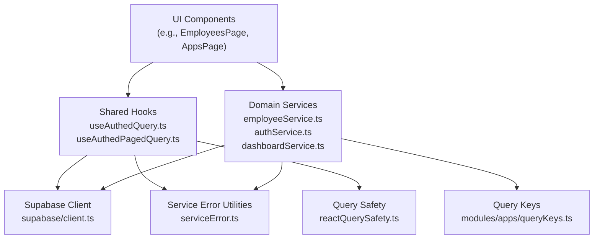

**Diagram sources**
- [client.ts:1-76](file://frontend/services/supabase/client.ts#L1-L76)
- [serviceError.ts:1-74](file://frontend/services/serviceError.ts#L1-L74)
- [useAuthedQuery.ts:1-53](file://frontend/shared/hooks/useAuthedQuery.ts#L1-L53)
- [useAuthedPagedQuery.ts:1-37](file://frontend/shared/hooks/useAuthedPagedQuery.ts#L1-L37)
- [reactQuerySafety.ts:1-23](file://frontend/shared/lib/reactQuerySafety.ts#L1-L23)
- [employeeService.ts:1-367](file://frontend/services/employeeService.ts#L1-L367)
- [authService.ts:1-226](file://frontend/services/authService.ts#L1-L226)
- [dashboardService.ts:1-892](file://frontend/services/dashboardService.ts#L1-L892)
- [queryKeys.ts:1-8](file://frontend/modules/apps/queryKeys.ts#L1-L8)

## Detailed Component Analysis

### Supabase Client and Silent Auth Refresh
The Supabase client is initialized with environment validation and a wrapped fetch that attempts a silent token refresh on 401 responses. Auth persistence uses sessionStorage with auto-refresh enabled. The client instance is exported for use across services.

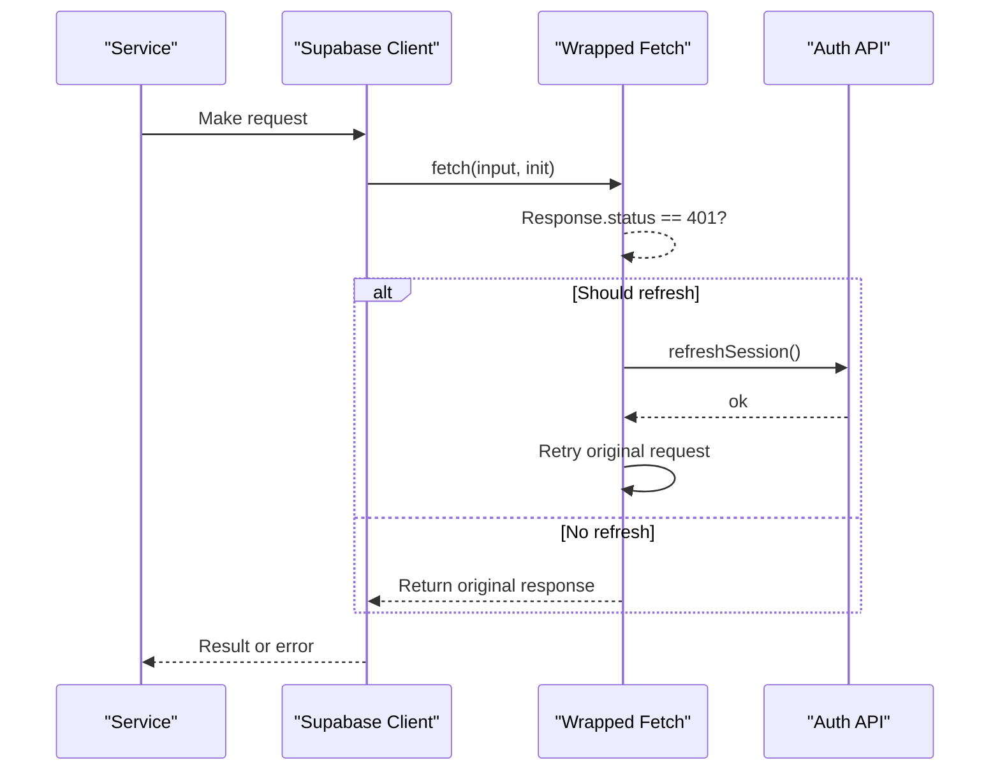

**Diagram sources**
- [client.ts:29-62](file://frontend/services/supabase/client.ts#L29-L62)

**Section sources**
- [client.ts:1-76](file://frontend/services/supabase/client.ts#L1-L76)

### Service Error Handling and Normalization
A dedicated error class and helpers normalize errors from Supabase and other sources. They capture exceptions, extract user-friendly messages, and support context-aware logging and Sentry reporting. Utility functions convert unknown runtime errors to user-facing strings.

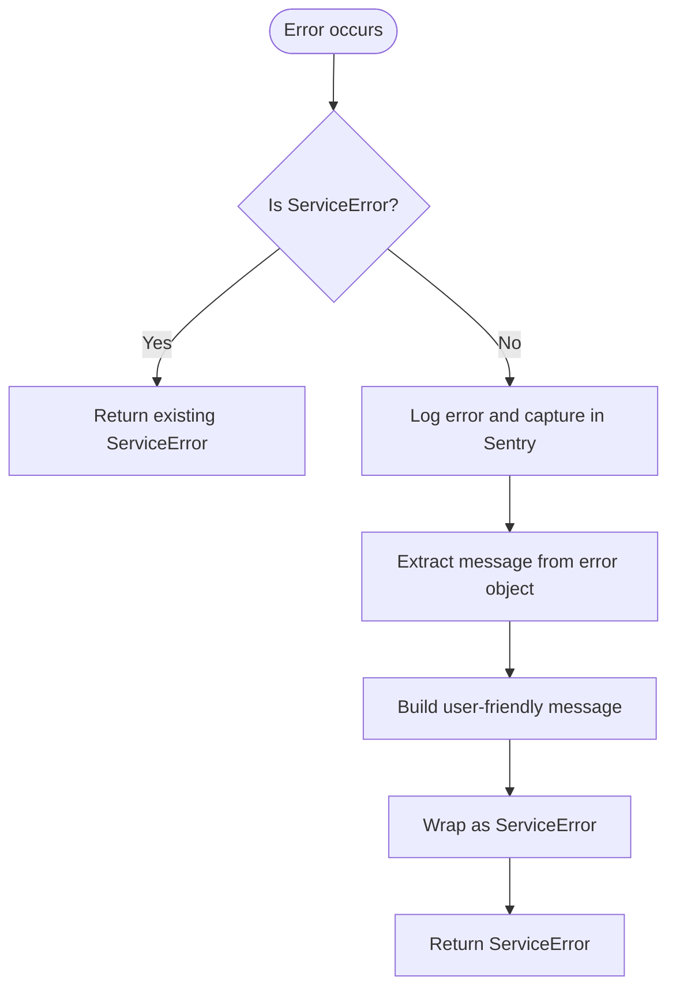

**Diagram sources**
- [serviceError.ts:14-48](file://frontend/services/serviceError.ts#L14-L48)

**Section sources**
- [serviceError.ts:1-74](file://frontend/services/serviceError.ts#L1-L74)

### TanStack Query Integration: Authenticated Queries
The shared hook composes an authenticated query with:
- Auth gating via AuthContext and a gate helper
- Query key scoping to the authenticated user ID
- Optional error toast integration
- Configurable staleTime, GC, and refetch policies

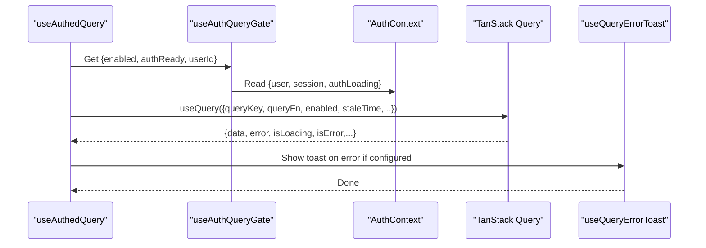

**Diagram sources**
- [useAuthedQuery.ts:19-52](file://frontend/shared/hooks/useAuthedQuery.ts#L19-L52)
- [useAuthQueryGate.ts:10-16](file://frontend/shared/hooks/useAuthQueryGate.ts#L10-L16)
- [useQueryErrorToast.ts:9-26](file://frontend/shared/hooks/useQueryErrorToast.ts#L9-L26)

**Section sources**
- [useAuthedQuery.ts:1-53](file://frontend/shared/hooks/useAuthedQuery.ts#L1-L53)
- [useAuthQueryGate.ts:1-22](file://frontend/shared/hooks/useAuthQueryGate.ts#L1-L22)
- [useQueryErrorToast.ts:1-27](file://frontend/shared/hooks/useQueryErrorToast.ts#L1-L27)
- [query.ts:11-17](file://frontend/shared/lib/query.ts#L11-L17)

### TanStack Query Integration: Paged Queries
The paged query hook adds:
- Timeout protection for long-running queries
- Safe retry policy excluding auth failures
- Stale-time defaults optimized for lists

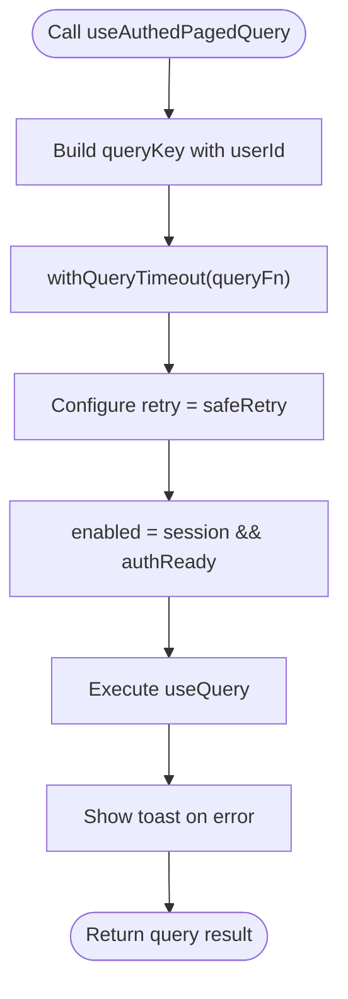

**Diagram sources**
- [useAuthedPagedQuery.ts:15-36](file://frontend/shared/hooks/useAuthedPagedQuery.ts#L15-L36)
- [reactQuerySafety.ts:9-22](file://frontend/shared/lib/reactQuerySafety.ts#L9-L22)
- [query.ts:11-17](file://frontend/shared/lib/query.ts#L11-L17)

**Section sources**
- [useAuthedPagedQuery.ts:1-37](file://frontend/shared/hooks/useAuthedPagedQuery.ts#L1-L37)
- [reactQuerySafety.ts:1-23](file://frontend/shared/lib/reactQuerySafety.ts#L1-L23)
- [query.ts:1-48](file://frontend/shared/lib/query.ts#L1-L48)

### Authentication Service Wrapper
The authentication service wraps Supabase auth APIs and admin-managed user actions:
- Session and user retrieval
- Role and activity checks with in-flight deduplication
- Real-time channel subscriptions for profile changes
- Admin actions via internal API functions with robust error handling

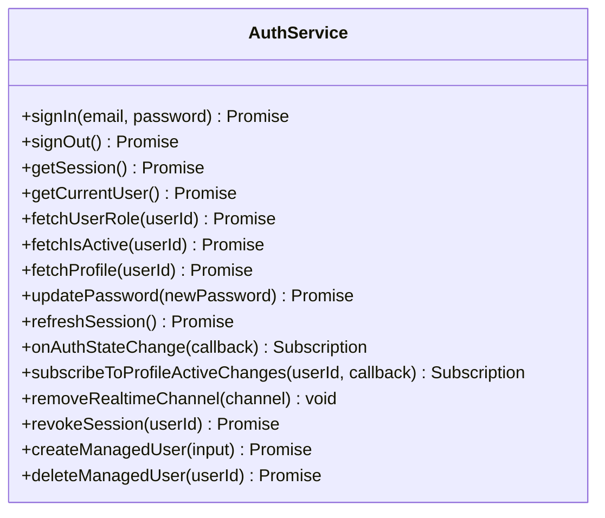

**Diagram sources**
- [authService.ts:84-225](file://frontend/services/authService.ts#L84-L225)

**Section sources**
- [authService.ts:1-226](file://frontend/services/authService.ts#L1-L226)

### Employee Service: Encapsulation and Pagination
The employee service encapsulates:
- Listing and paginated queries with server-side filtering and search
- City updates and record blocking checks
- Document upload/remove with path sanitization
- App assignment replacement with safe upsert-before-delete
- Export helpers and salary-context retrieval

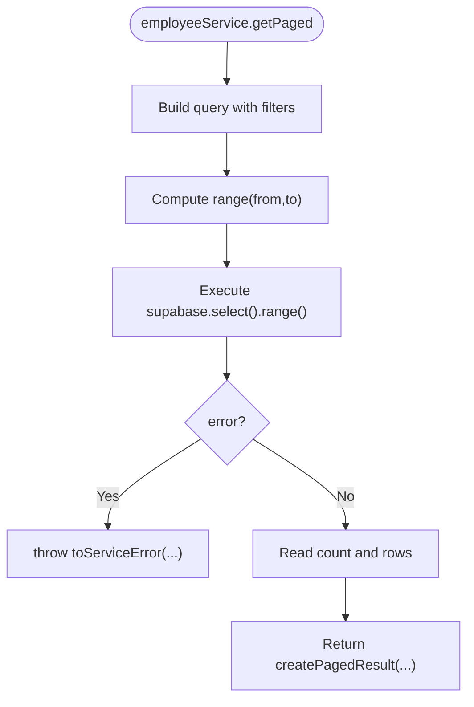

**Diagram sources**
- [employeeService.ts:85-129](file://frontend/services/employeeService.ts#L85-L129)

**Section sources**
- [employeeService.ts:1-367](file://frontend/services/employeeService.ts#L1-L367)

### Dashboard Service: Aggregated RPC and Parallel Queries
The dashboard service orchestrates:
- Robust RPC discovery with fallback signatures
- Parallelized queries for KPIs, charts, and summaries
- Visibility filtering for operational dashboards
- Comprehensive stats across modules

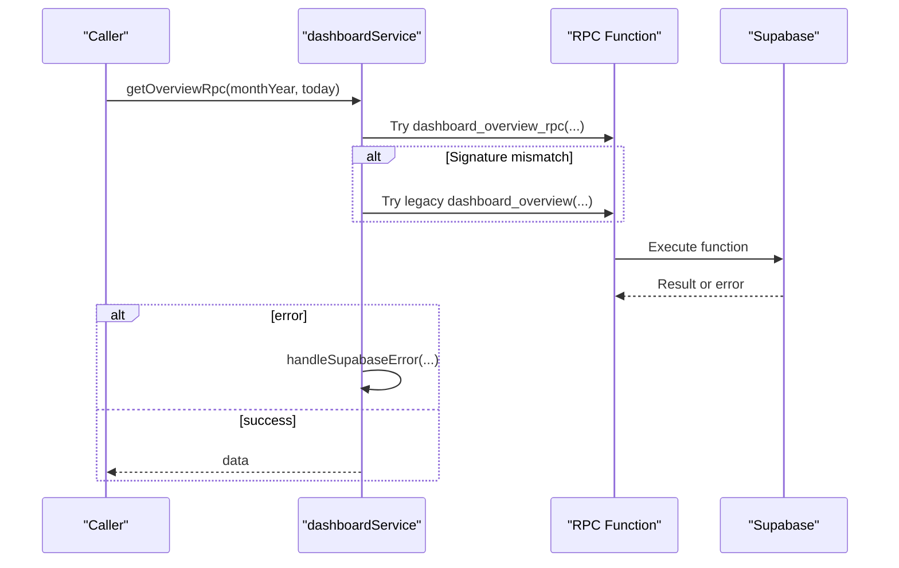

**Diagram sources**
- [dashboardService.ts:41-76](file://frontend/services/dashboardService.ts#L41-L76)

**Section sources**
- [dashboardService.ts:1-892](file://frontend/services/dashboardService.ts#L1-L892)

### Module-Specific Service and Query Keys
Module services compose domain logic with shared query keys to scope cache by user and feature context. Query keys ensure cache isolation and predictable invalidation.

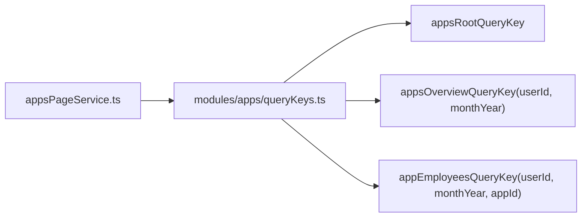

**Diagram sources**
- [appsPageService.ts](file://frontend/modules/apps/services/appsPageService.ts)
- [queryKeys.ts:1-8](file://frontend/modules/apps/queryKeys.ts#L1-L8)

**Section sources**
- [appsPageService.ts](file://frontend/modules/apps/services/appsPageService.ts)
- [queryKeys.ts:1-8](file://frontend/modules/apps/queryKeys.ts#L1-L8)

## Dependency Analysis
The service layer exhibits low coupling and high cohesion:
- UI depends on shared hooks and services, not on Supabase directly.
- Services depend on the Supabase client and shared error utilities.
- Query keys enforce cache scoping and reduce cross-module interference.
- TanStack Query utilities provide consistent retry and timeout behavior.

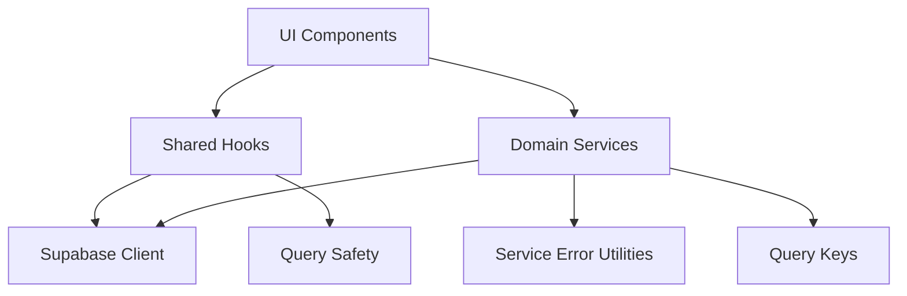

**Diagram sources**
- [client.ts:1-76](file://frontend/services/supabase/client.ts#L1-L76)
- [serviceError.ts:1-74](file://frontend/services/serviceError.ts#L1-L74)
- [useAuthedQuery.ts:1-53](file://frontend/shared/hooks/useAuthedQuery.ts#L1-L53)
- [useAuthedPagedQuery.ts:1-37](file://frontend/shared/hooks/useAuthedPagedQuery.ts#L1-L37)
- [reactQuerySafety.ts:1-23](file://frontend/shared/lib/reactQuerySafety.ts#L1-L23)
- [employeeService.ts:1-367](file://frontend/services/employeeService.ts#L1-L367)
- [authService.ts:1-226](file://frontend/services/authService.ts#L1-L226)
- [dashboardService.ts:1-892](file://frontend/services/dashboardService.ts#L1-L892)
- [queryKeys.ts:1-8](file://frontend/modules/apps/queryKeys.ts#L1-L8)

**Section sources**
- [client.ts:1-76](file://frontend/services/supabase/client.ts#L1-L76)
- [serviceError.ts:1-74](file://frontend/services/serviceError.ts#L1-L74)
- [useAuthedQuery.ts:1-53](file://frontend/shared/hooks/useAuthedQuery.ts#L1-L53)
- [useAuthedPagedQuery.ts:1-37](file://frontend/shared/hooks/useAuthedPagedQuery.ts#L1-L37)
- [reactQuerySafety.ts:1-23](file://frontend/shared/lib/reactQuerySafety.ts#L1-L23)
- [employeeService.ts:1-367](file://frontend/services/employeeService.ts#L1-L367)
- [authService.ts:1-226](file://frontend/services/authService.ts#L1-L226)
- [dashboardService.ts:1-892](file://frontend/services/dashboardService.ts#L1-L892)
- [queryKeys.ts:1-8](file://frontend/modules/apps/queryKeys.ts#L1-L8)

## Performance Considerations
- Pagination: Services like employeeService paginate large datasets to avoid Supabase limits and reduce memory usage.
- Parallel queries: Services orchestrate multiple queries concurrently to minimize total latency.
- Stale-time defaults: Shared query utilities define conservative staleTimes and capped retries to balance freshness and performance.
- Timeouts: Paged queries use timeouts to fail fast on slow networks.
- Real-time channels: Services subscribe to real-time events to keep data fresh without polling.

[No sources needed since this section provides general guidance]

## Troubleshooting Guide
Common issues and resolutions:
- Authentication failures: The Supabase client attempts silent refresh on 401; if it fails, the original error is surfaced. Use the error toast hook to surface user-friendly messages.
- Network timeouts: Paged queries wrap promises with a timeout; adjust timeout duration if needed.
- Excessive retries: Default retry excludes auth failures and caps retries to two for transient errors.
- Error normalization: Use the service error utilities to convert raw errors into consistent messages for UI consumption.

**Section sources**
- [client.ts:29-62](file://frontend/services/supabase/client.ts#L29-L62)
- [reactQuerySafety.ts:9-22](file://frontend/shared/lib/reactQuerySafety.ts#L9-L22)
- [query.ts:11-17](file://frontend/shared/lib/query.ts#L11-L17)
- [useQueryErrorToast.ts:9-26](file://frontend/shared/hooks/useQueryErrorToast.ts#L9-L26)
- [serviceError.ts:68-73](file://frontend/services/serviceError.ts#L68-L73)

## Conclusion
MuhimmatAltawseel’s service layer cleanly separates UI concerns from Supabase interactions. Services encapsulate data access, business rules, and transformations, while TanStack Query handles caching, retries, and state. Authentication gating, error normalization, and query safety utilities ensure robust, maintainable behavior across features.

[No sources needed since this section summarizes without analyzing specific files]

## Appendices

### Service Initialization and Lifecycle
- Supabase client initialization validates environment variables and sets up a wrapped fetch for silent refresh.
- Services import the singleton client and expose domain methods.
- Hooks manage lifecycle: enabling/disabling queries based on auth state, showing error toasts, and applying timeouts/retries.

**Section sources**
- [client.ts:12-76](file://frontend/services/supabase/client.ts#L12-L76)
- [employeeService.ts:1-367](file://frontend/services/employeeService.ts#L1-L367)
- [authService.ts:1-226](file://frontend/services/authService.ts#L1-L226)
- [dashboardService.ts:1-892](file://frontend/services/dashboardService.ts#L1-L892)

### Query Configuration Patterns
- Authenticated queries: Use the shared hook with a buildQueryKey that scopes to the authenticated user ID.
- Paged queries: Apply withQueryTimeout and safeRetry; configure staleTime for list views.
- Error handling: Integrate useQueryErrorToast to show actionable toasts with retry actions.

**Section sources**
- [useAuthedQuery.ts:6-17](file://frontend/shared/hooks/useAuthedQuery.ts#L6-L17)
- [useAuthedPagedQuery.ts:7-13](file://frontend/shared/hooks/useAuthedPagedQuery.ts#L7-L13)
- [reactQuerySafety.ts:3-7](file://frontend/shared/lib/reactQuerySafety.ts#L3-L7)
- [query.ts:11-17](file://frontend/shared/lib/query.ts#L11-L17)
- [useQueryErrorToast.ts:9-26](file://frontend/shared/hooks/useQueryErrorToast.ts#L9-L26)

### Response Transformation Patterns
- Services transform raw Supabase rows into domain-friendly shapes (e.g., flattening joins, renaming fields).
- Aggregation services compute derived metrics from multiple queries.
- Visibility filters are applied to operational dashboards to respect tenant constraints.

**Section sources**
- [employeeService.ts:71-76](file://frontend/services/employeeService.ts#L71-L76)
- [dashboardService.ts:349-392](file://frontend/services/dashboardService.ts#L349-L392)
- [dashboardService.ts:421-569](file://frontend/services/dashboardService.ts#L421-L569)