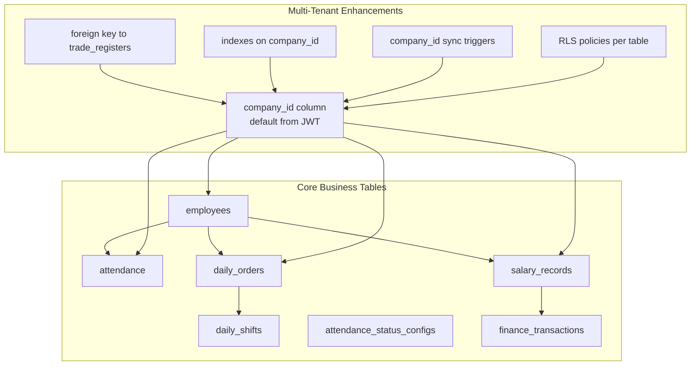
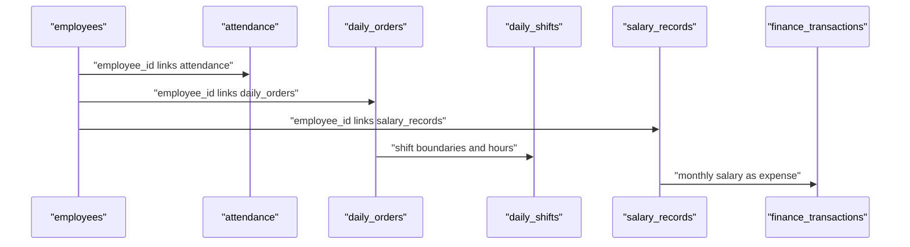
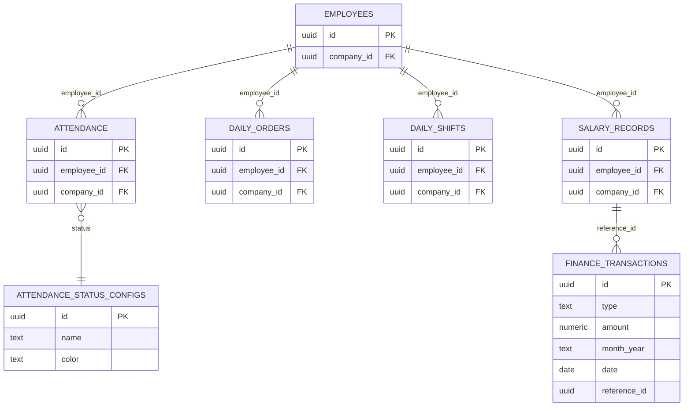

# Core Business Tables

<cite>
**Referenced Files in This Document**
- [20260226083236_a06ac86d-f40a-4105-8231-3099763861e3.sql](file://supabase/migrations/20260226083236_a06ac86d-f40a-4105-8231-3099763861e3.sql)
- [20260405000000_add_shifts_and_hybrid_work_types.sql](file://supabase/migrations/20260405000000_add_shifts_and_hybrid_work_types.sql)
- [20260411000000_attendance_status_configs.sql](file://supabase/migrations/20260411000000_attendance_status_configs.sql)
- [20260411050000_finance_transactions.sql](file://supabase/migrations/20260411050000_finance_transactions.sql)
- [20260325174500_add_company_id_to_operational_tables.sql](file://supabase/migrations/20260325174500_add_company_id_to_operational_tables.sql)
- [20260325001000_attendance_checkin_checkout_metrics.sql](file://supabase/migrations/20260325001000_attendance_checkin_checkout_metrics.sql)
- [20260324150000_rls_payroll_attendance_employees_hardening.sql](file://supabase/migrations/20260324150000_rls_payroll_attendance_employees_hardening.sql)
- [20260325170000_tenant_rls_ops_finance_tables.sql](file://supabase/migrations/20260325170000_tenant_rls_ops_finance_tables.sql)
- [20260324120001_vehicle_mileage_daily_rls_finance.sql](file://supabase/migrations/20260324120001_vehicle_mileage_daily_rls_finance.sql)
- [20260324120000_dashboard_alerts_realtime_publication.sql](file://supabase/migrations/20260324120000_dashboard_alerts_realtime_publication.sql)
- [20260324200000_salary_engine_rpc.sql](file://supabase/migrations/20260324200000_salary_engine_rpc.sql)
- [20260324213000_seed_roles_permissions_matrix.sql](file://supabase/migrations/20260324213000_seed_roles_permissions_matrix.sql)
- [20260324220000_roles_upsert_and_permissions_bootstrap.sql](file://supabase/migrations/20260324220000_roles_upsert_and_permissions_bootstrap.sql)
- [20260325190000_salary_engine_tenant_secure.sql](file://supabase/migrations/20260325190000_salary_engine_tenant_secure.sql)
- [20260325193000_salary_preview_rpc.sql](file://supabase/migrations/20260325193000_salary_preview_rpc.sql)
- [20260325210500_employees_name_not_empty_check.sql](file://supabase/migrations/20260325210500_employees_name_not_empty_check.sql)
- [20260325213500_generate_missing_multitenant_rls_policies.sql](file://supabase/migrations/20260325213500_generate_missing_multitenant_rls_policies.sql)
- [20260327120000_finalize_remove_company_id_single_org.sql](file://supabase/migrations/20260327120000_finalize_remove_company_id_single_org.sql)
- [20260327123500_fix_employees_visibility_after_company_id_removal.sql](file://supabase/migrations/20260327123500_fix_employees_visibility_after_company_id_removal.sql)
- [20260327130000_allow_attendance_viewers_to_read_employees.sql](file://supabase/migrations/20260327130000_allow_attendance_viewers_to_read_employees.sql)
- [20260328100000_single_org_platform_accounts_triggers_and_rls.sql](file://supabase/migrations/20260328100000_single_org_platform_accounts_triggers_and_rls.sql)
- [20260329143000_supervisor_targets_and_assignments.sql](file://supabase/migrations/20260329143000_supervisor_targets_and_assignments.sql)
- [20260329210000_salary_per_order_band_and_calc_tiers.sql](file://supabase/migrations/20260329210000_salary_per_order_band_and_calc_tiers.sql)
- [20260330120000_salary_slip_templates.sql](file://supabase/migrations/20260330120000_salary_slip_templates.sql)
- [20260401000000_fix_tier_type_constraint.sql](file://supabase/migrations/20260401000000_fix_tier_type_constraint.sql)
- [20260402010000_assign_platform_account_rpc.sql](file://supabase/migrations/20260402010000_assign_platform_account_rpc.sql)
- [20260403000000_add_commercial_record_to_employees.sql](file://supabase/migrations/20260403000000_add_commercial_record_to_employees.sql)
- [20260404000000_remove_company_id_from_platform_accounts.sql](file://supabase/migrations/20260404000000_remove_company_id_from_platform_accounts.sql)
- [20260404010000_cleanup_employee_code_and_employee_cities.sql](file://supabase/migrations/20260404010000_cleanup_employee_code_and_employee_cities.sql)
- [20260405000000_add_shifts_and_hybrid_work_types.sql](file://supabase/migrations/20260405000000_add_shifts_and_hybrid_work_types.sql)
- [20260406000000_fix_salary_preview_for_shifts.sql](file://supabase/migrations/20260406000000_fix_salary_preview_for_shifts.sql)
- [20260407000000_concurrent_editing_protection.sql](file://supabase/migrations/20260407000000_concurrent_editing_protection.sql)
- [20260407000001_salary_preview_platform_breakdown.sql](file://supabase/migrations/20260407000001_salary_preview_platform_breakdown.sql)
- [20260407110000_employee_commercial_records_and_iqama_docs.sql](file://supabase/migrations/20260407110000_employee_commercial_records_and_iqama_docs.sql)
- [20260408000000_align_salary_engine_with_sheet_and_admin_titles.sql](file://supabase/migrations/20260408000000_align_salary_engine_with_sheet_and_admin_titles.sql)
- [20260409000000_salary_record_sheet_snapshot.sql](file://supabase/migrations/20260409000000_salary_record_sheet_snapshot.sql)
- [20260410000000_performance_engine_foundation.sql](file://supabase/migrations/20260410000000_performance_engine_foundation.sql)
- [20260410010000_performance_dashboard_rpcs.sql](file://supabase/migrations/20260410010000_performance_dashboard_rpcs.sql)
- [20260410011000_fix_performance_dashboard_avg_orders.sql](file://supabase/migrations/20260410011000_fix_performance_dashboard_avg_orders.sql)
- [20260410020000_fix_auth_users_fk_cascade_for_delete.sql](file://supabase/migrations/20260410020000_fix_auth_users_fk_cascade_for_delete.sql)
- [20260410030000_fix_salary_engine_ambiguous_column.sql](file://supabase/migrations/20260410030000_fix_salary_engine_ambiguous_column.sql)
- [20260410040000_fix_security_definer_views.sql](file://supabase/migrations/20260410040000_fix_security_definer_views.sql)
- [20260410050000_fix_search_path_and_security_invoker.sql](file://supabase/migrations/20260410050000_fix_search_path_and_security_invoker.sql)
- [20260410060000_fix_sponsorship_alerts_company_id.sql](file://supabase/migrations/20260410060000_fix_sponsorship_alerts_company_id.sql)
- [20260411010000_rls_edge_rate_limits.sql](file://supabase/migrations/20260411010000_rls_edge_rate_limits.sql)
- [20260411020000_fix_shift_threshold_for_attendance.sql](file://supabase/migrations/20260411020000_fix_shift_threshold_for_attendance.sql)
- [20260411030000_fix_preview_salary_shift_threshold.sql](file://supabase/migrations/20260411030000_fix_preview_salary_shift_threshold.sql)
- [20260411040000_fix_preview_salary_read_scheme.sql](file://supabase/migrations/20260411040000_fix_preview_salary_read_scheme.sql)
- [20260411050000_finance_transactions.sql](file://supabase/migrations/20260411050000_finance_transactions.sql)
- [20260413000000_fix_sponsorship_alert_cr_number.sql](file://supabase/migrations/20260413000000_fix_sponsorship_alert_cr_number.sql)
- [20260413090000_fix_salary_preview_skip_unlinked_platforms.sql](file://supabase/migrations/20260413090000_fix_salary_preview_skip_unlinked_platforms.sql)
- [20260413100000_fix_salary_rpc_flat_rate_and_scheme.sql](file://supabase/migrations/20260413100000_fix_salary_rpc_flat_rate_and_scheme.sql)
- [20260414000000_add_salary_slip_template_columns.sql](file://supabase/migrations/20260414000000_add_salary_slip_template_columns.sql)
- [20260415000000_audit_log_performance.sql](file://supabase/migrations/20260415000000_audit_log_performance.sql)
- [20260415100000_fix_calc_tier_with_scheme_id.sql](file://supabase/migrations/20260415100000_fix_calc_tier_with_scheme_id.sql)
- [20260415200000_debug_and_fix_shift_salary.sql](file://supabase/migrations/20260415200000_debug_and_fix_shift_salary.sql)
- [20260415210000_shift_salary_fallback_full_month.sql](file://supabase/migrations/20260415210000_shift_salary_fallback_full_month.sql)
- [20260415220000_shift_salary_always_full_month.sql](file://supabase/migrations/20260415220000_shift_salary_always_full_month.sql)
- [20260416000000_unique_default_slip_template.sql](file://supabase/migrations/20260416000000_unique_default_slip_template.sql)
- [20260425000000_check_employee_operational_records.sql](file://supabase/migrations/20260425000000_check_employee_operational_records.sql)
- [20260426000000_index_audit_review.sql](file://supabase/migrations/20260426000000_index_audit_review.sql)
- [20260427000000_fix_admin_action_log_rls.sql](file://supabase/migrations/20260427000000_fix_admin_action_log_rls.sql)
- [20260501000000_fix_security_warnings.sql](file://supabase/migrations/20260501000000_fix_security_warnings.sql)
- [20260502000000_flip_admin_rider_logic.sql](file://supabase/migrations/20260502000000_flip_admin_rider_logic.sql)
- [20260503000000_leave_requests.sql](file://supabase/migrations/20260503000000_leave_requests.sql)
- [20260503000001_performance_reviews.sql](file://supabase/migrations/20260503000001_performance_reviews.sql)
- [20260503000002_fix_security_warnings_v2.sql](file://supabase/migrations/20260503000002_fix_security_warnings_v2.sql)
- [20260503000003_allow_negative_hours_worked.sql](file://supabase/migrations/20260503000003_allow_negative_hours_worked.sql)
- [20260503000004_add_is_archived_to_apps.sql](file://supabase/migrations/20260503000004_add_is_archived_to_apps.sql)
- [20260504000000_fix_remaining_auth_users_fk.sql](file://supabase/migrations/20260504000000_fix_remaining_auth_users_fk.sql)
- [20260504000001_fix_security_warnings_v3.sql](file://supabase/migrations/20260504000001_fix_security_warnings_v3.sql)
- [20260504000002_fix_logo_upload.sql](file://supabase/migrations/20260504000002_fix_logo_upload.sql)
- [20260504000003_fix_remaining_security_warnings.sql](file://supabase/migrations/20260504000003_fix_remaining_security_warnings.sql)
</cite>

## Table of Contents
1. [Introduction](#introduction)
2. [Project Structure](#project-structure)
3. [Core Components](#core-components)
4. [Architecture Overview](#architecture-overview)
5. [Detailed Component Analysis](#detailed-component-analysis)
6. [Dependency Analysis](#dependency-analysis)
7. [Performance Considerations](#performance-considerations)
8. [Troubleshooting Guide](#troubleshooting-guide)
9. [Conclusion](#conclusion)

## Introduction
This document provides comprehensive data model documentation for MuhimmatAltawseel’s core business tables. It focuses on:
- employees table structure and platform assignment linkage
- daily_orders and daily_shifts tables for operational tracking
- salary_records table and its relationship to salary schemes and payment processing
- attendance table with check-in/check-out tracking and status configurations
- finance_transactions table for monetary operations

It explains field definitions, data types, constraints, business rules, table relationships, indexing strategies, and performance considerations derived from the Supabase migration history.

## Project Structure
The data model is primarily defined in Supabase migrations under the supabase/migrations directory. The migrations establish:
- Base table schemas for employees, attendance, daily_orders, daily_shifts, salary_records, attendance_status_configs, and finance_transactions
- Multi-tenant company_id alignment across operational tables
- Row-level security (RLS) policies and triggers for integrity and access control
- Indexes for performance on frequently queried columns

**Diagram sources**
- [20260226083236_a06ac86d-f40a-4105-8231-3099763861e3.sql](file://supabase/migrations/20260226083236_a06ac86d-f40a-4105-8231-3099763861e3.sql)
- [20260405000000_add_shifts_and_hybrid_work_types.sql](file://supabase/migrations/20260405000000_add_shifts_and_hybrid_work_types.sql)
- [20260411000000_attendance_status_configs.sql](file://supabase/migrations/20260411000000_attendance_status_configs.sql)
- [20260411050000_finance_transactions.sql](file://supabase/migrations/20260411050000_finance_transactions.sql)
- [20260325174500_add_company_id_to_operational_tables.sql](file://supabase/migrations/20260325174500_add_company_id_to_operational_tables.sql)

**Section sources**
- [20260226083236_a06ac86d-f40a-4105-8231-3099763861e3.sql](file://supabase/migrations/20260226083236_a06ac86d-f40a-4105-8231-3099763861e3.sql)
- [20260325174500_add_company_id_to_operational_tables.sql](file://supabase/migrations/20260325174500_add_company_id_to_operational_tables.sql)

## Core Components
This section documents the core business tables and their relationships.

- employees
  - Purpose: Stores personal and employment information and platform assignments for riders.
  - Key attributes: id, personal info, employment status, platform assignments, and company_id for multi-tenancy.
  - Constraints: Not null checks on names and tenant integrity enforced via RLS and triggers.
  - Relationships: Links to attendance, daily_orders, and salary_records via employee_id.

- daily_orders
  - Purpose: Tracks daily order metrics per employee.
  - Key attributes: employee_id, order counts, revenue metrics, and company_id.
  - Constraints: company_id aligned to owning employee; RLS policies restrict access by role and tenant.
  - Relationships: Linked to employees; daily_shifts can be derived from shifts and order windows.

- daily_shifts
  - Purpose: Captures shift-level operational data for attendance and payroll alignment.
  - Key attributes: shift identifiers, start/end timestamps, hours worked, and derived metrics.
  - Constraints: Designed to integrate with salary engine and attendance thresholds.
  - Relationships: Supports daily_orders and attendance reconciliation.

- salary_records
  - Purpose: Stores computed salary entries per employee per month, linking to salary schemes and payment processing.
  - Key attributes: employee_id, scheme references, calculated amounts, status, and payment metadata.
  - Constraints: company_id synchronized from employee; RLS policies for finance/admin roles.
  - Relationships: Drives finance_transactions as monthly salary expenses.

- attendance
  - Purpose: Records check-in/check-out events and derived attendance metrics.
  - Key attributes: employee_id, timestamps, status configuration, and company_id.
  - Constraints: Status validated against attendance_status_configs; RLS policies for HR/Operations/Finance.
  - Relationships: Provides raw data for daily_shifts and daily_orders reconciliation.

- attendance_status_configs
  - Purpose: Defines configurable statuses (e.g., present, late, absent) with color coding.
  - Key attributes: id, name, color, created_at.
  - Constraints: RLS allows authenticated reads; admin manages updates.

- finance_transactions
  - Purpose: Central ledger for revenues and expenses, including auto-generated salary expenses.
  - Key attributes: type (revenue/expense), category, amount, month_year, date, reference metadata, and audit fields.
  - Constraints: Amount non-negative; indexes on month_year, type, and date; RLS for authenticated users and finance/admin.

**Section sources**
- [20260226083236_a06ac86d-f40a-4105-8231-3099763861e3.sql](file://supabase/migrations/20260226083236_a06ac86d-f40a-4105-8231-3099763861e3.sql)
- [20260405000000_add_shifts_and_hybrid_work_types.sql](file://supabase/migrations/20260405000000_add_shifts_and_hybrid_work_types.sql)
- [20260411000000_attendance_status_configs.sql](file://supabase/migrations/20260411000000_attendance_status_configs.sql)
- [20260411050000_finance_transactions.sql](file://supabase/migrations/20260411050000_finance_transactions.sql)

## Architecture Overview
The system enforces multi-tenancy via company_id propagated from employees to dependent operational tables. Triggers ensure referential integrity, while RLS policies restrict access by role and tenant. The salary_records table feeds finance_transactions monthly, and attendance/daily_orders support shift reconciliation.

**Diagram sources**
- [20260226083236_a06ac86d-f40a-4105-8231-3099763861e3.sql](file://supabase/migrations/20260226083236_a06ac86d-f40a-4105-8231-3099763861e3.sql)
- [20260405000000_add_shifts_and_hybrid_work_types.sql](file://supabase/migrations/20260405000000_add_shifts_and_hybrid_work_types.sql)
- [20260411050000_finance_transactions.sql](file://supabase/migrations/20260411050000_finance_transactions.sql)

## Detailed Component Analysis

### employees
- Purpose: Central identity and platform assignment hub for riders.
- Field highlights:
  - id: primary key
  - Personal info: name, contact details, and identification fields
  - Employment status: active/inactive flags and employment dates
  - Platform assignments: linked via platform accounts and apps
  - company_id: multi-tenant tenant discriminator
- Constraints and rules:
  - Name not empty constraint
  - Tenant integrity enforced via RLS and triggers
  - Visibility hardening for PII and cross-tenant access
- Relationships:
  - One-to-many with attendance, daily_orders, and salary_records
  - Many-to-many with platform accounts via assignments

**Section sources**
- [20260325210500_employees_name_not_empty_check.sql](file://supabase/migrations/20260325210500_employees_name_not_empty_check.sql)
- [20260325173000_tenant_integrity_assertions_and_not_null.sql](file://supabase/migrations/20260325173000_tenant_integrity_assertions_and_not_null.sql)
- [20260327130000_allow_attendance_viewers_to_read_employees.sql](file://supabase/migrations/20260327130000_allow_attendance_viewers_to_read_employees.sql)

### daily_orders
- Purpose: Operational KPIs per employee per day (orders, revenue, etc.).
- Field highlights:
  - employee_id: links to employees
  - order counts and revenue metrics
  - company_id: inherited from employee
- Constraints and rules:
  - Non-null company_id enforced
  - RLS policies for admin/hr/operations/finance
- Relationships:
  - Used by dashboards and salary engine previews
  - Supports reconciliation with daily_shifts

**Section sources**
- [20260226083236_a06ac86d-f40a-4105-8231-3099763861e3.sql](file://supabase/migrations/20260226083236_a06ac86d-f40a-4105-8231-3099763861e3.sql)
- [20260325174500_add_company_id_to_operational_tables.sql](file://supabase/migrations/20260325174500_add_company_id_to_operational_tables.sql)

### daily_shifts
- Purpose: Shift-level operational data for attendance and payroll alignment.
- Field highlights:
  - Shift identifiers, start/end timestamps, hours worked
  - Derived metrics for salary computation
- Constraints and rules:
  - Designed to integrate with salary engine and attendance thresholds
- Relationships:
  - Supports daily_orders reconciliation and salary_records generation

**Section sources**
- [20260405000000_add_shifts_and_hybrid_work_types.sql](file://supabase/migrations/20260405000000_add_shifts_and_hybrid_work_types.sql)
- [20260411020000_fix_shift_threshold_for_attendance.sql](file://supabase/migrations/20260411020000_fix_shift_threshold_for_attendance.sql)

### salary_records
- Purpose: Monthly salary computation and payment tracking per employee.
- Field highlights:
  - employee_id, scheme references, calculated amounts, status, payment metadata
  - company_id: synchronized from employee
- Constraints and rules:
  - Non-null company_id enforced
  - RLS policies for finance/admin
  - Tenant security hardening and RPC integrations for preview and calculation
- Relationships:
  - Feeds finance_transactions as monthly salary expenses
  - Drives salary slip templates and batch processing

**Section sources**
- [20260226083236_a06ac86d-f40a-4105-8231-3099763861e3.sql](file://supabase/migrations/20260226083236_a06ac86d-f40a-4105-8231-3099763861e3.sql)
- [20260325190000_salary_engine_tenant_secure.sql](file://supabase/migrations/20260325190000_salary_engine_tenant_secure.sql)
- [20260325193000_salary_preview_rpc.sql](file://supabase/migrations/20260325193000_salary_preview_rpc.sql)
- [20260324200000_salary_engine_rpc.sql](file://supabase/migrations/20260324200000_salary_engine_rpc.sql)

### attendance
- Purpose: Check-in/check-out tracking and attendance metrics.
- Field highlights:
  - employee_id, timestamps, status via attendance_status_configs
  - company_id: synchronized from employee
- Constraints and rules:
  - Status validated against attendance_status_configs
  - RLS policies for HR/Operations/Finance
  - Check-in/checkout metrics and shift threshold adjustments
- Relationships:
  - Raw data for daily_shifts and daily_orders reconciliation

**Section sources**
- [20260226083236_a06ac86d-f40a-4105-8231-3099763861e3.sql](file://supabase/migrations/20260226083236_a06ac86d-f40a-4105-8231-3099763861e3.sql)
- [20260325001000_attendance_checkin_checkout_metrics.sql](file://supabase/migrations/20260325001000_attendance_checkin_checkout_metrics.sql)
- [20260411000000_attendance_status_configs.sql](file://supabase/migrations/20260411000000_attendance_status_configs.sql)

### attendance_status_configs
- Purpose: Configurable attendance status definitions with color coding.
- Field highlights:
  - id, name, color, created_at
- Constraints and rules:
  - RLS: authenticated users can read; admin can manage

**Section sources**
- [20260411000000_attendance_status_configs.sql](file://supabase/migrations/20260411000000_attendance_status_configs.sql)

### finance_transactions
- Purpose: Track revenues and expenses, including auto-generated salary expenses.
- Field highlights:
  - type (revenue/expense), category, amount, month_year, date, reference metadata, notes, created_by, created_at, updated_at
- Constraints and rules:
  - amount >= 0; indexes on month_year, type, date; RLS for authenticated users and finance/admin
  - updated_at trigger maintained
- Relationships:
  - Driven by salary_records monthly postings

**Section sources**
- [20260411050000_finance_transactions.sql](file://supabase/migrations/20260411050000_finance_transactions.sql)
- [20260325170000_tenant_rls_ops_finance_tables.sql](file://supabase/migrations/20260325170000_tenant_rls_ops_finance_tables.sql)
- [20260324120001_vehicle_mileage_daily_rls_finance.sql](file://supabase/migrations/20260324120001_vehicle_mileage_daily_rls_finance.sql)

## Dependency Analysis
The following diagram maps core table dependencies and multi-tenancy synchronization:

**Diagram sources**
- [20260226083236_a06ac86d-f40a-4105-8231-3099763861e3.sql](file://supabase/migrations/20260226083236_a06ac86d-f40a-4105-8231-3099763861e3.sql)
- [20260405000000_add_shifts_and_hybrid_work_types.sql](file://supabase/migrations/20260405000000_add_shifts_and_hybrid_work_types.sql)
- [20260411050000_finance_transactions.sql](file://supabase/migrations/20260411050000_finance_transactions.sql)
- [20260411000000_attendance_status_configs.sql](file://supabase/migrations/20260411000000_attendance_status_configs.sql)

**Section sources**
- [20260226083236_a06ac86d-f40a-4105-8231-3099763861e3.sql](file://supabase/migrations/20260226083236_a06ac86d-f40a-4105-8231-3099763861e3.sql)
- [20260405000000_add_shifts_and_hybrid_work_types.sql](file://supabase/migrations/20260405000000_add_shifts_and_hybrid_work_types.sql)
- [20260411050000_finance_transactions.sql](file://supabase/migrations/20260411050000_finance_transactions.sql)
- [20260411000000_attendance_status_configs.sql](file://supabase/migrations/20260411000000_attendance_status_configs.sql)

## Performance Considerations
- Indexing strategy:
  - company_id indexes on attendance, daily_orders, advances, advance_installments, external_deductions, salary_records
  - finance_transactions: indexes on month_year, type, date
- Triggers and functions:
  - company_id synchronization triggers prevent orphaned records and maintain referential integrity
- RLS and row filtering:
  - Policies restrict scans to tenant scope; ensure queries leverage tenant filters
- Salary engine and previews:
  - RPCs and preview functions rely on accurate joins; maintain indexes on foreign keys and computed metrics
- Audit and logs:
  - Audit log improvements and index reviews help with performance monitoring

**Section sources**
- [20260325174500_add_company_id_to_operational_tables.sql](file://supabase/migrations/20260325174500_add_company_id_to_operational_tables.sql)
- [20260411050000_finance_transactions.sql](file://supabase/migrations/20260411050000_finance_transactions.sql)
- [20260415000000_audit_log_performance.sql](file://supabase/migrations/20260415000000_audit_log_performance.sql)

## Troubleshooting Guide
Common issues and resolutions:
- Attendance records missing company_id:
  - Verify employee belongs to a tenant-bound employee; triggers enforce company_id synchronization
- Salary record not appearing in finance:
  - Confirm salary_records generated for the target month_year and reference_id populated
- Access denied to operational data:
  - Ensure user role includes admin/hr/operations/finance; RLS policies restrict by role and tenant
- Shift threshold mismatches:
  - Review shift threshold fixes and preview adjustments for accurate salary computation
- Finance transaction discrepancies:
  - Validate amount constraints and ensure updated_at trigger is active

**Section sources**
- [20260325174500_add_company_id_to_operational_tables.sql](file://supabase/migrations/20260325174500_add_company_id_to_operational_tables.sql)
- [20260411020000_fix_shift_threshold_for_attendance.sql](file://supabase/migrations/20260411020000_fix_shift_threshold_for_attendance.sql)
- [20260411050000_finance_transactions.sql](file://supabase/migrations/20260411050000_finance_transactions.sql)

## Conclusion
The core business tables form a cohesive, multi-tenant data model supporting attendance tracking, operational KPIs, shift reconciliation, salary computation, and financial ledgering. The migration history demonstrates robust constraints, RLS policies, and indexing strategies to ensure data integrity, tenant isolation, and performance. Adhering to these definitions and relationships ensures reliable operation across dashboards, payroll, and finance modules.