# Database Schema & Data Model

<cite>
**Referenced Files in This Document**
- [config.toml](file://supabase/config.toml)
- [TENANT_RLS_ROLLOUT_CHECKLIST.md](file://supabase/TENANT_RLS_ROLLOUT_CHECKLIST.md)
- [20260324193000_erd_foundation_roles_salary_structure.sql](file://supabase/migrations/20260324193000_erd_foundation_roles_salary_structure.sql)
- [20260324200000_salary_engine_rpc.sql](file://supabase/migrations/20260324200000_salary_engine_rpc.sql)
- [20260325153000_employees_tenant_rls_hardening.sql](file://supabase/migrations/20260325153000_employees_tenant_rls_hardening.sql)
- [20260324120000_dashboard_alerts_realtime_publication.sql](file://supabase/migrations/20260324120000_dashboard_alerts_realtime_publication.sql)
- [20260325170000_tenant_rls_ops_finance_tables.sql](file://supabase/migrations/20260325170000_tenant_rls_ops_finance_tables.sql)
- [20260325173000_tenant_integrity_assertions_and_not_null.sql](file://supabase/migrations/20260325173000_tenant_integrity_assertions_and_not_null.sql)
- [20260325190000_salary_engine_tenant_secure.sql](file://supabase/migrations/20260325190000_salary_engine_tenant_secure.sql)
- [20260324213000_seed_roles_permissions_matrix.sql](file://supabase/migrations/20260324213000_seed_roles_permissions_matrix.sql)
- [20260324150000_rls_payroll_attendance_employees_hardening.sql](file://supabase/migrations/20260324150000_rls_payroll_attendance_employees_hardening.sql)
- [20260325174500_add_company_id_to_operational_tables.sql](file://supabase/migrations/20260325174500_add_company_id_to_operational_tables.sql)
- [20260325181500_company_id_rollout_remaining_tables.sql](file://supabase/migrations/20260325181500_company_id_rollout_remaining_tables.sql)
- [salary-engine/index.ts](file://supabase/functions/salary-engine/index.ts)
</cite>

## Table of Contents
1. [Introduction](#introduction)
2. [Project Structure](#project-structure)
3. [Core Components](#core-components)
4. [Architecture Overview](#architecture-overview)
5. [Detailed Component Analysis](#detailed-component-analysis)
6. [Dependency Analysis](#dependency-analysis)
7. [Performance Considerations](#performance-considerations)
8. [Troubleshooting Guide](#troubleshooting-guide)
9. [Conclusion](#conclusion)
10. [Appendices](#appendices)

## Introduction
This document describes the MuhimmatAltawseel Supabase database schema and data model. It focuses on the core business entities (employees, daily_orders, daily_shifts, salary_records, advances, attendance, apps, vehicles, alerts, and user management), their relationships, constraints, indexes, triggers, Row Level Security (RLS) policies, tenant isolation, migration patterns, edge function integrations, PostgreSQL RPC implementations, validation rules, audit logging, and operational procedures for data lifecycle, performance, and backups.

## Project Structure
The database assets live under the Supabase configuration directory, including:
- Migrations that define schema, constraints, indexes, policies, and stored functions
- Edge functions that orchestrate secure, rate-limited RPC invocations
- A tenant RLS rollout checklist for safe multi-tenant deployment

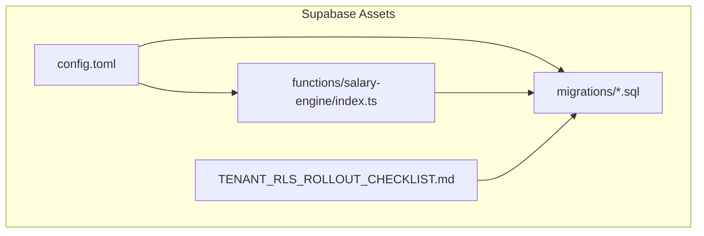

**Diagram sources**
- [config.toml:1-2](file://supabase/config.toml#L1-L2)
- [TENANT_RLS_ROLLOUT_CHECKLIST.md:1-77](file://supabase/TENANT_RLS_ROLLOUT_CHECKLIST.md#L1-L77)

**Section sources**
- [config.toml:1-2](file://supabase/config.toml#L1-L2)
- [TENANT_RLS_ROLLOUT_CHECKLIST.md:1-77](file://supabase/TENANT_RLS_ROLLOUT_CHECKLIST.md#L1-L77)

## Core Components
This section outlines the major tables and their responsibilities, focusing on entities central to payroll, attendance, orders, advances, vehicles, alerts, and user management.

- Employees
  - Stores worker profiles and employment metadata
  - Enforces tenant isolation via RLS policies
  - Maintains role assignments and visibility rules

- Daily Orders
  - Captures per-employee, per-day order counts and statuses
  - Supports filtering by status and app/platform
  - Indexed for efficient monthly aggregation

- Daily Shifts
  - Tracks shift-level scheduling and timing
  - Supports hybrid work types and shift thresholds for attendance

- Salary Records
  - Holds computed monthly salary breakdowns
  - Includes approvals, payments, and calc metadata
  - Enforced tenant isolation and lifecycle states

- Advances
  - Manages prepayments to employees with installments
  - Linked to salary deduction logic

- Attendance
  - Logs check-in/check-out and status (present/late)
  - Enforces tenant-aware policies and constraints

- Apps
  - Represents platforms or applications employees work on
  - Linked to targets and pricing rules

- Vehicles
  - Fleet management including assignments, mileage, and maintenance

- Alerts
  - Operational and compliance notifications
  - Linked to entities and resolved by users

- User Management
  - Roles, permissions, profiles, and audit trails
  - Enforces role-based access and tenant scoping

**Section sources**
- [20260324193000_erd_foundation_roles_salary_structure.sql:7-177](file://supabase/migrations/20260324193000_erd_foundation_roles_salary_structure.sql#L7-L177)
- [20260324150000_rls_payroll_attendance_employees_hardening.sql:1-122](file://supabase/migrations/20260324150000_rls_payroll_attendance_employees_hardening.sql#L1-L122)
- [20260325170000_tenant_rls_ops_finance_tables.sql:1-338](file://supabase/migrations/20260325170000_tenant_rls_ops_finance_tables.sql#L1-L338)
- [20260325174500_add_company_id_to_operational_tables.sql:1-549](file://supabase/migrations/20260325174500_add_company_id_to_operational_tables.sql#L1-L549)
- [20260325181500_company_id_rollout_remaining_tables.sql:1-319](file://supabase/migrations/20260325181500_company_id_rollout_remaining_tables.sql#L1-L319)

## Architecture Overview
The system follows a multi-tenant SaaS pattern with:
- Canonical tenant key: company_id mapped from JWT claims
- Tenant-aware RLS policies on all business tables
- Secure DB functions (RPCs) executed via a service_role edge function
- Realtime publication for frequently accessed tables
- Audit logging and integrity assertions

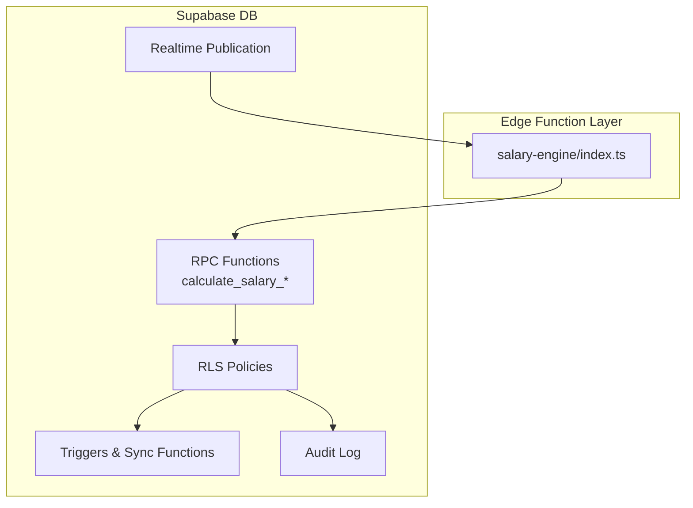

**Diagram sources**
- [salary-engine/index.ts:1-218](file://supabase/functions/salary-engine/index.ts#L1-L218)
- [20260324200000_salary_engine_rpc.sql:1-231](file://supabase/migrations/20260324200000_salary_engine_rpc.sql#L1-L231)
- [20260324120000_dashboard_alerts_realtime_publication.sql:1-34](file://supabase/migrations/20260324120000_dashboard_alerts_realtime_publication.sql#L1-L34)
- [20260325170000_tenant_rls_ops_finance_tables.sql:1-338](file://supabase/migrations/20260325170000_tenant_rls_ops_finance_tables.sql#L1-L338)

## Detailed Component Analysis

### Employees
- Purpose: Store employee identities, employment status, and tenant linkage
- Key attributes: id, name, status, role_id, company_id, timestamps
- Constraints:
  - Unique role per employee via employee_roles
  - Name not empty constraint introduced later
- Indexes: role_id, composite unique on (company_id, id)
- RLS: Tenant-scoped SELECT/INSERT/UPDATE/DELETE with role gates

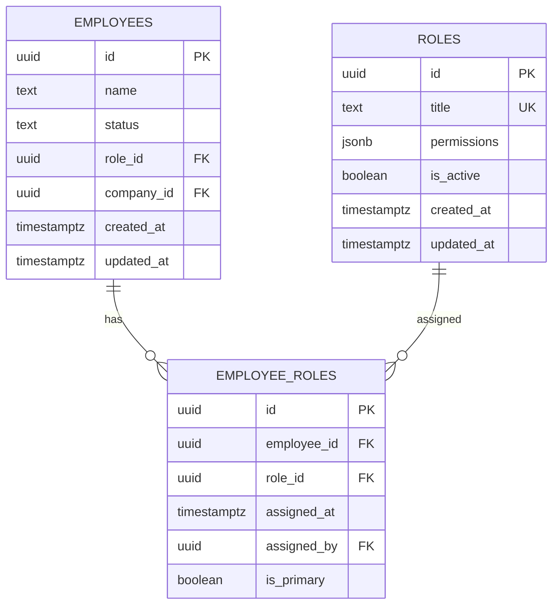

**Diagram sources**
- [20260324193000_erd_foundation_roles_salary_structure.sql:8-49](file://supabase/migrations/20260324193000_erd_foundation_roles_salary_structure.sql#L8-L49)
- [20260325153000_employees_tenant_rls_hardening.sql:10-111](file://supabase/migrations/20260325153000_employees_tenant_rls_hardening.sql#L10-L111)

**Section sources**
- [20260324193000_erd_foundation_roles_salary_structure.sql:8-49](file://supabase/migrations/20260324193000_erd_foundation_roles_salary_structure.sql#L8-L49)
- [20260325153000_employees_tenant_rls_hardening.sql:10-111](file://supabase/migrations/20260325153000_employees_tenant_rls_hardening.sql#L10-L111)

### Daily Orders
- Purpose: Fact table for per-employee, per-day order counts
- Attributes: employee_id, app_id, date, orders_count, status, source, company_id
- Constraints:
  - Status enum: draft, confirmed, cancelled
  - Composite unique on (employee_id, date)
- Indexes: (employee_id, date), (app_id, date), status
- RLS: Tenant-scoped SELECT/ALL with role gates

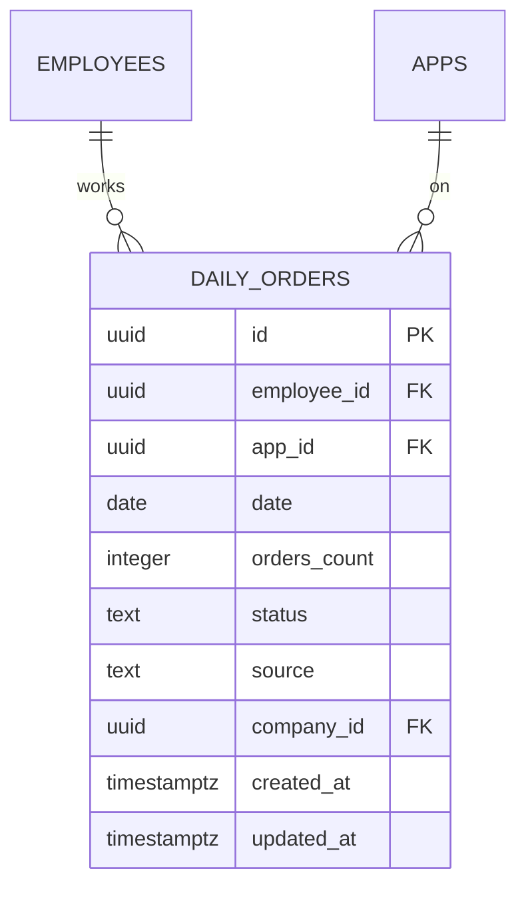

**Diagram sources**
- [20260324193000_erd_foundation_roles_salary_structure.sql:51-63](file://supabase/migrations/20260324193000_erd_foundation_roles_salary_structure.sql#L51-L63)
- [20260325174500_add_company_id_to_operational_tables.sql:14-162](file://supabase/migrations/20260325174500_add_company_id_to_operational_tables.sql#L14-L162)

**Section sources**
- [20260324193000_erd_foundation_roles_salary_structure.sql:51-63](file://supabase/migrations/20260324193000_erd_foundation_roles_salary_structure.sql#L51-L63)
- [20260325174500_add_company_id_to_operational_tables.sql:14-162](file://supabase/migrations/20260325174500_add_company_id_to_operational_tables.sql#L14-L162)

### Daily Shifts
- Purpose: Track shift schedules and durations
- Attributes: employee_id, date, start_time, end_time, type (hybrid/remote/onsite), company_id
- Constraints:
  - Check-in/out ordering and shift threshold logic
- Indexes: (employee_id, date), (employee_id, status, date)
- RLS: Tenant-scoped SELECT/ALL with role gates

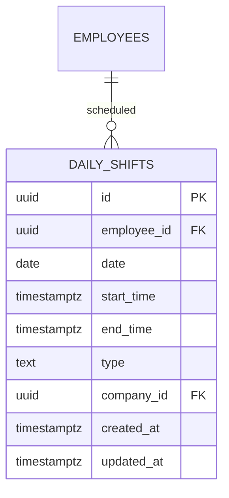

**Diagram sources**
- [20260325170000_tenant_rls_ops_finance_tables.sql:37-112](file://supabase/migrations/20260325170000_tenant_rls_ops_finance_tables.sql#L37-L112)
- [20260325181500_company_id_rollout_remaining_tables.sql:1-319](file://supabase/migrations/20260325181500_company_id_rollout_remaining_tables.sql#L1-L319)

**Section sources**
- [20260325170000_tenant_rls_ops_finance_tables.sql:37-112](file://supabase/migrations/20260325170000_tenant_rls_ops_finance_tables.sql#L37-L112)
- [20260325181500_company_id_rollout_remaining_tables.sql:1-319](file://supabase/migrations/20260325181500_company_id_rollout_remaining_tables.sql#L1-L319)

### Salary Records
- Purpose: Persist calculated monthly salary with breakdowns
- Attributes: employee_id, month_year, base_salary, attendance_deduction, external_deduction, advance_deduction, manual_deduction, net_salary, payment_method, calc_status, calc_source, is_approved, company_id
- Lifecycle: calculated → approved → paid → cancelled
- Indexes: (employee_id, month_year), calc_status
- RLS: Tenant-scoped SELECT/ALL with finance/admin roles

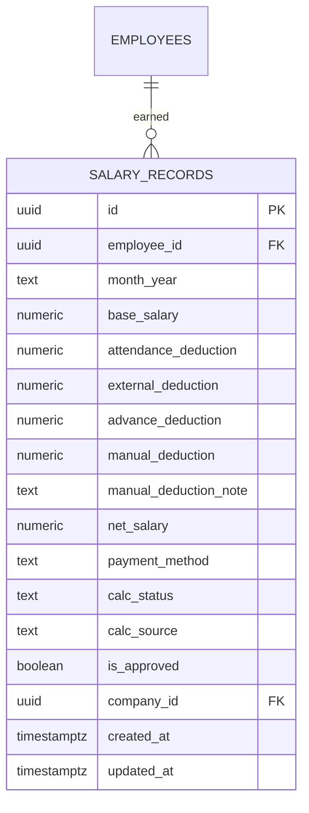

**Diagram sources**
- [20260324193000_erd_foundation_roles_salary_structure.sql:117-129](file://supabase/migrations/20260324193000_erd_foundation_roles_salary_structure.sql#L117-L129)
- [20260325190000_salary_engine_tenant_secure.sql:106-177](file://supabase/migrations/20260325190000_salary_engine_tenant_secure.sql#L106-L177)

**Section sources**
- [20260324193000_erd_foundation_roles_salary_structure.sql:117-129](file://supabase/migrations/20260324193000_erd_foundation_roles_salary_structure.sql#L117-L129)
- [20260325190000_salary_engine_tenant_secure.sql:106-177](file://supabase/migrations/20260325190000_salary_engine_tenant_secure.sql#L106-L177)

### Advances and Installments
- Purpose: Manage employee advances and monthly installments
- Attributes:
  - Advances: employee_id, amount, approved_by, company_id
  - Installments: advance_id, month_year, amount, status
- RLS: Tenant-scoped SELECT/ALL with finance/admin roles
- Integrity: Installments must resolve to advances owned by the same tenant

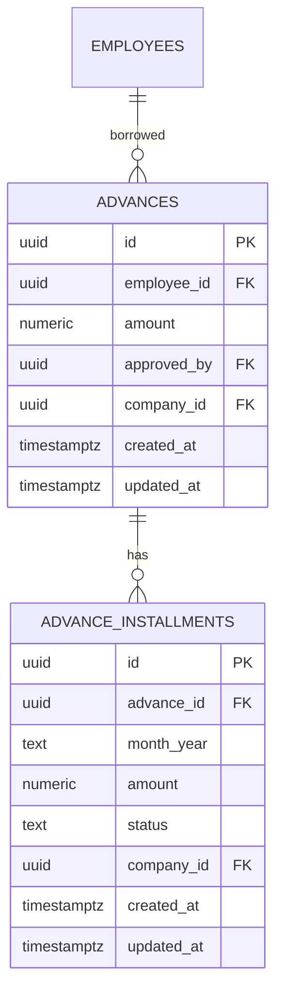

**Diagram sources**
- [20260325170000_tenant_rls_ops_finance_tables.sql:164-251](file://supabase/migrations/20260325170000_tenant_rls_ops_finance_tables.sql#L164-L251)
- [20260325190000_salary_engine_tenant_secure.sql:86-94](file://supabase/migrations/20260325190000_salary_engine_tenant_secure.sql#L86-L94)

**Section sources**
- [20260325170000_tenant_rls_ops_finance_tables.sql:164-251](file://supabase/migrations/20260325170000_tenant_rls_ops_finance_tables.sql#L164-L251)
- [20260325190000_salary_engine_tenant_secure.sql:86-94](file://supabase/migrations/20260325190000_salary_engine_tenant_secure.sql#L86-L94)

### Attendance
- Purpose: Track daily presence and punctuality
- Attributes: employee_id, date, check_in, check_out, status, company_id
- Constraints:
  - Check-out must be after check-in
  - Unique per employee per day
- Indexes: (employee_id, date), (employee_id, status, date)
- RLS: Tenant-scoped SELECT/INSERT/UPDATE/DELETE with HR/admin roles

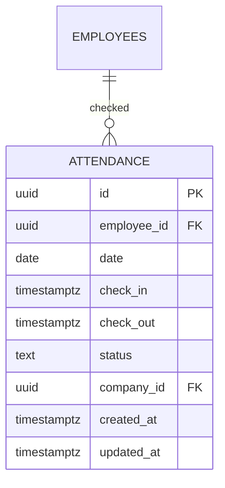

**Diagram sources**
- [20260324193000_erd_foundation_roles_salary_structure.sql:66-84](file://supabase/migrations/20260324193000_erd_foundation_roles_salary_structure.sql#L66-L84)
- [20260325170000_tenant_rls_ops_finance_tables.sql:37-112](file://supabase/migrations/20260325170000_tenant_rls_ops_finance_tables.sql#L37-L112)

**Section sources**
- [20260324193000_erd_foundation_roles_salary_structure.sql:66-84](file://supabase/migrations/20260324193000_erd_foundation_roles_salary_structure.sql#L66-L84)
- [20260325170000_tenant_rls_ops_finance_tables.sql:37-112](file://supabase/migrations/20260325170000_tenant_rls_ops_finance_tables.sql#L37-L112)

### Apps
- Purpose: Represent platforms or apps employees work on
- Attributes: id, name, is_archived, company_id
- RLS: Tenant-scoped SELECT/ALL with appropriate roles

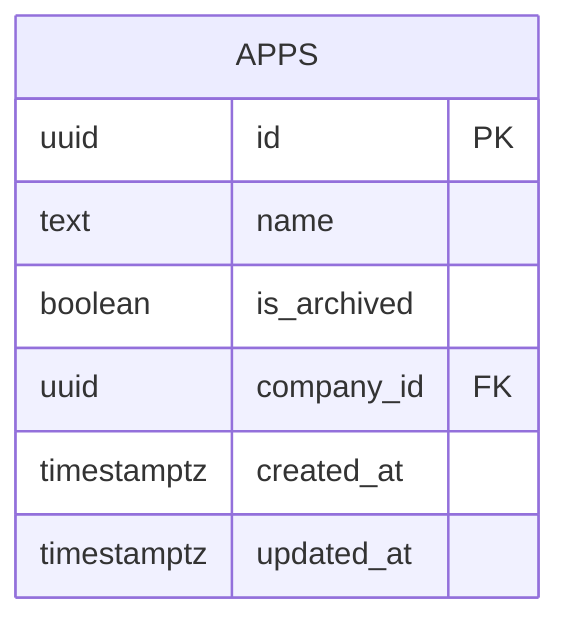

**Diagram sources**
- [20260325181500_company_id_rollout_remaining_tables.sql:158-163](file://supabase/migrations/20260325181500_company_id_rollout_remaining_tables.sql#L158-L163)

**Section sources**
- [20260325181500_company_id_rollout_remaining_tables.sql:158-163](file://supabase/migrations/20260325181500_company_id_rollout_remaining_tables.sql#L158-L163)

### Vehicles
- Purpose: Fleet management including assignments, mileage, and maintenance
- Attributes: vehicles, assignments, mileage, daily mileage, maintenance logs
- RLS: Tenant-scoped SELECT/ALL with operations/finance roles

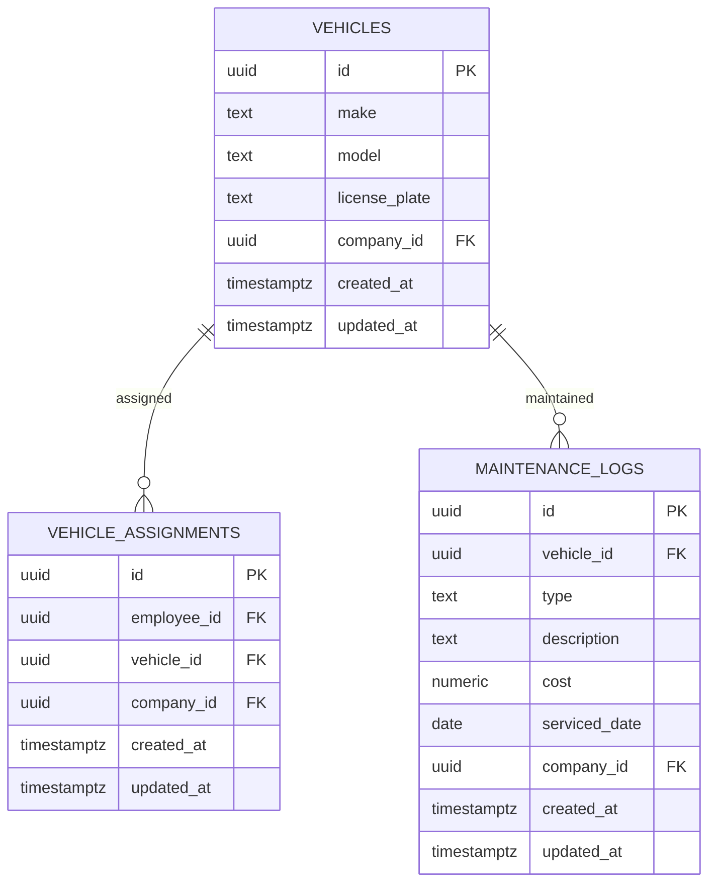

**Diagram sources**
- [20260325181500_company_id_rollout_remaining_tables.sql:97-109](file://supabase/migrations/20260325181500_company_id_rollout_remaining_tables.sql#L97-L109)
- [20260325181500_company_id_rollout_remaining_tables.sql:104-109](file://supabase/migrations/20260325181500_company_id_rollout_remaining_tables.sql#L104-L109)

**Section sources**
- [20260325181500_company_id_rollout_remaining_tables.sql:97-109](file://supabase/migrations/20260325181500_company_id_rollout_remaining_tables.sql#L97-L109)

### Alerts
- Purpose: Operational and compliance notifications
- Attributes: entity_type, entity_id, severity, message, resolved_by, company_id
- RLS: Tenant-scoped SELECT/ALL with viewer/operations roles

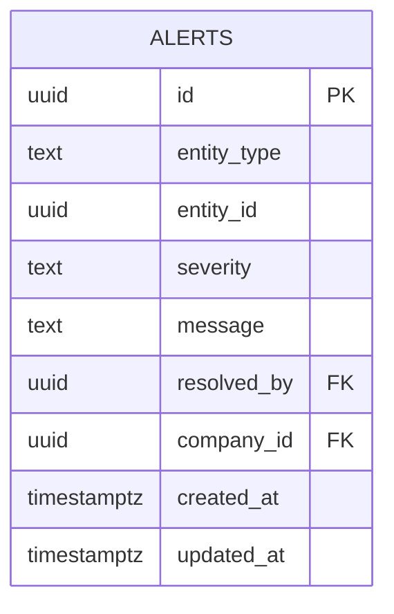

**Diagram sources**
- [20260325181500_company_id_rollout_remaining_tables.sql:172-185](file://supabase/migrations/20260325181500_company_id_rollout_remaining_tables.sql#L172-L185)

**Section sources**
- [20260325181500_company_id_rollout_remaining_tables.sql:172-185](file://supabase/migrations/20260325181500_company_id_rollout_remaining_tables.sql#L172-L185)

### User Management
- Roles and Permissions
  - Roles table defines titles and permissions
  - Permissions matrix seeded per role
- Profiles and User Roles
  - Profiles link to company_id via JWT defaults
  - user_roles table maps users to roles
- Audit Logging
  - audit_log captures administrative actions

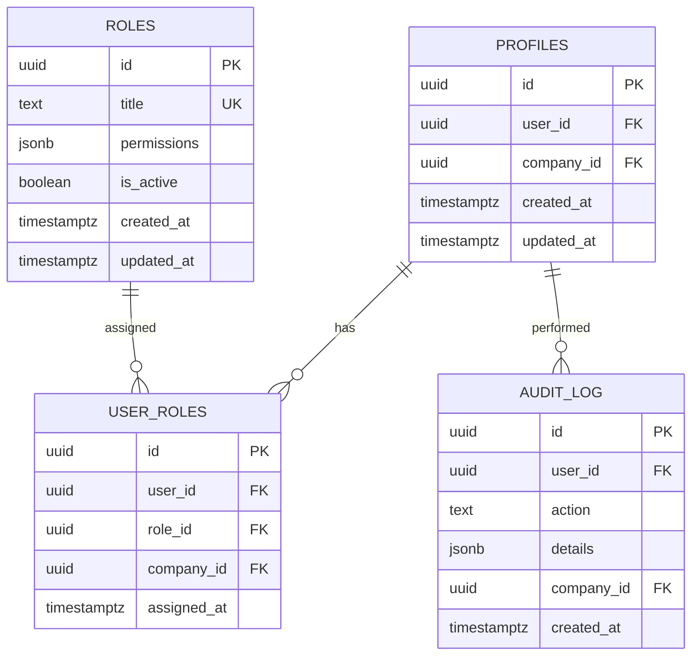

**Diagram sources**
- [20260324213000_seed_roles_permissions_matrix.sql:1-79](file://supabase/migrations/20260324213000_seed_roles_permissions_matrix.sql#L1-L79)
- [20260325174500_add_company_id_to_operational_tables.sql:8-80](file://supabase/migrations/20260325174500_add_company_id_to_operational_tables.sql#L8-L80)
- [20260325181500_company_id_rollout_remaining_tables.sql:194-199](file://supabase/migrations/20260325181500_company_id_rollout_remaining_tables.sql#L194-L199)

**Section sources**
- [20260324213000_seed_roles_permissions_matrix.sql:1-79](file://supabase/migrations/20260324213000_seed_roles_permissions_matrix.sql#L1-L79)
- [20260325174500_add_company_id_to_operational_tables.sql:8-80](file://supabase/migrations/20260325174500_add_company_id_to_operational_tables.sql#L8-L80)
- [20260325181500_company_id_rollout_remaining_tables.sql:194-199](file://supabase/migrations/20260325181500_company_id_rollout_remaining_tables.sql#L194-L199)

### Salary Engine RPC Workflow
The salary engine orchestrates secure, tenant-aware calculations via an edge function that invokes DB RPCs.

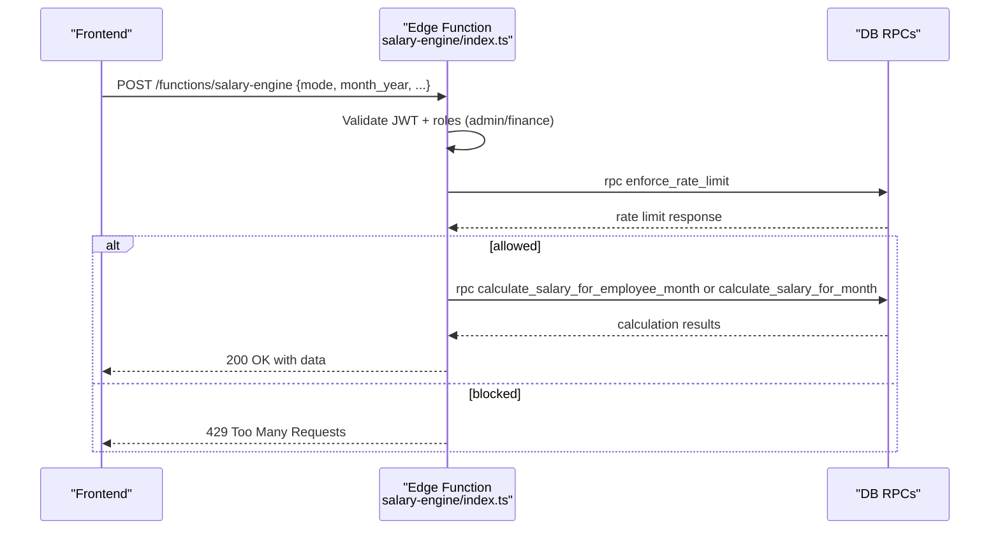

**Diagram sources**
- [salary-engine/index.ts:43-217](file://supabase/functions/salary-engine/index.ts#L43-L217)
- [20260324200000_salary_engine_rpc.sql:31-231](file://supabase/migrations/20260324200000_salary_engine_rpc.sql#L31-L231)
- [20260325190000_salary_engine_tenant_secure.sql:7-228](file://supabase/migrations/20260325190000_salary_engine_tenant_secure.sql#L7-L228)

**Section sources**
- [salary-engine/index.ts:43-217](file://supabase/functions/salary-engine/index.ts#L43-L217)
- [20260324200000_salary_engine_rpc.sql:31-231](file://supabase/migrations/20260324200000_salary_engine_rpc.sql#L31-L231)
- [20260325190000_salary_engine_tenant_secure.sql:7-228](file://supabase/migrations/20260325190000_salary_engine_tenant_secure.sql#L7-L228)

### Tenant Isolation and RLS
- Tenant Key: company_id derived from JWT claims
- Policies:
  - Employees: SELECT/INSERT/UPDATE/DELETE scoped by company_id and role
  - Operations/Finance tables: SELECT/ALL scoped by company_id and role
  - Salary engine: restricted to service_role via edge function
- Integrity Assertions:
  - Non-null company_id enforced on core tables
  - Cross-table linkage integrity validated (e.g., advances → employees → company_id)

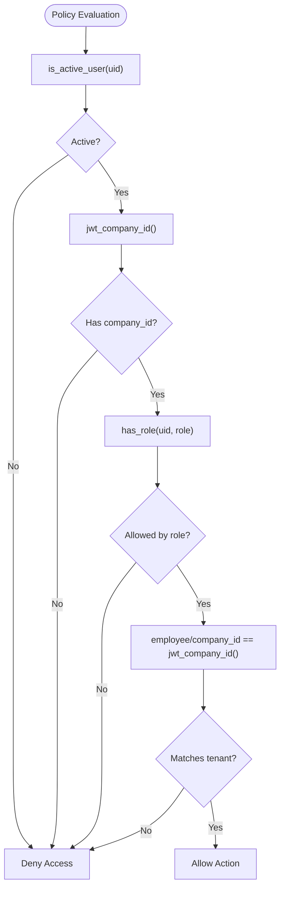

**Diagram sources**
- [20260325153000_employees_tenant_rls_hardening.sql:46-110](file://supabase/migrations/20260325153000_employees_tenant_rls_hardening.sql#L46-L110)
- [20260325170000_tenant_rls_ops_finance_tables.sql:52-337](file://supabase/migrations/20260325170000_tenant_rls_ops_finance_tables.sql#L52-L337)
- [20260325173000_tenant_integrity_assertions_and_not_null.sql:9-108](file://supabase/migrations/20260325173000_tenant_integrity_assertions_and_not_null.sql#L9-L108)

**Section sources**
- [20260325153000_employees_tenant_rls_hardening.sql:46-110](file://supabase/migrations/20260325153000_employees_tenant_rls_hardening.sql#L46-L110)
- [20260325170000_tenant_rls_ops_finance_tables.sql:52-337](file://supabase/migrations/20260325170000_tenant_rls_ops_finance_tables.sql#L52-L337)
- [20260325173000_tenant_integrity_assertions_and_not_null.sql:9-108](file://supabase/migrations/20260325173000_tenant_integrity_assertions_and_not_null.sql#L9-L108)

## Dependency Analysis
- Schema Dependencies
  - company_id added to operational tables and backfilled from owning entities
  - Triggers and sync functions maintain company_id consistency
  - RLS policies depend on helper functions (e.g., jwt_company_id, has_role)
- Edge Function Dependencies
  - salary-engine invokes DB RPCs and enforces rate limits
  - Requires service_role to execute DB functions securely

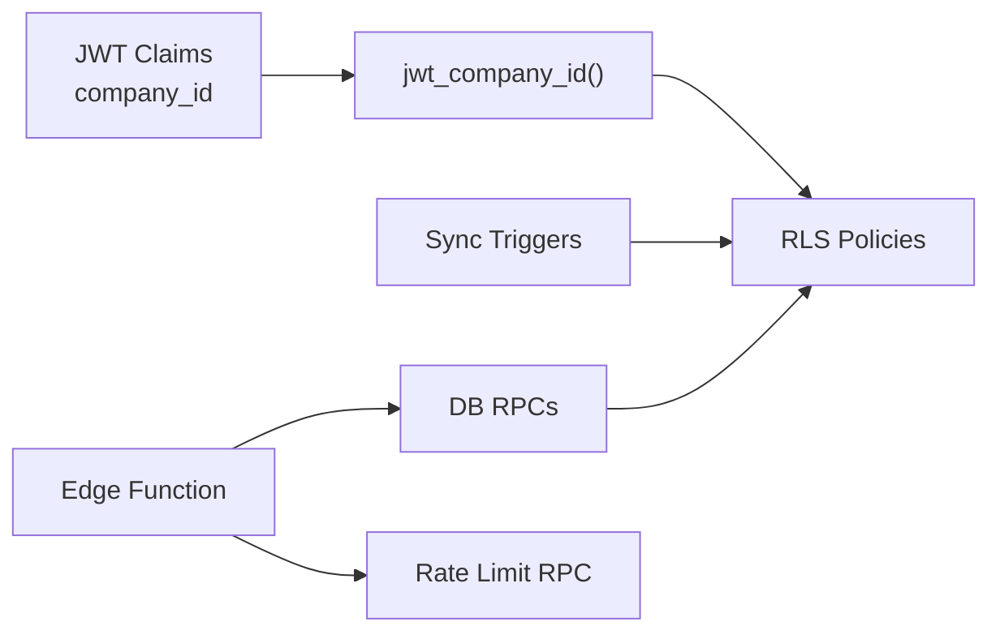

**Diagram sources**
- [20260325174500_add_company_id_to_operational_tables.sql:178-303](file://supabase/migrations/20260325174500_add_company_id_to_operational_tables.sql#L178-L303)
- [20260324200000_salary_engine_rpc.sql:31-231](file://supabase/migrations/20260324200000_salary_engine_rpc.sql#L31-L231)
- [salary-engine/index.ts:88-176](file://supabase/functions/salary-engine/index.ts#L88-L176)

**Section sources**
- [20260325174500_add_company_id_to_operational_tables.sql:178-303](file://supabase/migrations/20260325174500_add_company_id_to_operational_tables.sql#L178-L303)
- [20260324200000_salary_engine_rpc.sql:31-231](file://supabase/migrations/20260324200000_salary_engine_rpc.sql#L31-L231)
- [salary-engine/index.ts:88-176](file://supabase/functions/salary-engine/index.ts#L88-L176)

## Performance Considerations
- Indexes
  - Composite indexes on (employee_id, date) for daily_orders and attendance
  - Status and app/date indexes for filtering and reporting
- Realtime
  - Tables added to supabase_realtime publication for low-latency reads
- Stored Procedures
  - Month-level aggregation reduces per-query overhead
- Rate Limiting
  - Edge function enforces per-user rate limits for RPCs

**Section sources**
- [20260324193000_erd_foundation_roles_salary_structure.sql:59-84](file://supabase/migrations/20260324193000_erd_foundation_roles_salary_structure.sql#L59-L84)
- [20260324120000_dashboard_alerts_realtime_publication.sql:9-19](file://supabase/migrations/20260324120000_dashboard_alerts_realtime_publication.sql#L9-L19)
- [salary-engine/index.ts:94-118](file://supabase/functions/salary-engine/index.ts#L94-L118)

## Troubleshooting Guide
- Common Issues
  - Missing company_id in JWT: Salary engine raises exception
  - Cross-tenant linkage mismatch: Integrity assertions raise exceptions
  - Permission Denied on tenant-scoped tables: Verify role and tenant alignment
- Validation Steps
  - Run tenant RLS smoke tests after deployment
  - Confirm policies cover scoped tables and helper functions exist
- Recovery
  - Restore from DB backup if critical errors occur during rollout
  - Re-run validation checks before returning to production traffic

**Section sources**
- [20260325190000_salary_engine_tenant_secure.sql:42-55](file://supabase/migrations/20260325190000_salary_engine_tenant_secure.sql#L42-L55)
- [20260325173000_tenant_integrity_assertions_and_not_null.sql:9-108](file://supabase/migrations/20260325173000_tenant_integrity_assertions_and_not_null.sql#L9-L108)
- [TENANT_RLS_ROLLOUT_CHECKLIST.md:30-68](file://supabase/TENANT_RLS_ROLLOUT_CHECKLIST.md#L30-L68)

## Conclusion
The MuhimmatAltawseel database implements a robust, tenant-aware schema with strong RLS policies, comprehensive indexing, and secure RPC execution via edge functions. The migration sequence establishes company_id as the canonical tenant key, enforces integrity across related tables, and hardens access controls for payroll, attendance, orders, and fleet operations. Realtime publication and audit logging support responsive dashboards and compliance needs.

## Appendices

### Migration Patterns
- Phased rollout with tenant hardening and integrity checks
- Idempotent additions with backfills and FK constraints
- Policy cleanup and redefinition for consistent coverage

**Section sources**
- [20260325153000_employees_tenant_rls_hardening.sql:1-111](file://supabase/migrations/20260325153000_employees_tenant_rls_hardening.sql#L1-L111)
- [20260325170000_tenant_rls_ops_finance_tables.sql:1-338](file://supabase/migrations/20260325170000_tenant_rls_ops_finance_tables.sql#L1-L338)
- [20260325173000_tenant_integrity_assertions_and_not_null.sql:1-119](file://supabase/migrations/20260325173000_tenant_integrity_assertions_and_not_null.sql#L1-L119)
- [20260325174500_add_company_id_to_operational_tables.sql:1-549](file://supabase/migrations/20260325174500_add_company_id_to_operational_tables.sql#L1-L549)
- [20260325181500_company_id_rollout_remaining_tables.sql:1-319](file://supabase/migrations/20260325181500_company_id_rollout_remaining_tables.sql#L1-L319)

### Edge Function Integrations
- Validates caller roles and enforces rate limits
- Invokes DB RPCs for salary calculations and previews
- Returns structured responses with CORS headers

**Section sources**
- [salary-engine/index.ts:43-217](file://supabase/functions/salary-engine/index.ts#L43-L217)

### PostgreSQL RPC Implementations
- calc_tier_salary: piecewise tier computation
- calculate_salary_for_employee_month: tenant-aware monthly calculation
- calculate_salary_for_month: batch calculation for active employees

**Section sources**
- [20260324200000_salary_engine_rpc.sql:9-231](file://supabase/migrations/20260324200000_salary_engine_rpc.sql#L9-L231)
- [20260325190000_salary_engine_tenant_secure.sql:7-228](file://supabase/migrations/20260325190000_salary_engine_tenant_secure.sql#L7-L228)

### Data Validation Rules and Business Constraints
- Enum constraints on status fields
- Check constraints for temporal ordering (check_in/check_out)
- Non-null company_id on operational tables
- Cross-table linkage integrity assertions

**Section sources**
- [20260324193000_erd_foundation_roles_salary_structure.sql:52-106](file://supabase/migrations/20260324193000_erd_foundation_roles_salary_structure.sql#L52-L106)
- [20260324193000_erd_foundation_roles_salary_structure.sql:66-78](file://supabase/migrations/20260324193000_erd_foundation_roles_salary_structure.sql#L66-L78)
- [20260325173000_tenant_integrity_assertions_and_not_null.sql:9-108](file://supabase/migrations/20260325173000_tenant_integrity_assertions_and_not_null.sql#L9-L108)

### Audit Logging Mechanisms
- audit_log captures user actions with company_id scoping
- Used for compliance and operational oversight

**Section sources**
- [20260325181500_company_id_rollout_remaining_tables.sql:194-199](file://supabase/migrations/20260325181500_company_id_rollout_remaining_tables.sql#L194-L199)

### Data Lifecycle Management, Performance Optimization, and Backup Procedures
- Lifecycle
  - Monthly salary calculation and approval workflows
  - Locked months to prevent retroactive changes
- Performance
  - Strategic indexes and monthly aggregation RPCs
  - Realtime publication for frequently accessed tables
- Backups
  - Full DB backup prior to deployment
  - Snapshot-based rollback capability

**Section sources**
- [20260325181500_company_id_rollout_remaining_tables.sql:187-192](file://supabase/migrations/20260325181500_company_id_rollout_remaining_tables.sql#L187-L192)
- [20260324120000_dashboard_alerts_realtime_publication.sql:9-19](file://supabase/migrations/20260324120000_dashboard_alerts_realtime_publication.sql#L9-L19)
- [TENANT_RLS_ROLLOUT_CHECKLIST.md:5-6](file://supabase/TENANT_RLS_ROLLOUT_CHECKLIST.md#L5-L6)