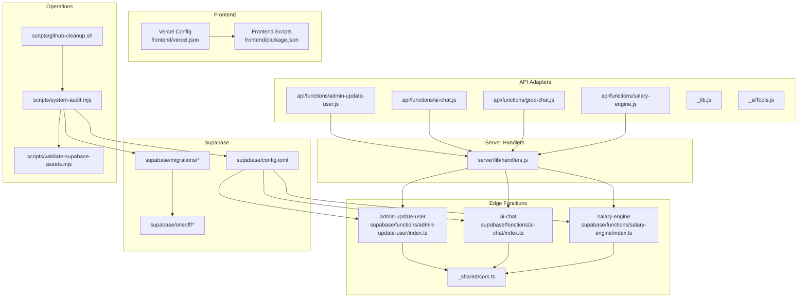
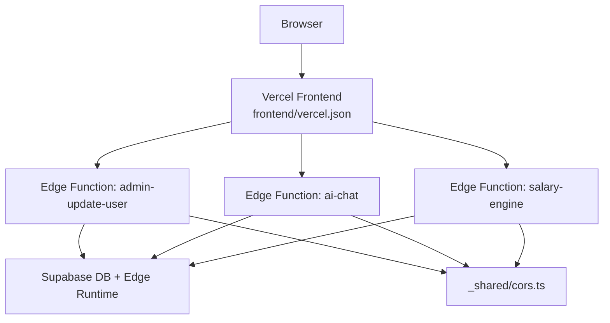
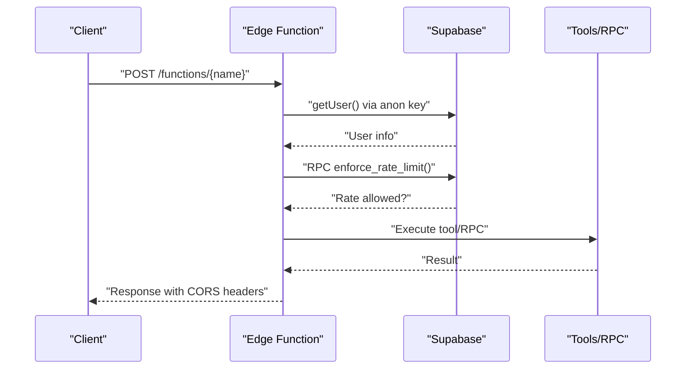
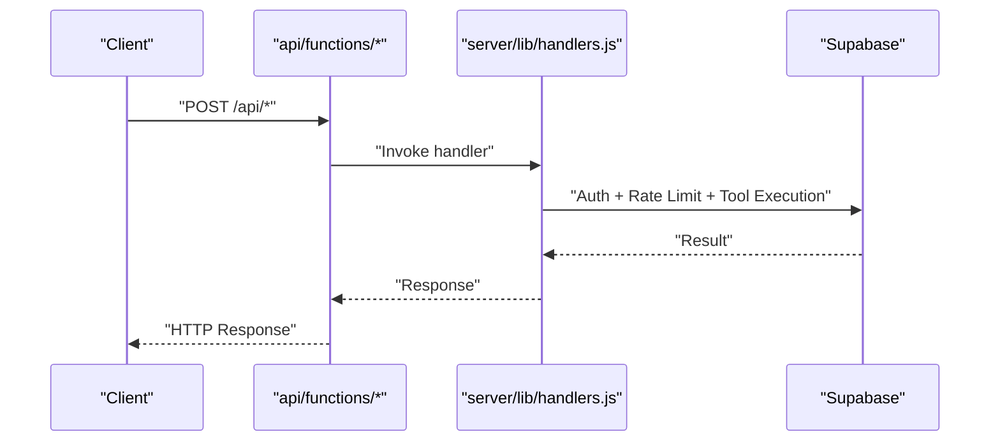
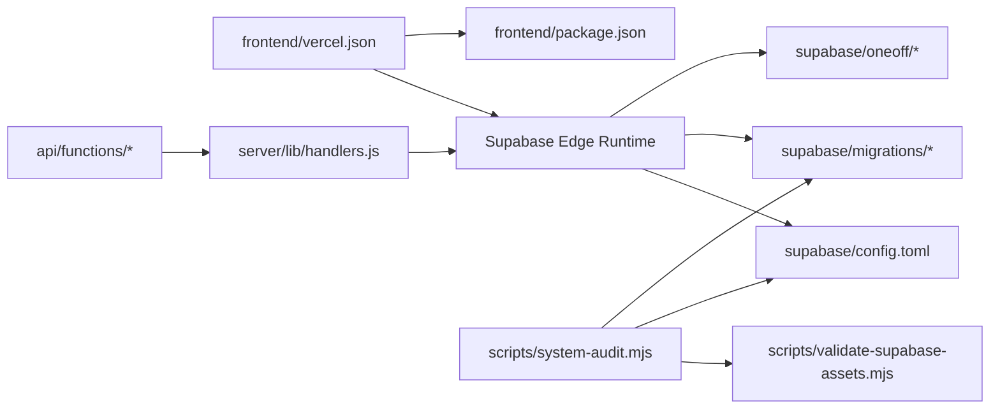

# Deployment & Operations

<cite>
**Referenced Files in This Document**
- [vercel.json](file://vercel.json)
- [frontend/vercel.json](file://frontend/vercel.json)
- [frontend/package.json](file://frontend/package.json)
- [package.json](file://package.json)
- [supabase/config.toml](file://supabase/config.toml)
- [scripts/system-audit.mjs](file://scripts/system-audit.mjs)
- [scripts/github-cleanup.sh](file://scripts/github-cleanup.sh)
- [scripts/validate-supabase-assets.mjs](file://scripts/validate-supabase-assets.mjs)
- [supabase/functions/_shared/cors.ts](file://supabase/functions/_shared/cors.ts)
- [supabase/functions/admin-update-user/index.ts](file://supabase/functions/admin-update-user/index.ts)
- [supabase/functions/ai-chat/index.ts](file://supabase/functions/ai-chat/index.ts)
- [supabase/functions/salary-engine/index.ts](file://supabase/functions/salary-engine/index.ts)
- [api/functions/admin-update-user.js](file://api/functions/admin-update-user.js)
- [api/functions/ai-chat.js](file://api/functions/ai-chat.js)
- [api/functions/groq-chat.js](file://api/functions/groq-chat.js)
- [api/functions/salary-engine.js](file://api/functions/salary-engine.js)
- [api/_lib.js](file://api/_lib.js)
- [api/_aiTools.js](file://api/_aiTools.js)
- [server/lib/handlers.js](file://server/lib/handlers.js)
- [supabase/TENANT_RLS_ROLLOUT_CHECKLIST.md](file://supabase/TENANT_RLS_ROLLOUT_CHECKLIST.md)
- [supabase/oneoff/tenant_rls_smoke_tests.sql](file://supabase/oneoff/tenant_rls_smoke_tests.sql)
- [supabase/oneoff/phase_1_5_validation_checks.sql](file://supabase/oneoff/phase_1_5_validation_checks.sql)
- [supabase/oneoff/maintenance_system_tests.sql](file://supabase/oneoff/maintenance_system_tests.sql)
</cite>

## Table of Contents
1. [Introduction](#introduction)
2. [Project Structure](#project-structure)
3. [Core Components](#core-components)
4. [Architecture Overview](#architecture-overview)
5. [Detailed Component Analysis](#detailed-component-analysis)
6. [Dependency Analysis](#dependency-analysis)
7. [Performance Considerations](#performance-considerations)
8. [Troubleshooting Guide](#troubleshooting-guide)
9. [Conclusion](#conclusion)
10. [Appendices](#appendices)

## Introduction
This document provides comprehensive deployment and operations guidance for MuhimmatAltawseel. It covers the frontend deployment pipeline on Vercel, Supabase Edge Functions deployment, database migration procedures, CI/CD workflow considerations, environment configuration, release management, production deployment strategy, rollback procedures, monitoring setup, infrastructure requirements, scaling considerations, maintenance procedures, troubleshooting, performance monitoring, operational best practices, system audit tools, cleanup scripts, and maintenance automation.

## Project Structure
The project is organized into:
- Frontend application under the frontend directory, built with Vite and deployed via Vercel.
- Supabase Edge Functions under supabase/functions/, implementing admin actions, AI chat, and salary engine logic.
- API adapters under api/functions/ that proxy to server-side handlers.
- Server-side handlers under server/lib/handlers.js.
- Supabase database migrations and one-off validation scripts under supabase/migrations and supabase/oneoff.
- Operational scripts for system audits and repository cleanup under scripts/.

**Diagram sources**
- [frontend/vercel.json:1-36](file://frontend/vercel.json#L1-L36)
- [frontend/package.json:1-103](file://frontend/package.json#L1-L103)
- [supabase/functions/admin-update-user/index.ts:1-272](file://supabase/functions/admin-update-user/index.ts#L1-L272)
- [supabase/functions/ai-chat/index.ts:1-890](file://supabase/functions/ai-chat/index.ts#L1-L890)
- [supabase/functions/salary-engine/index.ts:1-218](file://supabase/functions/salary-engine/index.ts#L1-L218)
- [supabase/functions/_shared/cors.ts](file://supabase/functions/_shared/cors.ts)
- [api/functions/admin-update-user.js:1-9](file://api/functions/admin-update-user.js#L1-L9)
- [api/functions/ai-chat.js:1-9](file://api/functions/ai-chat.js#L1-L9)
- [api/functions/groq-chat.js:1-9](file://api/functions/groq-chat.js#L1-L9)
- [api/functions/salary-engine.js:1-9](file://api/functions/salary-engine.js#L1-L9)
- [api/_lib.js](file://api/_lib.js)
- [api/_aiTools.js](file://api/_aiTools.js)
- [server/lib/handlers.js](file://server/lib/handlers.js)
- [supabase/config.toml:1-2](file://supabase/config.toml#L1-L2)
- [supabase/migrations](file://supabase/migrations)
- [supabase/oneoff](file://supabase/oneoff)
- [scripts/system-audit.mjs:1-127](file://scripts/system-audit.mjs#L1-L127)
- [scripts/github-cleanup.sh:1-78](file://scripts/github-cleanup.sh#L1-L78)
- [scripts/validate-supabase-assets.mjs:1-121](file://scripts/validate-supabase-assets.mjs#L1-L121)

**Section sources**
- [frontend/vercel.json:1-36](file://frontend/vercel.json#L1-L36)
- [frontend/package.json:1-103](file://frontend/package.json#L1-L103)
- [supabase/config.toml:1-2](file://supabase/config.toml#L1-L2)
- [scripts/system-audit.mjs:1-127](file://scripts/system-audit.mjs#L1-L127)
- [scripts/github-cleanup.sh:1-78](file://scripts/github-cleanup.sh#L1-L78)
- [scripts/validate-supabase-assets.mjs:1-121](file://scripts/validate-supabase-assets.mjs#L1-L121)

## Core Components
- Frontend deployment configuration and caching headers for Vercel.
- Supabase Edge Functions for admin user updates, AI chat, and salary engine calculations.
- API adapter functions that route requests to server-side handlers.
- Server-side handlers orchestrating Supabase client interactions, rate limiting, and tool execution.
- Supabase migrations and one-off validation scripts ensuring data integrity and RLS rollout.
- Operational scripts for system audits, Supabase asset validation, and repository cleanup.

**Section sources**
- [frontend/vercel.json:1-36](file://frontend/vercel.json#L1-L36)
- [supabase/functions/admin-update-user/index.ts:1-272](file://supabase/functions/admin-update-user/index.ts#L1-L272)
- [supabase/functions/ai-chat/index.ts:1-890](file://supabase/functions/ai-chat/index.ts#L1-L890)
- [supabase/functions/salary-engine/index.ts:1-218](file://supabase/functions/salary-engine/index.ts#L1-L218)
- [api/functions/admin-update-user.js:1-9](file://api/functions/admin-update-user.js#L1-L9)
- [api/functions/ai-chat.js:1-9](file://api/functions/ai-chat.js#L1-L9)
- [api/functions/groq-chat.js:1-9](file://api/functions/groq-chat.js#L1-L9)
- [api/functions/salary-engine.js:1-9](file://api/functions/salary-engine.js#L1-L9)
- [server/lib/handlers.js](file://server/lib/handlers.js)
- [supabase/migrations](file://supabase/migrations)
- [supabase/oneoff](file://supabase/oneoff)
- [scripts/system-audit.mjs:1-127](file://scripts/system-audit.mjs#L1-L127)
- [scripts/validate-supabase-assets.mjs:1-121](file://scripts/validate-supabase-assets.mjs#L1-L121)

## Architecture Overview
The deployment architecture integrates Vercel-hosted frontend with Supabase Edge Functions and Supabase database. Requests flow from Vercel to Edge Functions, which enforce authentication, authorization, rate limits, and interact with Supabase services. API adapters under api/functions/ provide Node.js-based handlers that delegate to server-side logic.

**Diagram sources**
- [frontend/vercel.json:1-36](file://frontend/vercel.json#L1-L36)
- [supabase/functions/admin-update-user/index.ts:1-272](file://supabase/functions/admin-update-user/index.ts#L1-L272)
- [supabase/functions/ai-chat/index.ts:1-890](file://supabase/functions/ai-chat/index.ts#L1-L890)
- [supabase/functions/salary-engine/index.ts:1-218](file://supabase/functions/salary-engine/index.ts#L1-L218)
- [supabase/functions/_shared/cors.ts](file://supabase/functions/_shared/cors.ts)

## Detailed Component Analysis

### Frontend Deployment on Vercel
- Build framework is Vite; build command runs in the frontend directory.
- Output directory is frontend/dist.
- Routes prioritize filesystem and SPA fallback to index.html.
- Security headers include CSP, X-Frame-Options, and cache-control policies.
- Environment variables are managed via Vercel project settings.

Operational notes:
- Ensure Vercel project settings define environment variables for Supabase and third-party integrations referenced by the frontend.
- Verify cache-control headers for static assets and HTML to balance freshness and performance.

**Section sources**
- [frontend/vercel.json:1-36](file://frontend/vercel.json#L1-L36)
- [frontend/package.json:1-103](file://frontend/package.json#L1-L103)

### Supabase Edge Functions
Edge Functions implement:
- Admin user management with role checks, rate limiting, and secure updates.
- AI chat with tool-permissions, role gating, and Groq integration.
- Salary engine with mode-specific calculations and rate limiting.

Key implementation patterns:
- Authentication and authorization checks using Supabase auth.
- Role-based access control enforced via database policies.
- Rate limiting via RPC calls to enforce_rate_limit.
- CORS handling via shared module.

**Diagram sources**
- [supabase/functions/admin-update-user/index.ts:1-272](file://supabase/functions/admin-update-user/index.ts#L1-L272)
- [supabase/functions/ai-chat/index.ts:1-890](file://supabase/functions/ai-chat/index.ts#L1-L890)
- [supabase/functions/salary-engine/index.ts:1-218](file://supabase/functions/salary-engine/index.ts#L1-L218)
- [supabase/functions/_shared/cors.ts](file://supabase/functions/_shared/cors.ts)

**Section sources**
- [supabase/functions/admin-update-user/index.ts:1-272](file://supabase/functions/admin-update-user/index.ts#L1-L272)
- [supabase/functions/ai-chat/index.ts:1-890](file://supabase/functions/ai-chat/index.ts#L1-L890)
- [supabase/functions/salary-engine/index.ts:1-218](file://supabase/functions/salary-engine/index.ts#L1-L218)
- [supabase/functions/_shared/cors.ts](file://supabase/functions/_shared/cors.ts)

### API Adapters and Server Handlers
- API adapters under api/functions/ forward POST requests to server-side handlers.
- Handlers orchestrate Supabase client initialization, rate limiting, and tool execution.
- Shared libraries provide request validation and AI tool definitions.

**Diagram sources**
- [api/functions/admin-update-user.js:1-9](file://api/functions/admin-update-user.js#L1-L9)
- [api/functions/ai-chat.js:1-9](file://api/functions/ai-chat.js#L1-L9)
- [api/functions/groq-chat.js:1-9](file://api/functions/groq-chat.js#L1-L9)
- [api/functions/salary-engine.js:1-9](file://api/functions/salary-engine.js#L1-L9)
- [api/_lib.js](file://api/_lib.js)
- [api/_aiTools.js](file://api/_aiTools.js)
- [server/lib/handlers.js](file://server/lib/handlers.js)

**Section sources**
- [api/functions/admin-update-user.js:1-9](file://api/functions/admin-update-user.js#L1-L9)
- [api/functions/ai-chat.js:1-9](file://api/functions/ai-chat.js#L1-L9)
- [api/functions/groq-chat.js:1-9](file://api/functions/groq-chat.js#L1-L9)
- [api/functions/salary-engine.js:1-9](file://api/functions/salary-engine.js#L1-L9)
- [api/_lib.js](file://api/_lib.js)
- [api/_aiTools.js](file://api/_aiTools.js)
- [server/lib/handlers.js](file://server/lib/handlers.js)

### Database Migration Procedures
- Migrations are stored under supabase/migrations with numbered filenames indicating chronological order.
- One-off validation scripts ensure RLS rollout completeness and system health.
- Supabase project ID is defined in supabase/config.toml.

Recommended procedure:
- Review migration history and checksums before applying.
- Apply migrations in order; verify each step with validation scripts.
- Use oneoff validation scripts for smoke tests during pre-deployment verification.

**Section sources**
- [supabase/config.toml:1-2](file://supabase/config.toml#L1-L2)
- [supabase/migrations](file://supabase/migrations)
- [supabase/oneoff/tenant_rls_smoke_tests.sql](file://supabase/oneoff/tenant_rls_smoke_tests.sql)
- [supabase/oneoff/phase_1_5_validation_checks.sql](file://supabase/oneoff/phase_1_5_validation_checks.sql)
- [supabase/oneoff/maintenance_system_tests.sql](file://supabase/oneoff/maintenance_system_tests.sql)

### CI/CD Workflow and Release Management
- The repository does not include GitHub Actions workflows in the provided structure.
- Recommended approach:
  - Trigger builds on pull requests and main branch pushes.
  - Run frontend verification (lint, test, build) and backend smoke tests.
  - Validate Supabase assets and migrations prior to deployment.
  - Deploy frontend to Vercel and deploy Supabase Edge Functions via Supabase CLI.
  - Apply database migrations after validating with oneoff scripts.

[No sources needed since this section provides general guidance]

### Production Deployment Strategy
- Frontend: Deploy the built bundle to Vercel using the frontend/vercel.json configuration.
- Edge Functions: Deploy Supabase Edge Functions using the Supabase CLI with environment variables configured.
- Database: Apply migrations sequentially; run oneoff validation scripts post-migration.
- API Adapters: Keep Node.js adapters aligned with server-side handlers; redeploy when logic changes.

**Section sources**
- [frontend/vercel.json:1-36](file://frontend/vercel.json#L1-L36)
- [supabase/functions/admin-update-user/index.ts:1-272](file://supabase/functions/admin-update-user/index.ts#L1-L272)
- [supabase/functions/ai-chat/index.ts:1-890](file://supabase/functions/ai-chat/index.ts#L1-L890)
- [supabase/functions/salary-engine/index.ts:1-218](file://supabase/functions/salary-engine/index.ts#L1-L218)
- [supabase/migrations](file://supabase/migrations)
- [supabase/oneoff](file://supabase/oneoff)

### Rollback Procedures
- Frontend: Revert to the previous Vercel deployment using branch protection and preview behavior.
- Edge Functions: Revert to the previous function revision using Supabase CLI or dashboard.
- Database: Use reverse migrations or point-in-time recovery if supported by the Supabase environment.

[No sources needed since this section provides general guidance]

### Monitoring Setup
- Frontend: Enable Vercel Analytics and Sentry for error tracking.
- Edge Functions: Monitor logs and metrics via Supabase dashboard; configure alerting for rate limit thresholds and error spikes.
- Database: Track migration status and RLS policy compliance; monitor query performance and long-running transactions.

**Section sources**
- [frontend/package.json:1-103](file://frontend/package.json#L1-L103)
- [supabase/functions/admin-update-user/index.ts:1-272](file://supabase/functions/admin-update-user/index.ts#L1-L272)
- [supabase/functions/ai-chat/index.ts:1-890](file://supabase/functions/ai-chat/index.ts#L1-L890)
- [supabase/functions/salary-engine/index.ts:1-218](file://supabase/functions/salary-engine/index.ts#L1-L218)

### Infrastructure Requirements
- Vercel project with configured environment variables for Supabase and Groq.
- Supabase project with Edge Functions enabled and configured environment variables.
- Node.js runtime for server-side handlers and scripts.
- Python for AI backend smoke tests when applicable.

**Section sources**
- [frontend/vercel.json:1-36](file://frontend/vercel.json#L1-L36)
- [supabase/functions/admin-update-user/index.ts:1-272](file://supabase/functions/admin-update-user/index.ts#L1-L272)
- [supabase/functions/ai-chat/index.ts:1-890](file://supabase/functions/ai-chat/index.ts#L1-L890)
- [supabase/functions/salary-engine/index.ts:1-218](file://supabase/functions/salary-engine/index.ts#L1-L218)
- [package.json:1-9](file://package.json#L1-L9)

### Scaling Considerations
- Frontend: Horizontal scaling via Vercel’s CDN and edge caching.
- Edge Functions: Scale automatically; consider cold start mitigation and rate limiting tuning.
- Database: Optimize queries, add indexes, and review RLS policies for performance.

[No sources needed since this section provides general guidance]

### Maintenance Procedures
- Regularly audit Supabase assets and migrations.
- Run oneoff validation scripts pre-deployment.
- Clean up stale branches and temporary files using repository cleanup scripts.

**Section sources**
- [scripts/system-audit.mjs:1-127](file://scripts/system-audit.mjs#L1-L127)
- [scripts/validate-supabase-assets.mjs:1-121](file://scripts/validate-supabase-assets.mjs#L1-L121)
- [scripts/github-cleanup.sh:1-78](file://scripts/github-cleanup.sh#L1-L78)
- [supabase/TENANT_RLS_ROLLOUT_CHECKLIST.md](file://supabase/TENANT_RLS_ROLLOUT_CHECKLIST.md)

### Operational Best Practices
- Enforce role-based access control and row-level security.
- Use rate limiting to protect APIs and prevent abuse.
- Maintain strict separation between service role and anonymous keys.
- Keep environment variables secret and rotate credentials regularly.

**Section sources**
- [supabase/functions/admin-update-user/index.ts:1-272](file://supabase/functions/admin-update-user/index.ts#L1-L272)
- [supabase/functions/ai-chat/index.ts:1-890](file://supabase/functions/ai-chat/index.ts#L1-L890)
- [supabase/functions/salary-engine/index.ts:1-218](file://supabase/functions/salary-engine/index.ts#L1-L218)

## Dependency Analysis
The system exhibits layered dependencies:
- Frontend depends on Vercel configuration and Supabase client libraries.
- Edge Functions depend on Supabase runtime, environment variables, and shared CORS utilities.
- API adapters depend on server-side handlers and shared libraries.
- Database migrations and oneoff scripts depend on Supabase project configuration.

**Diagram sources**
- [frontend/vercel.json:1-36](file://frontend/vercel.json#L1-L36)
- [frontend/package.json:1-103](file://frontend/package.json#L1-L103)
- [api/functions/admin-update-user.js:1-9](file://api/functions/admin-update-user.js#L1-L9)
- [api/functions/ai-chat.js:1-9](file://api/functions/ai-chat.js#L1-L9)
- [api/functions/groq-chat.js:1-9](file://api/functions/groq-chat.js#L1-L9)
- [api/functions/salary-engine.js:1-9](file://api/functions/salary-engine.js#L1-L9)
- [server/lib/handlers.js](file://server/lib/handlers.js)
- [supabase/config.toml:1-2](file://supabase/config.toml#L1-L2)
- [supabase/migrations](file://supabase/migrations)
- [supabase/oneoff](file://supabase/oneoff)
- [scripts/system-audit.mjs:1-127](file://scripts/system-audit.mjs#L1-L127)
- [scripts/validate-supabase-assets.mjs:1-121](file://scripts/validate-supabase-assets.mjs#L1-L121)

**Section sources**
- [frontend/vercel.json:1-36](file://frontend/vercel.json#L1-L36)
- [frontend/package.json:1-103](file://frontend/package.json#L1-L103)
- [api/functions/admin-update-user.js:1-9](file://api/functions/admin-update-user.js#L1-L9)
- [api/functions/ai-chat.js:1-9](file://api/functions/ai-chat.js#L1-L9)
- [api/functions/groq-chat.js:1-9](file://api/functions/groq-chat.js#L1-L9)
- [api/functions/salary-engine.js:1-9](file://api/functions/salary-engine.js#L1-L9)
- [server/lib/handlers.js](file://server/lib/handlers.js)
- [supabase/config.toml:1-2](file://supabase/config.toml#L1-L2)
- [supabase/migrations](file://supabase/migrations)
- [supabase/oneoff](file://supabase/oneoff)
- [scripts/system-audit.mjs:1-127](file://scripts/system-audit.mjs#L1-L127)
- [scripts/validate-supabase-assets.mjs:1-121](file://scripts/validate-supabase-assets.mjs#L1-L121)

## Performance Considerations
- Frontend: Leverage Vercel’s edge caching and immutable asset caching for static resources.
- Edge Functions: Minimize cold starts by keeping functions small and avoiding unnecessary dependencies; tune rate limits based on observed traffic.
- Database: Ensure proper indexing and avoid N+1 queries; monitor long-running transactions and adjust RLS policies for performance.

[No sources needed since this section provides general guidance]

## Troubleshooting Guide
Common areas to investigate:
- Frontend build failures: Verify Vite build commands and environment variables in Vercel.
- Edge Function errors: Check Supabase logs for authentication failures, rate limit errors, and tool execution errors.
- Database migration issues: Confirm migration order and run oneoff validation scripts to isolate problems.
- Repository cleanup: Use the cleanup script to remove stale branches and untracked temporary files.

**Section sources**
- [frontend/vercel.json:1-36](file://frontend/vercel.json#L1-L36)
- [supabase/functions/admin-update-user/index.ts:1-272](file://supabase/functions/admin-update-user/index.ts#L1-L272)
- [supabase/functions/ai-chat/index.ts:1-890](file://supabase/functions/ai-chat/index.ts#L1-L890)
- [supabase/functions/salary-engine/index.ts:1-218](file://supabase/functions/salary-engine/index.ts#L1-L218)
- [scripts/github-cleanup.sh:1-78](file://scripts/github-cleanup.sh#L1-L78)

## Conclusion
MuhimmatAltawseel’s deployment and operations rely on a robust integration between Vercel-hosted frontend, Supabase Edge Functions, and Supabase database. By following the documented deployment pipeline, environment configuration, CI/CD recommendations, and operational best practices—combined with the provided audit and cleanup scripts—you can achieve reliable, scalable, and maintainable operations across environments.

[No sources needed since this section summarizes without analyzing specific files]

## Appendices

### Appendix A: Environment Variables Reference
- SUPABASE_URL: Supabase project URL.
- SUPABASE_ANON_KEY: Supabase anonymous API key.
- SUPABASE_SERVICE_ROLE_KEY: Supabase service role key for privileged operations.
- GROQ_API_KEY: API key for Groq chat completions.

**Section sources**
- [supabase/functions/admin-update-user/index.ts:45-54](file://supabase/functions/admin-update-user/index.ts#L45-L54)
- [supabase/functions/ai-chat/index.ts:741-761](file://supabase/functions/ai-chat/index.ts#L741-L761)
- [supabase/functions/salary-engine/index.ts:35-41](file://supabase/functions/salary-engine/index.ts#L35-L41)

### Appendix B: Supabase Asset Validation
- Validates presence and content of required Edge Functions and migrations.
- Ensures project configuration is present and not empty.

**Section sources**
- [scripts/validate-supabase-assets.mjs:1-121](file://scripts/validate-supabase-assets.mjs#L1-L121)

### Appendix C: System Audit Script
- Runs frontend verification, optional AI backend smoke tests, and optional Supabase SQL smoke tests.
- Supports skipping components and strict frontend checks.

**Section sources**
- [scripts/system-audit.mjs:1-127](file://scripts/system-audit.mjs#L1-L127)