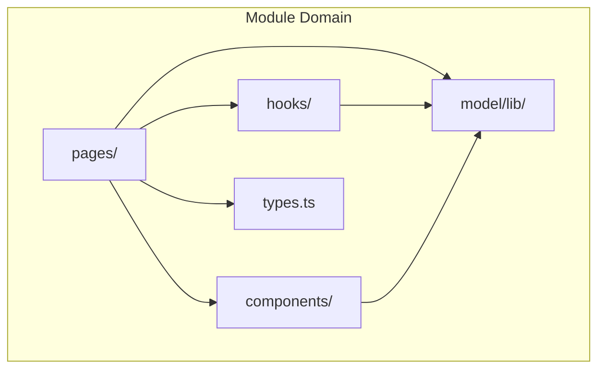
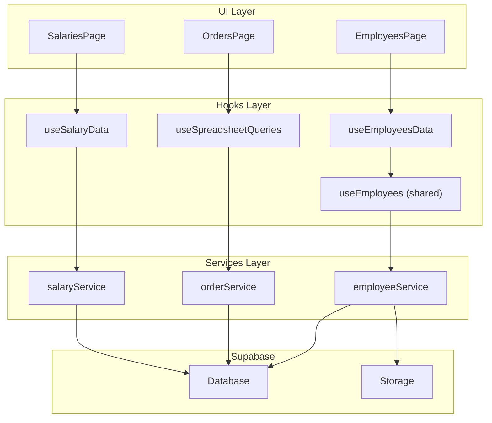
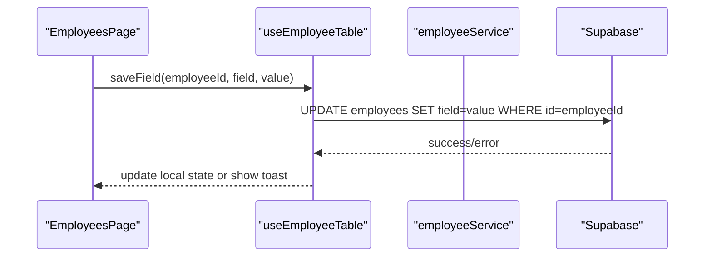
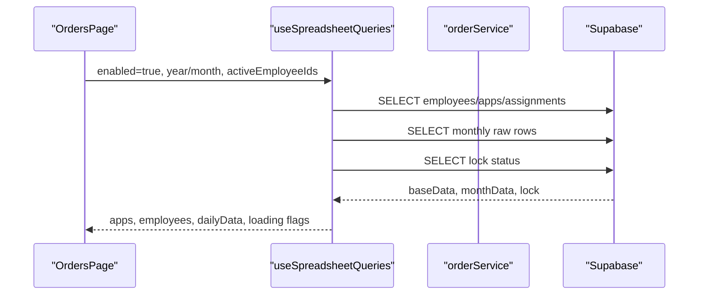
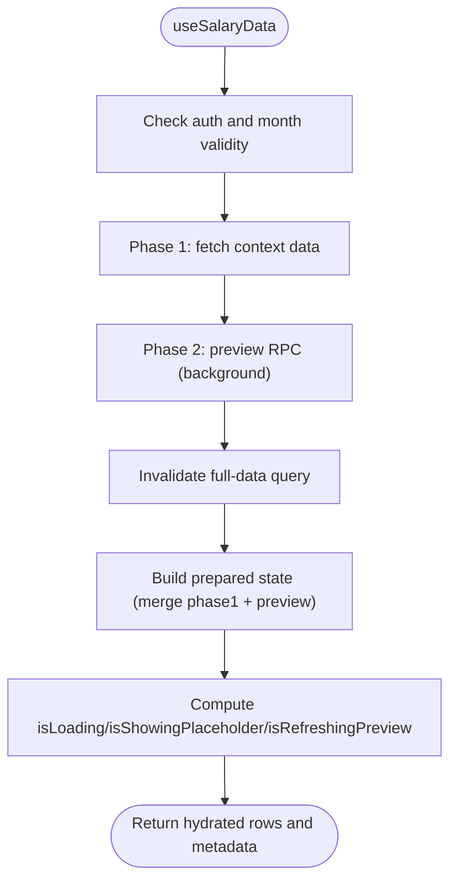
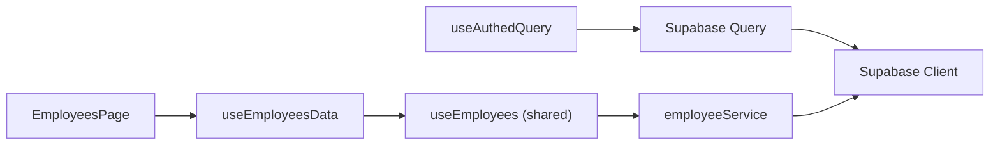

# Feature Modules

<cite>
**Referenced Files in This Document**
- [modules/README.md](file://frontend/modules/README.md)
- [EmployeesPage.tsx](file://frontend/modules/employees/pages/EmployeesPage.tsx)
- [useEmployees.ts](file://frontend/modules/employees/hooks/useEmployees.ts)
- [employee.types.ts](file://frontend/modules/employees/types/employee.types.ts)
- [OrdersPage.tsx](file://frontend/modules/orders/pages/OrdersPage.tsx)
- [useSpreadsheetQueries.ts](file://frontend/modules/orders/hooks/useSpreadsheetQueries.ts)
- [SalariesPage.tsx](file://frontend/modules/salaries/pages/SalariesPage.tsx)
- [useSalaryData.ts](file://frontend/modules/salaries/hooks/useSalaryData.ts)
- [DashboardPage.tsx](file://frontend/modules/dashboard/pages/DashboardPage.tsx)
- [employeeService.ts](file://frontend/services/employeeService.ts)
- [useEmployees.ts](file://frontend/shared/hooks/useEmployees.ts)
- [useAuthedQuery.ts](file://frontend/shared/hooks/useAuthedQuery.ts)
- [client.ts](file://frontend/services/supabase/client.ts)
- [EmployeeTable.tsx](file://frontend/modules/employees/components/EmployeeTable.tsx)
- [useEmployeeTable.ts](file://frontend/modules/employees/hooks/useEmployeeTable.ts)
- [employeeUtils.ts](file://frontend/modules/employees/model/employeeUtils.ts)
</cite>

## Table of Contents
1. [Introduction](#introduction)
2. [Project Structure](#project-structure)
3. [Core Components](#core-components)
4. [Architecture Overview](#architecture-overview)
5. [Detailed Component Analysis](#detailed-component-analysis)
6. [Dependency Analysis](#dependency-analysis)
7. [Performance Considerations](#performance-considerations)
8. [Troubleshooting Guide](#troubleshooting-guide)
9. [Conclusion](#conclusion)

## Introduction
This document explains MuhimmatAltawseel’s feature module system. Each feature follows a consistent structure:
- pages/: top-level page component orchestrating UI, state, and integrations
- components/: reusable UI building blocks
- hooks/: custom hooks encapsulating data fetching, actions, and cross-cutting concerns
- model/lib/: domain logic, validations, and helpers
- types.ts: shared TypeScript types and constants

The system emphasizes:
- Clear separation of concerns
- Shared patterns for data fetching and caching via TanStack Query
- Optimistic updates and local state mirroring for responsive UX
- Business logic encapsulated in model/lib and service layers
- Extensive use of Supabase for database and storage operations with RLS

## Project Structure
Modules are organized by domain under frontend/modules. Each module adheres to the same folder layout and naming conventions, enabling onboarding and ownership across teams.

**Section sources**
- [modules/README.md:1-14](file://frontend/modules/README.md#L1-L14)

## Core Components
- Pages orchestrate UI, state, and integrations. They consume custom hooks and services, manage permissions, and coordinate TanStack Query caches.
- Hooks encapsulate data fetching, transformations, and actions. They often mirror React Query data in local state for optimistic updates.
- Services abstract Supabase operations and enforce RLS. They return typed results and standardized errors.
- Model/lib contains pure domain logic, validations, and helpers used by pages and hooks.
- Types define shared interfaces, constants, and column definitions.

Examples:
- Employees page composes actions, filters, and a detailed table with inline editors.
- Orders page integrates multiple tabs and lazy-loaded components.
- Salaries page implements a two-phase data loading strategy with preview RPCs.

**Section sources**
- [EmployeesPage.tsx:1-455](file://frontend/modules/employees/pages/EmployeesPage.tsx#L1-L455)
- [OrdersPage.tsx:1-161](file://frontend/modules/orders/pages/OrdersPage.tsx#L1-L161)
- [SalariesPage.tsx:1-473](file://frontend/modules/salaries/pages/SalariesPage.tsx#L1-L473)

## Architecture Overview
The feature modules follow a layered architecture:
- UI Layer: pages and components
- Hooks Layer: data fetching, actions, and state management
- Services Layer: typed Supabase operations
- Model Layer: domain logic and utilities
- Supabase: database and storage with RLS

**Diagram sources**
- [EmployeesPage.tsx:1-455](file://frontend/modules/employees/pages/EmployeesPage.tsx#L1-L455)
- [OrdersPage.tsx:1-161](file://frontend/modules/orders/pages/OrdersPage.tsx#L1-L161)
- [SalariesPage.tsx:1-473](file://frontend/modules/salaries/pages/SalariesPage.tsx#L1-L473)
- [useEmployees.ts:1-45](file://frontend/modules/employees/hooks/useEmployees.ts#L1-L45)
- [useEmployees.ts:1-37](file://frontend/shared/hooks/useEmployees.ts#L1-L37)
- [useSpreadsheetQueries.ts:1-126](file://frontend/modules/orders/hooks/useSpreadsheetQueries.ts#L1-L126)
- [useSalaryData.ts:1-214](file://frontend/modules/salaries/hooks/useSalaryData.ts#L1-L214)
- [employeeService.ts:1-367](file://frontend/services/employeeService.ts#L1-L367)
- [client.ts:1-76](file://frontend/services/supabase/client.ts#L1-L76)

## Detailed Component Analysis

### Employees Module
- Page: EmployeesPage manages filters, sorting, pagination, and actions (export, import, print). It mirrors TanStack Query data locally for optimistic inline edits and invalidates/refetches caches after mutations.
- Hooks:
  - useEmployeesData: combines active employee IDs for the current month with the full employees list, applying visibility filtering.
  - useEmployeeTable: centralizes actions (saveField, handleDelete, handleExport, runImportFile) and exposes them to the table.
- Model/Types:
  - employeeUtils: filtering, sorting, and residency calculations.
  - employee.types: column definitions, labels, and type exports.
- Service: employeeService encapsulates CRUD, document uploads, and assignment management with RLS enforcement.

**Diagram sources**
- [EmployeesPage.tsx:1-455](file://frontend/modules/employees/pages/EmployeesPage.tsx#L1-L455)
- [useEmployeeTable.ts:1-383](file://frontend/modules/employees/hooks/useEmployeeTable.ts#L1-L383)
- [employeeService.ts:1-367](file://frontend/services/employeeService.ts#L1-L367)

**Section sources**
- [EmployeesPage.tsx:1-455](file://frontend/modules/employees/pages/EmployeesPage.tsx#L1-L455)
- [useEmployees.ts:1-45](file://frontend/modules/employees/hooks/useEmployees.ts#L1-L45)
- [employee.types.ts:1-115](file://frontend/modules/employees/types/employee.types.ts#L1-L115)
- [useEmployeeTable.ts:1-383](file://frontend/modules/employees/hooks/useEmployeeTable.ts#L1-L383)
- [employeeUtils.ts:1-183](file://frontend/modules/employees/model/employeeUtils.ts#L1-L183)
- [employeeService.ts:1-367](file://frontend/services/employeeService.ts#L1-L367)

### Orders Module
- Page: OrdersPage renders tabs for grid, shifts, and summary. It gates access with permissions and auth.
- Hooks:
  - useSpreadsheetQueries: fetches base data (employees, apps, assignments), monthly raw data, and lock status. It applies visibility filters and builds derived maps for rendering.

**Diagram sources**
- [OrdersPage.tsx:1-161](file://frontend/modules/orders/pages/OrdersPage.tsx#L1-L161)
- [useSpreadsheetQueries.ts:1-126](file://frontend/modules/orders/hooks/useSpreadsheetQueries.ts#L1-L126)

**Section sources**
- [OrdersPage.tsx:1-161](file://frontend/modules/orders/pages/OrdersPage.tsx#L1-L161)
- [useSpreadsheetQueries.ts:1-126](file://frontend/modules/orders/hooks/useSpreadsheetQueries.ts#L1-L126)

### Salaries Module
- Page: SalariesPage implements a two-phase data loading strategy:
  - Phase 1: fetch non-RPC context data (parallel) for fast table rendering.
  - Phase 2: background preview RPC; upon success, invalidates and rebuilds full state with preview data.
- Hooks:
  - useSalaryData: orchestrates phase1, phase2, and full-state queries; handles realtime invalidations and placeholder banners.

**Diagram sources**
- [SalariesPage.tsx:1-473](file://frontend/modules/salaries/pages/SalariesPage.tsx#L1-L473)
- [useSalaryData.ts:1-214](file://frontend/modules/salaries/hooks/useSalaryData.ts#L1-L214)

**Section sources**
- [SalariesPage.tsx:1-473](file://frontend/modules/salaries/pages/SalariesPage.tsx#L1-L473)
- [useSalaryData.ts:1-214](file://frontend/modules/salaries/hooks/useSalaryData.ts#L1-L214)

### Dashboard Module
- The dashboard module consolidates performance-focused views. The legacy export in DashboardPage points to the performance page, ensuring a single entry for dashboard-related features.

**Section sources**
- [DashboardPage.tsx:1-4](file://frontend/modules/dashboard/pages/DashboardPage.tsx#L1-L4)

## Dependency Analysis
Shared patterns and dependencies:
- TanStack Query: useAuthedQuery provides a consistent wrapper for authenticated queries with error handling and refetch gating.
- Supabase client: centralized configuration with automatic silent refresh on 401 responses.
- Service layer: each domain exposes a service module implementing CRUD and domain-specific operations.
- Model/lib: pure functions for filtering, sorting, and calculations reused across pages and hooks.

**Diagram sources**
- [useAuthedQuery.ts:1-53](file://frontend/shared/hooks/useAuthedQuery.ts#L1-L53)
- [client.ts:1-76](file://frontend/services/supabase/client.ts#L1-L76)
- [EmployeesPage.tsx:1-455](file://frontend/modules/employees/pages/EmployeesPage.tsx#L1-L455)
- [useEmployees.ts:1-45](file://frontend/modules/employees/hooks/useEmployees.ts#L1-L45)
- [useEmployees.ts:1-37](file://frontend/shared/hooks/useEmployees.ts#L1-L37)
- [employeeService.ts:1-367](file://frontend/services/employeeService.ts#L1-L367)

**Section sources**
- [useAuthedQuery.ts:1-53](file://frontend/shared/hooks/useAuthedQuery.ts#L1-L53)
- [client.ts:1-76](file://frontend/services/supabase/client.ts#L1-L76)
- [employeeService.ts:1-367](file://frontend/services/employeeService.ts#L1-L367)

## Performance Considerations
- Two-phase loading: SalariesPage defers preview RPC to a background phase, keeping the table responsive during initial load.
- Local state mirroring: EmployeesPage mirrors TanStack Query data locally to enable optimistic updates and reduce perceived latency.
- Memoization: useMemo is used extensively for derived data (filtered rows, computed totals) to prevent unnecessary re-renders.
- Stale times and refetch policies: Modules configure staleTime and refetchOnWindowFocus/refetchOnReconnect to balance freshness and performance.
- Pagination and chunked exports: Employees supports fast export and chunked downloads to handle large datasets efficiently.

[No sources needed since this section provides general guidance]

## Troubleshooting Guide
Common issues and resolutions:
- Authentication gating: useAuthQueryGate ensures queries run only when auth is ready; verify session and user ID availability.
- Query timeouts: useEmployees sets a timeout guard; adjust or surface user-friendly messages when exceeded.
- 401 silent refresh: Supabase client attempts a single silent refresh on 401; if it fails, the original error is returned—handle gracefully in UI.
- Service errors: employeeService throws ServiceError with standardized messages; surface user-friendly feedback and allow retries.

**Section sources**
- [useAuthedQuery.ts:1-53](file://frontend/shared/hooks/useAuthedQuery.ts#L1-L53)
- [client.ts:1-76](file://frontend/services/supabase/client.ts#L1-L76)
- [employeeService.ts:1-367](file://frontend/services/employeeService.ts#L1-L367)

## Conclusion
MuhimmatAltawseel’s feature modules implement a scalable, consistent architecture:
- Pages coordinate UI and state, delegating data and actions to hooks.
- Hooks encapsulate TanStack Query usage, local state, and business logic.
- Services abstract Supabase operations with RLS and typed results.
- Model/lib and types provide reusable domain logic and contracts.
This structure enables maintainability, performance, and clear ownership across domains like employees, orders, salaries, and dashboard.