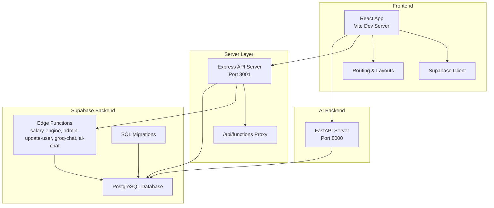
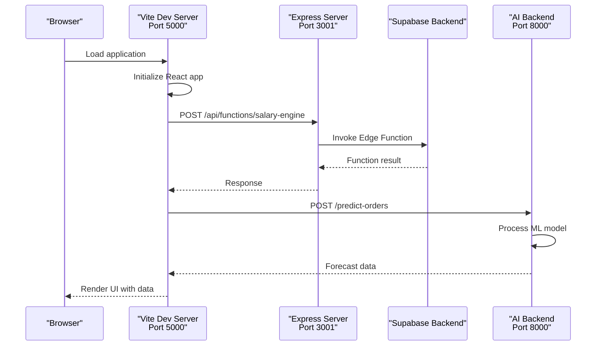
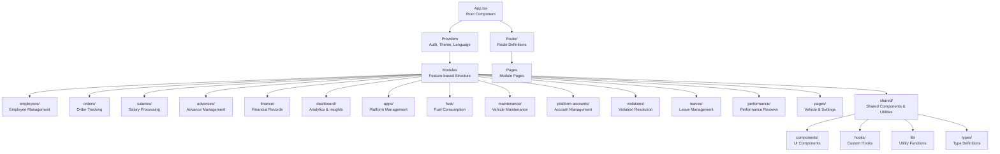
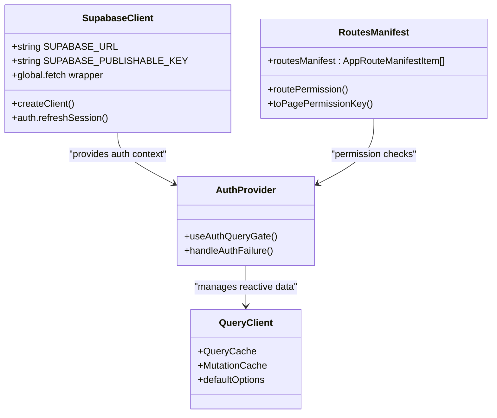
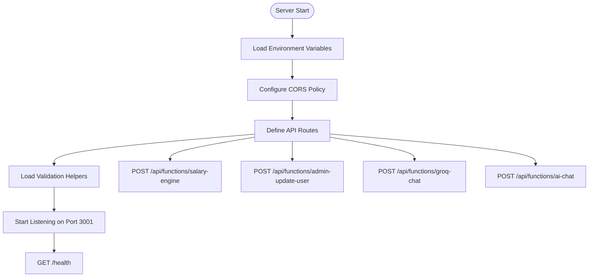
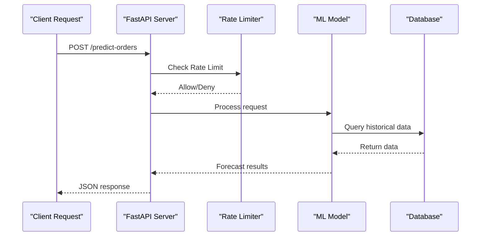
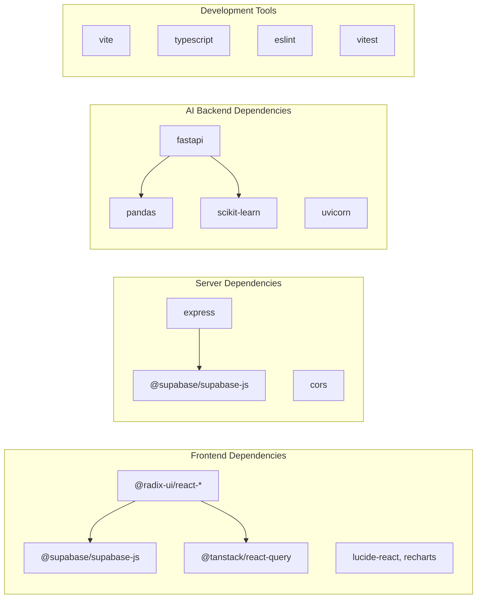

# Getting Started

<cite>
**Referenced Files in This Document**
- [README.md](file://README.md)
- [frontend/package.json](file://frontend/package.json)
- [frontend/vite.config.ts](file://frontend/vite.config.ts)
- [frontend/.env.example](file://frontend/.env.example)
- [frontend/app/App.tsx](file://frontend/app/App.tsx)
- [frontend/app/routesManifest.ts](file://frontend/app/routesManifest.ts)
- [frontend/services/supabase/client.ts](file://frontend/services/supabase/client.ts)
- [server/index.js](file://server/index.js)
- [server/package.json](file://server/package.json)
- [ai-backend/main.py](file://ai-backend/main.py)
- [ai-backend/requirements.txt](file://ai-backend/requirements.txt)
- [supabase/config.toml](file://supabase/config.toml)
</cite>

## Table of Contents
1. [Introduction](#introduction)
2. [Project Structure](#project-structure)
3. [Core Components](#core-components)
4. [Architecture Overview](#architecture-overview)
5. [Detailed Component Analysis](#detailed-component-analysis)
6. [Dependency Analysis](#dependency-analysis)
7. [Performance Considerations](#performance-considerations)
8. [Troubleshooting Guide](#troubleshooting-guide)
9. [Conclusion](#conclusion)
10. [Appendices](#appendices)

## Introduction
MuhimmatAltawseel is a delivery company management system designed to streamline daily operations. It covers employee management, daily orders, salaries, advances, vehicles, attendance, and alerts. The system is built with modern web technologies and integrates AI-powered analytics for smarter insights.

Key capabilities include:
- Employee lifecycle management with visibility controls and import/export
- Daily order tracking across multiple platforms
- Automated salary computation and slip generation
- Attendance monitoring and reporting
- Fuel consumption and maintenance tracking
- AI-driven analytics for forecasting and anomaly detection
- Real-time alerts and notifications

The system supports both local development and production deployments, with Supabase backend, Express API server, and a FastAPI AI analytics server.

## Project Structure
The repository is organized into several key areas:
- frontend: React SPA with TypeScript, Vite, and Supabase integration
- server: Express API server acting as a proxy for Supabase Edge Functions
- ai-backend: FastAPI server for AI analytics and machine learning models
- api: Vercel serverless functions (CommonJS)
- supabase: Database migrations and Edge Functions (Deno)
- scripts: Developer and maintenance utilities



**Diagram sources**
- [frontend/app/App.tsx:109-178](file://frontend/app/App.tsx#L109-L178)
- [frontend/vite.config.ts:18-31](file://frontend/vite.config.ts#L18-L31)
- [server/index.js:37-47](file://server/index.js#L37-L47)
- [ai-backend/main.py:346-403](file://ai-backend/main.py#L346-L403)
- [supabase/config.toml](file://supabase/config.toml)

**Section sources**
- [README.md:39-99](file://README.md#L39-L99)

## Core Components
This section outlines the essential components developers need to understand for local setup and operation.

- Frontend Application
  - Built with React 18, TypeScript, and Vite
  - Uses Supabase for authentication and database operations
  - Implements TanStack Query for data fetching and caching
  - Features modular architecture with feature-specific modules

- Express API Server
  - Acts as a proxy for Supabase Edge Functions
  - Handles CORS, authentication, and request routing
  - Provides health checks and security validations

- AI Analytics Backend
  - FastAPI server with machine learning models
  - Provides forecasting, ranking, and anomaly detection APIs
  - Includes rate limiting and internal key authentication

- Supabase Backend
  - PostgreSQL database with Row Level Security (RLS)
  - Edge Functions for specialized business logic
  - Migration system for database schema evolution

**Section sources**
- [frontend/package.json:25-68](file://frontend/package.json#L25-L68)
- [server/package.json:9-13](file://server/package.json#L9-L13)
- [ai-backend/requirements.txt:1-6](file://ai-backend/requirements.txt#L1-L6)
- [README.md:127-157](file://README.md#L127-L157)

## Architecture Overview
The system follows a layered architecture with clear separation of concerns:



**Diagram sources**
- [frontend/vite.config.ts:18-31](file://frontend/vite.config.ts#L18-L31)
- [server/index.js:37-47](file://server/index.js#L37-L47)
- [ai-backend/main.py:352-355](file://ai-backend/main.py#L352-L355)

The architecture ensures:
- Frontend communicates through Vite dev server with proxy configuration
- Express server handles cross-origin requests and function routing
- AI backend provides specialized analytics capabilities
- Supabase manages data persistence and security policies

**Section sources**
- [frontend/vite.config.ts:18-31](file://frontend/vite.config.ts#L18-L31)
- [server/index.js:15-31](file://server/index.js#L15-L31)
- [README.md:118-123](file://README.md#L118-L123)

## Detailed Component Analysis

### Local Development Setup
Follow these step-by-step instructions to set up the development environment:

1. Prerequisites
   - Node.js version 18 or higher
   - npm or pnpm package manager
   - Git for version control

2. Clone the Repository
   ```bash
   git clone <repo-url>
   cd MuhimmatAltawseel/frontend
   ```

3. Install Dependencies
   ```bash
   npm install
   ```

4. Configure Environment Variables
   ```bash
   cp .env.example .env.local
   ```
   Edit `.env.local` to set:
   - VITE_SUPABASE_URL: Your Supabase project URL
   - VITE_SUPABASE_PUBLISHABLE_KEY: Your Supabase public key

5. Run the Development Server
   ```bash
   npm run dev
   ```
   The application will be available at http://localhost:5173

6. Additional Development Commands
   - Build for production: `npm run build`
   - Run tests: `npm run test`
   - Lint code: `npm run lint`
   - Generate Supabase types: `npm run gen:types`

**Section sources**
- [README.md:11-36](file://README.md#L11-L36)
- [frontend/.env.example:1-37](file://frontend/.env.example#L1-L37)
- [frontend/package.json:6-23](file://frontend/package.json#L6-L23)

### Project Structure Understanding
The frontend follows a modular architecture pattern:



**Diagram sources**
- [frontend/app/App.tsx:26-51](file://frontend/app/App.tsx#L26-L51)
- [frontend/app/routesManifest.ts:32-64](file://frontend/app/routesManifest.ts#L32-L64)

Key structural elements:
- Modular organization with feature-specific directories
- Shared components and utilities for cross-module reuse
- Provider-based architecture for global state management
- Route manifest for centralized navigation configuration

**Section sources**
- [README.md:39-70](file://README.md#L39-L70)
- [frontend/app/App.tsx:109-178](file://frontend/app/App.tsx#L109-L178)
- [frontend/app/routesManifest.ts:32-84](file://frontend/app/routesManifest.ts#L32-L84)

### Supabase Integration
The application integrates with Supabase for authentication, database operations, and real-time features:



**Diagram sources**
- [frontend/services/supabase/client.ts:12-17](file://frontend/services/supabase/client.ts#L12-L17)
- [frontend/app/App.tsx:64-80](file://frontend/app/App.tsx#L64-L80)
- [frontend/app/routesManifest.ts:19-30](file://frontend/app/routesManifest.ts#L19-L30)

**Section sources**
- [frontend/services/supabase/client.ts:12-76](file://frontend/services/supabase/client.ts#L12-L76)
- [frontend/app/App.tsx:22-80](file://frontend/app/App.tsx#L22-L80)
- [frontend/app/routesManifest.ts:1-85](file://frontend/app/routesManifest.ts#L1-L85)

### Express API Server Configuration
The Express server acts as a proxy for Supabase Edge Functions and handles cross-origin requests:



**Diagram sources**
- [server/index.js:1-69](file://server/index.js#L1-L69)

**Section sources**
- [server/index.js:15-69](file://server/index.js#L15-L69)
- [server/package.json:5-13](file://server/package.json#L5-L13)

### AI Analytics Backend
The FastAPI server provides machine learning capabilities for predictive analytics:



**Diagram sources**
- [ai-backend/main.py:106-128](file://ai-backend/main.py#L106-L128)
- [ai-backend/main.py:352-355](file://ai-backend/main.py#L352-L355)

**Section sources**
- [ai-backend/main.py:43-71](file://ai-backend/main.py#L43-L71)
- [ai-backend/main.py:106-145](file://ai-backend/main.py#L106-L145)
- [ai-backend/requirements.txt:1-6](file://ai-backend/requirements.txt#L1-L6)

## Dependency Analysis
The project maintains clear dependency boundaries between components:



**Diagram sources**
- [frontend/package.json:25-68](file://frontend/package.json#L25-L68)
- [server/package.json:9-13](file://server/package.json#L9-L13)
- [ai-backend/requirements.txt:1-6](file://ai-backend/requirements.txt#L1-L6)

**Section sources**
- [frontend/package.json:25-101](file://frontend/package.json#L25-L101)
- [server/package.json:9-13](file://server/package.json#L9-L13)
- [ai-backend/requirements.txt:1-6](file://ai-backend/requirements.txt#L1-L6)

## Performance Considerations
The system incorporates several performance optimizations:

- Code Splitting and Lazy Loading
  - Dynamic imports for route components
  - Suspense boundaries for smooth transitions
  - Manual chunking for vendor libraries

- Caching Strategy
  - TanStack Query with intelligent caching
  - Stale-time configuration for optimal refresh
  - Background refetch on visibility change

- Build Optimizations
  - Rollup plugin visualizer for bundle analysis
  - Vendor chunk separation for better caching
  - Tree-shaking enabled through ES modules

- Network Efficiency
  - Proxy configuration for reduced latency
  - Rate limiting in AI backend to prevent abuse
  - CORS preflight handling optimization

**Section sources**
- [frontend/vite.config.ts:55-74](file://frontend/vite.config.ts#L55-L74)
- [frontend/app/App.tsx:64-80](file://frontend/app/App.tsx#L64-L80)

## Troubleshooting Guide

### Common Setup Issues

**Environment Variables Not Loading**
- Verify `.env.local` exists in the frontend directory
- Ensure VITE_SUPABASE_URL points to a valid Supabase project
- Check that VITE_SUPABASE_PUBLISHABLE_KEY is correctly set

**CORS Errors When Calling Supabase**
- Confirm ALLOWED_ORIGINS includes your development ports
- Verify the Express server is running on port 3001
- Check that Supabase Edge Functions are properly deployed

**AI Backend Authentication Failures**
- Set AI_INTERNAL_KEY environment variable
- Ensure X-Internal-Key header matches AI_INTERNAL_KEY
- Verify AI backend is running on port 8000

**Database Connection Issues**
- Validate Supabase project ID and connection string
- Check Row Level Security policies are properly configured
- Ensure Edge Functions have necessary permissions

### Development Server Problems

**Port Conflicts**
- Vite runs on port 5000 by default
- Express runs on port 3001
- AI backend runs on port 8000

**Hot Reload Not Working**
- Verify Vite configuration allows HMR
- Check browser console for WebSocket errors
- Ensure firewall allows connections to development ports

**Build Failures**
- Clear node_modules and reinstall dependencies
- Check TypeScript compilation errors
- Verify all environment variables are set

**Section sources**
- [frontend/.env.example:1-37](file://frontend/.env.example#L1-L37)
- [server/index.js:15-31](file://server/index.js#L15-L31)
- [ai-backend/main.py:44-70](file://ai-backend/main.py#L44-L70)

## Conclusion
MuhimmatAltawseel provides a comprehensive solution for delivery company management with modern architecture and robust features. The system balances developer productivity with operational efficiency through:

- Clean separation of concerns across frontend, server, and AI components
- Strong typing with TypeScript and comprehensive type generation
- Real-time capabilities through Supabase and TanStack Query
- AI-powered insights for better decision-making
- Extensive testing infrastructure with unit, integration, and E2E tests

The modular architecture enables easy extension and maintenance, while the comprehensive documentation and troubleshooting guide support both beginner and experienced developers. The system is production-ready with proper security measures, rate limiting, and monitoring capabilities.

## Appendices

### Quick Reference Commands
- Development: `npm run dev`
- Build: `npm run build`
- Test: `npm run test`
- Lint: `npm run lint`
- Coverage: `npm run test:coverage`
- Type Generation: `npm run gen:types`

### Environment Variables Reference
- VITE_SUPABASE_URL: Supabase project URL
- VITE_SUPABASE_PUBLISHABLE_KEY: Supabase public key
- AI_INTERNAL_KEY: Internal API key for AI backend
- SERVER_PORT: Express server port (default: 3001)
- ALLOWED_ORIGINS: Comma-separated CORS origins

### Supported Platforms and Technologies
- Frontend: React 18, TypeScript, Vite
- Backend: Node.js, Express, FastAPI
- Database: PostgreSQL via Supabase
- Authentication: Supabase Auth
- Real-time: Supabase Realtime
- Styling: Tailwind CSS, shadcn/ui
- Testing: Vitest, Playwright, React Testing Library