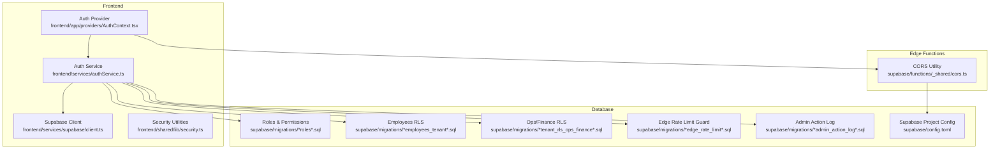
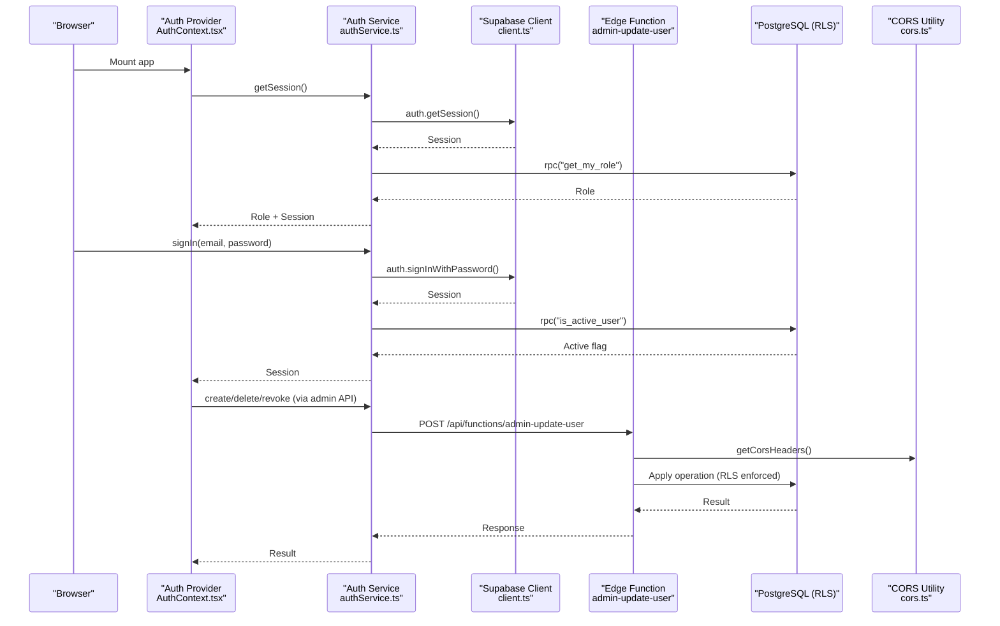
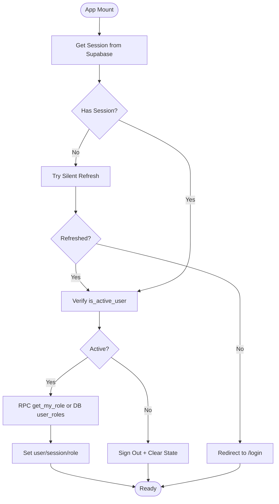
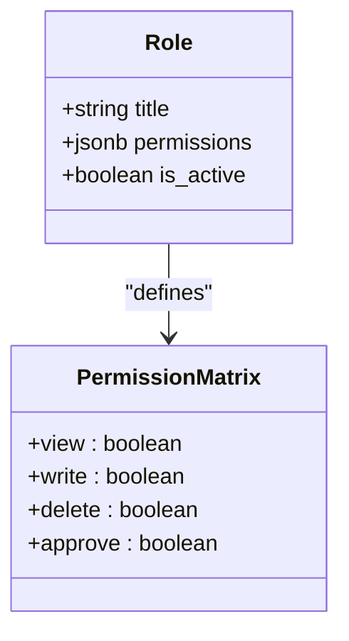
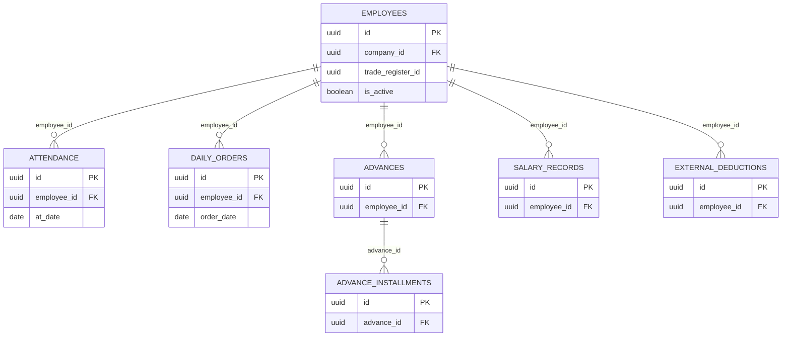
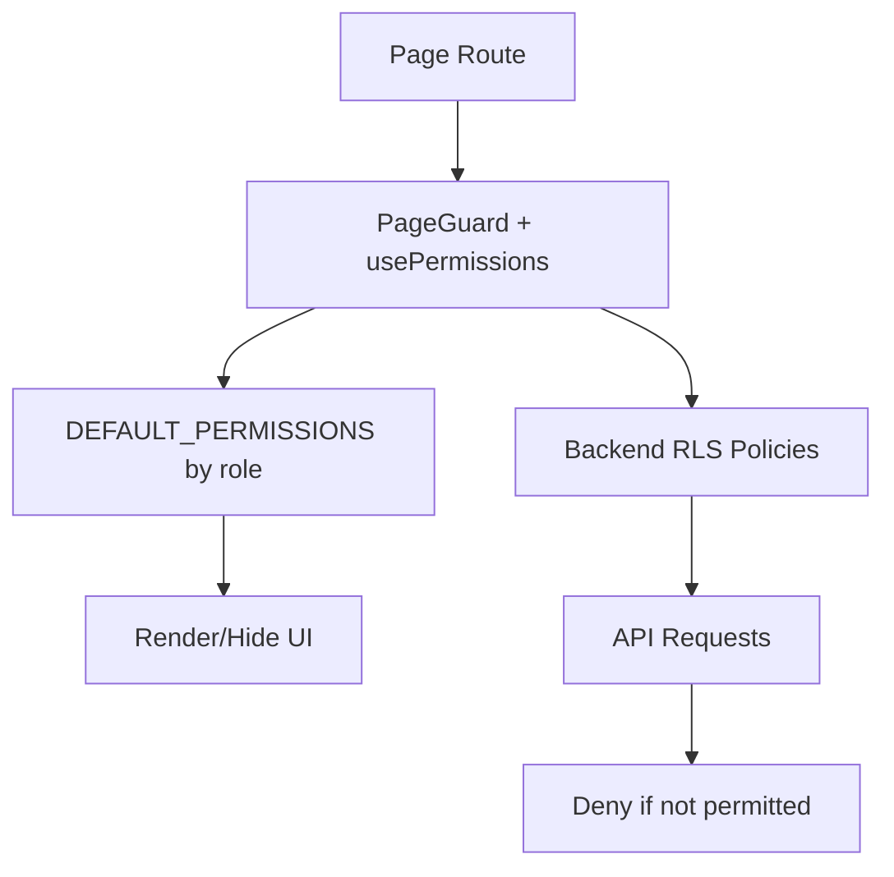
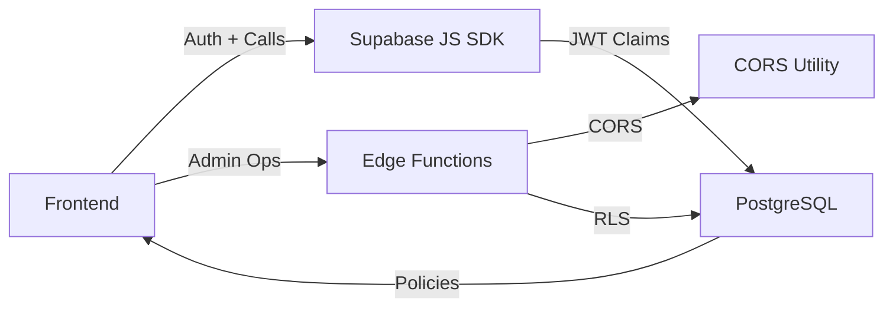

# Security & Authentication

<cite>
**Referenced Files in This Document**
- [client.ts](file://frontend/services/supabase/client.ts)
- [authService.ts](file://frontend/services/authService.ts)
- [AuthContext.tsx](file://frontend/app/providers/AuthContext.tsx)
- [security.ts](file://frontend/shared/lib/security.ts)
- [permissionPages.ts](file://frontend/shared/constants/permissionPages.ts)
- [PERMISSIONS.md](file://frontend/docs/PERMISSIONS.md)
- [cors.ts](file://supabase/functions/_shared/cors.ts)
- [20260324213000_seed_roles_permissions_matrix.sql](file://supabase/migrations/20260324213000_seed_roles_permissions_matrix.sql)
- [20260324220000_roles_upsert_and_permissions_bootstrap.sql](file://supabase/migrations/20260324220000_roles_upsert_and_permissions_bootstrap.sql)
- [20260325153000_employees_tenant_rls_hardening.sql](file://supabase/migrations/20260325153000_employees_tenant_rls_hardening.sql)
- [20260325170000_tenant_rls_ops_finance_tables.sql](file://supabase/migrations/20260325170000_tenant_rls_ops_finance_tables.sql)
- [20260325211000_edge_rate_limit_guard.sql](file://supabase/migrations/20260325211000_edge_rate_limit_guard.sql)
- [20260325234500_admin_action_log.sql](file://supabase/migrations/20260325234500_admin_action_log.sql)
- [config.toml](file://supabase/config.toml)
</cite>

## Table of Contents
1. [Introduction](#introduction)
2. [Project Structure](#project-structure)
3. [Core Components](#core-components)
4. [Architecture Overview](#architecture-overview)
5. [Detailed Component Analysis](#detailed-component-analysis)
6. [Dependency Analysis](#dependency-analysis)
7. [Performance Considerations](#performance-considerations)
8. [Troubleshooting Guide](#troubleshooting-guide)
9. [Conclusion](#conclusion)
10. [Appendices](#appendices)

## Introduction
This document provides comprehensive security and authentication documentation for MuhimmatAltawseel. It explains the Supabase authentication system, role-based access control (RBAC), multi-role security model (admin, hr, finance, operations, viewer), permission system, Row Level Security (RLS) policies, CORS configuration, and JWT token management. It also covers the authentication flow, session management, authorization patterns, best practices, audit logging, rate limiting, protection against common vulnerabilities, user registration and password management, and the integration between frontend authentication and backend authorization.

## Project Structure
Security and authentication span three primary areas:
- Frontend authentication and session management
- Supabase Edge Functions and shared CORS configuration
- Supabase database RBAC, RLS, and audit/logging infrastructure

**Diagram sources**
- [client.ts:1-76](file://frontend/services/supabase/client.ts#L1-L76)
- [authService.ts:1-226](file://frontend/services/authService.ts#L1-L226)
- [AuthContext.tsx:1-411](file://frontend/app/providers/AuthContext.tsx#L1-L411)
- [security.ts:1-38](file://frontend/shared/lib/security.ts#L1-L38)
- [cors.ts:1-65](file://supabase/functions/_shared/cors.ts#L1-L65)
- [20260324213000_seed_roles_permissions_matrix.sql:1-79](file://supabase/migrations/20260324213000_seed_roles_permissions_matrix.sql#L1-L79)
- [20260325153000_employees_tenant_rls_hardening.sql:1-111](file://supabase/migrations/20260325153000_employees_tenant_rls_hardening.sql#L1-L111)
- [20260325170000_tenant_rls_ops_finance_tables.sql:1-338](file://supabase/migrations/20260325170000_tenant_rls_ops_finance_tables.sql#L1-L338)
- [20260325211000_edge_rate_limit_guard.sql:1-69](file://supabase/migrations/20260325211000_edge_rate_limit_guard.sql#L1-L69)
- [20260325234500_admin_action_log.sql:1-55](file://supabase/migrations/20260325234500_admin_action_log.sql#L1-L55)
- [config.toml:1-2](file://supabase/config.toml#L1-L2)

**Section sources**
- [client.ts:1-76](file://frontend/services/supabase/client.ts#L1-L76)
- [authService.ts:1-226](file://frontend/services/authService.ts#L1-L226)
- [AuthContext.tsx:1-411](file://frontend/app/providers/AuthContext.tsx#L1-L411)
- [cors.ts:1-65](file://supabase/functions/_shared/cors.ts#L1-L65)
- [20260324213000_seed_roles_permissions_matrix.sql:1-79](file://supabase/migrations/20260324213000_seed_roles_permissions_matrix.sql#L1-L79)
- [20260325153000_employees_tenant_rls_hardening.sql:1-111](file://supabase/migrations/20260325153000_employees_tenant_rls_hardening.sql#L1-L111)
- [20260325170000_tenant_rls_ops_finance_tables.sql:1-338](file://supabase/migrations/20260325170000_tenant_rls_ops_finance_tables.sql#L1-L338)
- [20260325211000_edge_rate_limit_guard.sql:1-69](file://supabase/migrations/20260325211000_edge_rate_limit_guard.sql#L1-L69)
- [20260325234500_admin_action_log.sql:1-55](file://supabase/migrations/20260325234500_admin_action_log.sql#L1-L55)
- [config.toml:1-2](file://supabase/config.toml#L1-L2)

## Core Components
- Supabase client configured with PKCE, auto-refresh, persisted session, and a wrapped fetch that performs silent token refresh on 401 responses.
- Auth service encapsulating authentication operations, role retrieval via RPC and fallback DB queries, user activity checks, and admin-managed user operations via Edge Functions.
- Auth provider orchestrating session lifecycle, role caching, active user verification, redirects to login, and real-time subscriptions for deactivation events.
- Security utilities for HTML escaping, LIKE query sanitization, and UUID validation.
- Permission system constants and documentation guiding frontend guards and defaults.
- Edge Functions CORS utility enforcing allow-listed origins and JWT-based Authorization header usage.
- Database RBAC and RLS policies governing multi-role access and tenant isolation.
- Audit logging and rate limiting for Edge Functions.

**Section sources**
- [client.ts:1-76](file://frontend/services/supabase/client.ts#L1-L76)
- [authService.ts:1-226](file://frontend/services/authService.ts#L1-L226)
- [AuthContext.tsx:1-411](file://frontend/app/providers/AuthContext.tsx#L1-L411)
- [security.ts:1-38](file://frontend/shared/lib/security.ts#L1-L38)
- [permissionPages.ts:1-27](file://frontend/shared/constants/permissionPages.ts#L1-L27)
- [PERMISSIONS.md:1-25](file://frontend/docs/PERMISSIONS.md#L1-L25)
- [cors.ts:1-65](file://supabase/functions/_shared/cors.ts#L1-L65)
- [20260324213000_seed_roles_permissions_matrix.sql:1-79](file://supabase/migrations/20260324213000_seed_roles_permissions_matrix.sql#L1-L79)
- [20260325234500_admin_action_log.sql:1-55](file://supabase/migrations/20260325234500_admin_action_log.sql#L1-L55)
- [20260325211000_edge_rate_limit_guard.sql:1-69](file://supabase/migrations/20260325211000_edge_rate_limit_guard.sql#L1-L69)

## Architecture Overview
The system integrates Supabase’s authentication and Edge Functions with PostgreSQL RLS and audit capabilities. The frontend authenticates via Supabase, caches roles, and enforces authorization via both frontend guards and backend RLS. Edge Functions apply CORS and optional rate limits, while the database enforces tenant-aware access control and logs administrative actions.

**Diagram sources**
- [AuthContext.tsx:1-411](file://frontend/app/providers/AuthContext.tsx#L1-L411)
- [authService.ts:1-226](file://frontend/services/authService.ts#L1-L226)
- [client.ts:1-76](file://frontend/services/supabase/client.ts#L1-L76)
- [cors.ts:1-65](file://supabase/functions/_shared/cors.ts#L1-L65)
- [20260325153000_employees_tenant_rls_hardening.sql:1-111](file://supabase/migrations/20260325153000_employees_tenant_rls_hardening.sql#L1-L111)
- [20260325170000_tenant_rls_ops_finance_tables.sql:1-338](file://supabase/migrations/20260325170000_tenant_rls_ops_finance_tables.sql#L1-L338)

## Detailed Component Analysis

### Supabase Authentication and Session Management
- Client initialization sets PKCE flow, auto-refresh, persisted session, and a global fetch wrapper that attempts a silent refresh on 401 responses to avoid redirect loops.
- Auth service wraps Supabase auth operations, exposes role retrieval via RPC with fallback to DB, and provides admin-managed user operations by calling Edge Functions with Authorization: Bearer tokens.
- Auth provider manages loading states, redirects unauthenticated users to login, verifies active status, caches roles per user, and subscribes to real-time profile updates to force logout on deactivation.

**Diagram sources**
- [client.ts:29-62](file://frontend/services/supabase/client.ts#L29-L62)
- [authService.ts:101-146](file://frontend/services/authService.ts#L101-L146)
- [AuthContext.tsx:155-185](file://frontend/app/providers/AuthContext.tsx#L155-L185)

**Section sources**
- [client.ts:1-76](file://frontend/services/supabase/client.ts#L1-L76)
- [authService.ts:84-172](file://frontend/services/authService.ts#L84-L172)
- [AuthContext.tsx:187-225](file://frontend/app/providers/AuthContext.tsx#L187-L225)

### Role-Based Access Control (RBAC) and Multi-Role Model
- Roles: admin, hr, finance, operations, viewer.
- Permissions matrix defines page-level permissions per role, including view/write/delete/approve flags.
- Roles are enforced in RLS policies and via RPC checks to ensure backend enforcement remains authoritative.

**Diagram sources**
- [20260324213000_seed_roles_permissions_matrix.sql:1-79](file://supabase/migrations/20260324213000_seed_roles_permissions_matrix.sql#L1-L79)
- [20260324220000_roles_upsert_and_permissions_bootstrap.sql:1-110](file://supabase/migrations/20260324220000_roles_upsert_and_permissions_bootstrap.sql#L1-L110)

**Section sources**
- [20260324213000_seed_roles_permissions_matrix.sql:1-79](file://supabase/migrations/20260324213000_seed_roles_permissions_matrix.sql#L1-L79)
- [20260324220000_roles_upsert_and_permissions_bootstrap.sql:1-110](file://supabase/migrations/20260324220000_roles_upsert_and_permissions_bootstrap.sql#L1-L110)

### Row Level Security (RLS) Policies and Tenant Isolation
- Employees table: SELECT/INSERT/UPDATE/DELETE policies enforce active user, role membership, and tenant mapping via JWT claim.
- Operations/Finance tables: Attendance, daily_orders, advances, advance_installments, salary_records, external_deductions enforce tenant-aware access and role-based permissions.
- Helper functions and policies ensure that data access is scoped to the authenticated user’s company.

**Diagram sources**
- [20260325153000_employees_tenant_rls_hardening.sql:1-111](file://supabase/migrations/20260325153000_employees_tenant_rls_hardening.sql#L1-L111)
- [20260325170000_tenant_rls_ops_finance_tables.sql:1-338](file://supabase/migrations/20260325170000_tenant_rls_ops_finance_tables.sql#L1-L338)

**Section sources**
- [20260325153000_employees_tenant_rls_hardening.sql:1-111](file://supabase/migrations/20260325153000_employees_tenant_rls_hardening.sql#L1-L111)
- [20260325170000_tenant_rls_ops_finance_tables.sql:1-338](file://supabase/migrations/20260325170000_tenant_rls_ops_finance_tables.sql#L1-L338)

### Permission System and Frontend Guards
- Permission keys align with frontend pages and are documented alongside defaults and route keys.
- Frontend guards and sidebar visibility rely on page keys and defaults; however, the authoritative enforcement is in the database via RLS.

**Diagram sources**
- [permissionPages.ts:1-27](file://frontend/shared/constants/permissionPages.ts#L1-L27)
- [PERMISSIONS.md:1-25](file://frontend/docs/PERMISSIONS.md#L1-L25)

**Section sources**
- [permissionPages.ts:1-27](file://frontend/shared/constants/permissionPages.ts#L1-L27)
- [PERMISSIONS.md:1-25](file://frontend/docs/PERMISSIONS.md#L1-L25)

### JWT Token Management and Claims
- JWT claims include company_id mapped to the tenant key for tenant isolation.
- The system parses company_id from standard JWT locations and validates UUID format before use.
- Edge Functions and RLS rely on these claims to enforce access.

**Section sources**
- [20260325153000_employees_tenant_rls_hardening.sql:12-32](file://supabase/migrations/20260325153000_employees_tenant_rls_hardening.sql#L12-L32)

### CORS Configuration for Edge Functions
- Origins are validated against an allow-list; preflight requests are handled securely without wildcard origins.
- Credentials are intentionally not enabled because authentication relies on Authorization headers (JWT), not cookies.

**Section sources**
- [cors.ts:1-65](file://supabase/functions/_shared/cors.ts#L1-L65)

### Edge Rate Limiting
- A shared rate-limit guard tracks requests per key/window and returns remaining quota and reset time.
- Designed for Edge Functions to protect backend resources.

**Section sources**
- [20260325211000_edge_rate_limit_guard.sql:1-69](file://supabase/migrations/20260325211000_edge_rate_limit_guard.sql#L1-L69)

### Audit Logging and Admin Action Trail
- Dedicated admin action log captures intent and UI actions with metadata and company scoping.
- RLS policies restrict visibility and insertion to authorized roles.

**Section sources**
- [20260325234500_admin_action_log.sql:1-55](file://supabase/migrations/20260325234500_admin_action_log.sql#L1-L55)

### Frontend Security Utilities
- HTML escaping to prevent XSS in raw HTML contexts.
- LIKE query sanitization to prevent SQL injection.
- UUID validation for identifiers.

**Section sources**
- [security.ts:1-38](file://frontend/shared/lib/security.ts#L1-L38)

## Dependency Analysis
- Frontend depends on Supabase client for auth and on Edge Functions for privileged operations.
- Edge Functions depend on shared CORS utilities and Supabase project configuration.
- Database enforces RBAC and RLS; Edge Functions and frontend must honor these policies.

**Diagram sources**
- [client.ts:1-76](file://frontend/services/supabase/client.ts#L1-L76)
- [authService.ts:1-226](file://frontend/services/authService.ts#L1-L226)
- [cors.ts:1-65](file://supabase/functions/_shared/cors.ts#L1-L65)
- [20260325153000_employees_tenant_rls_hardening.sql:1-111](file://supabase/migrations/20260325153000_employees_tenant_rls_hardening.sql#L1-L111)

**Section sources**
- [client.ts:1-76](file://frontend/services/supabase/client.ts#L1-L76)
- [authService.ts:1-226](file://frontend/services/authService.ts#L1-L226)
- [cors.ts:1-65](file://supabase/functions/_shared/cors.ts#L1-L65)
- [20260325153000_employees_tenant_rls_hardening.sql:1-111](file://supabase/migrations/20260325153000_employees_tenant_rls_hardening.sql#L1-L111)

## Performance Considerations
- Silent token refresh reduces user friction and avoids redirect loops on 401 responses.
- Role caching minimizes redundant RPC/DB calls during a session.
- Rate limiting protects Edge Functions under load.
- RLS policies are designed to minimize per-row checks by leveraging indexed tenant and role filters.

[No sources needed since this section provides general guidance]

## Troubleshooting Guide
Common issues and resolutions:
- Silent refresh failures: The client attempts a single silent refresh on 401; failures are logged and the original response is returned. Investigate network connectivity and Supabase auth health.
- Redirect loops to login: Auth provider redirects unauthenticated users; ensure sessions are persisted and auto-refresh is enabled.
- Deactivation events: Real-time subscription forces logout when a user’s profile becomes inactive.
- Admin operations failing: Verify Authorization header presence and Edge Function CORS allow-list configuration.
- Permission mismatches: Confirm role assignments and RLS policies; re-run verification steps as documented.

**Section sources**
- [client.ts:29-62](file://frontend/services/supabase/client.ts#L29-L62)
- [AuthContext.tsx:87-101](file://frontend/app/providers/AuthContext.tsx#L87-L101)
- [AuthContext.tsx:327-340](file://frontend/app/providers/AuthContext.tsx#L327-L340)
- [cors.ts:1-65](file://supabase/functions/_shared/cors.ts#L1-L65)
- [PERMISSIONS.md:1-25](file://frontend/docs/PERMISSIONS.md#L1-L25)

## Conclusion
MuhimmatAltawseel employs a robust, layered security model: Supabase authentication and Edge Functions for identity and privileged operations, PostgreSQL RLS for tenant-aware, role-based access control, and comprehensive audit logging. Frontend guards complement backend enforcement, ensuring a secure and maintainable authorization framework. Adhering to the documented best practices and verification steps will sustain system integrity.

[No sources needed since this section summarizes without analyzing specific files]

## Appendices

### Authentication Flow Details
- PKCE-based sign-in with Supabase.
- Role retrieval via RPC with DB fallback.
- Active user verification on sign-in and session recovery.
- Silent refresh on 401 to maintain session continuity.

**Section sources**
- [client.ts:64-73](file://frontend/services/supabase/client.ts#L64-L73)
- [authService.ts:84-111](file://frontend/services/authService.ts#L84-L111)
- [AuthContext.tsx:125-144](file://frontend/app/providers/AuthContext.tsx#L125-L144)

### Security Best Practices
- Enforce RLS on all tables; treat frontend guards as UX-only.
- Use Authorization header (JWT) for Edge Functions; do not enable credentials for CORS.
- Sanitize inputs and escape HTML in raw templates.
- Validate UUIDs and sanitize LIKE queries.
- Monitor admin action logs and apply rate limits to sensitive endpoints.

**Section sources**
- [PERMISSIONS.md:1-25](file://frontend/docs/PERMISSIONS.md#L1-L25)
- [cors.ts:44-52](file://supabase/functions/_shared/cors.ts#L44-L52)
- [security.ts:1-38](file://frontend/shared/lib/security.ts#L1-L38)
- [20260325234500_admin_action_log.sql:1-55](file://supabase/migrations/20260325234500_admin_action_log.sql#L1-L55)
- [20260325211000_edge_rate_limit_guard.sql:1-69](file://supabase/migrations/20260325211000_edge_rate_limit_guard.sql#L1-L69)

### User Registration and Password Management
- Admin-managed user creation and deletion via Edge Functions using Bearer tokens.
- Password updates performed through Supabase auth APIs.
- Deactivation triggers immediate logout via real-time channels.

**Section sources**
- [authService.ts:205-224](file://frontend/services/authService.ts#L205-L224)
- [authService.ts:158-161](file://frontend/services/authService.ts#L158-L161)
- [AuthContext.tsx:327-340](file://frontend/app/providers/AuthContext.tsx#L327-L340)

### Integration Between Frontend and Backend
- Frontend obtains JWTs from Supabase; Edge Functions validate origins and apply RLS.
- Admin operations propagate through Edge Functions with strict CORS and optional rate limiting.
- Database policies ensure tenant isolation and role-based access regardless of frontend visibility.

**Section sources**
- [authService.ts:1-48](file://frontend/services/authService.ts#L1-L48)
- [cors.ts:1-65](file://supabase/functions/_shared/cors.ts#L1-L65)
- [20260325153000_employees_tenant_rls_hardening.sql:1-111](file://supabase/migrations/20260325153000_employees_tenant_rls_hardening.sql#L1-L111)
- [20260325170000_tenant_rls_ops_finance_tables.sql:1-338](file://supabase/migrations/20260325170000_tenant_rls_ops_finance_tables.sql#L1-L338)