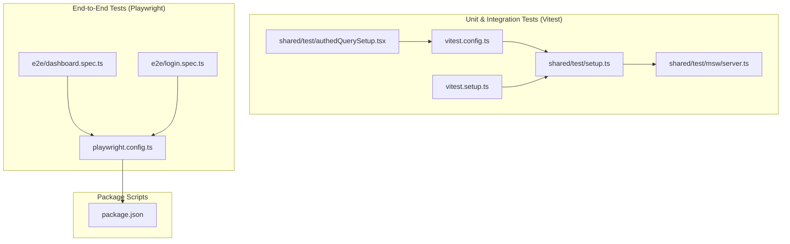
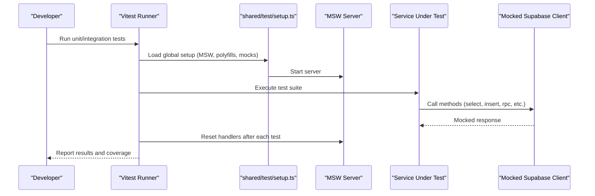
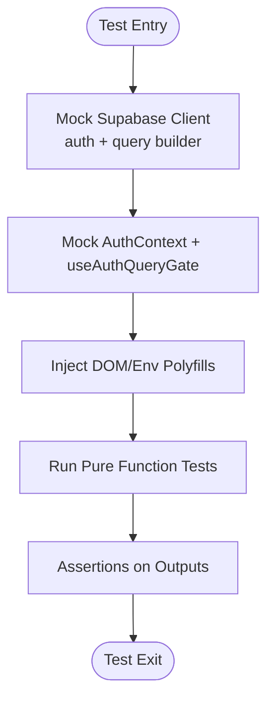
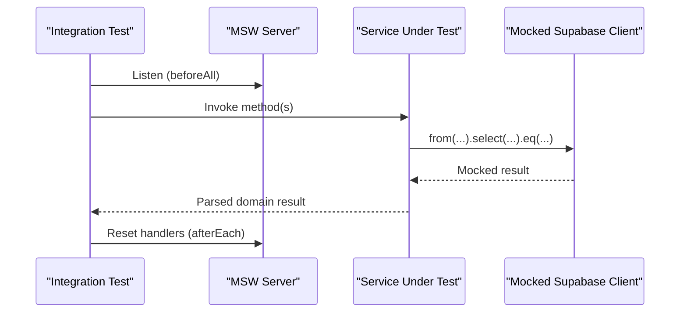
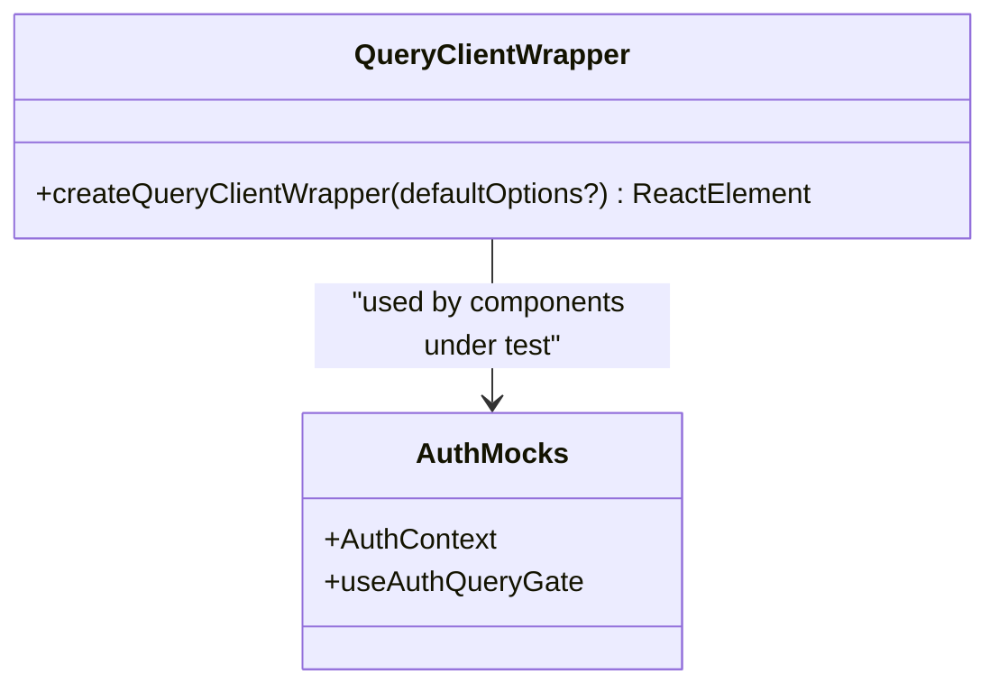
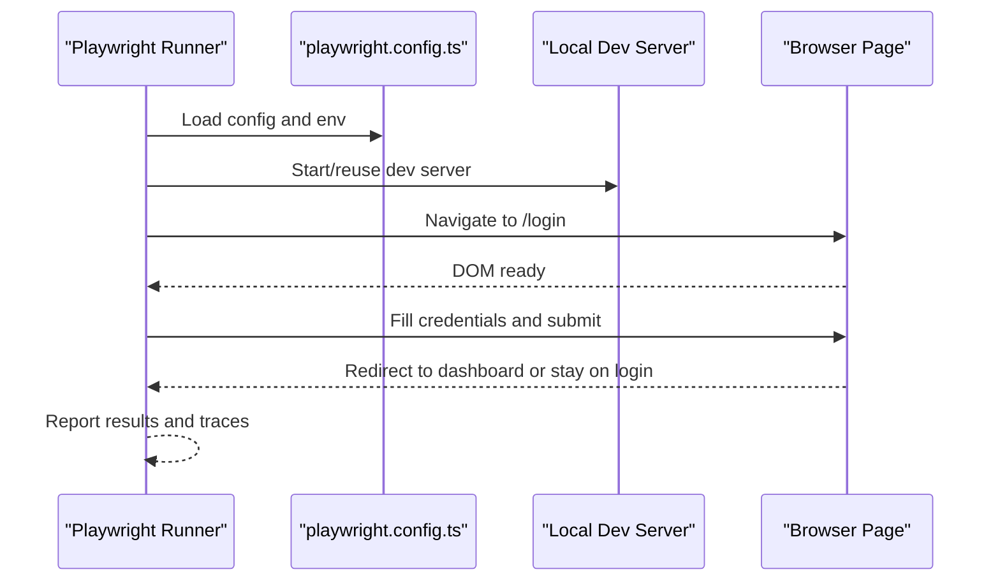
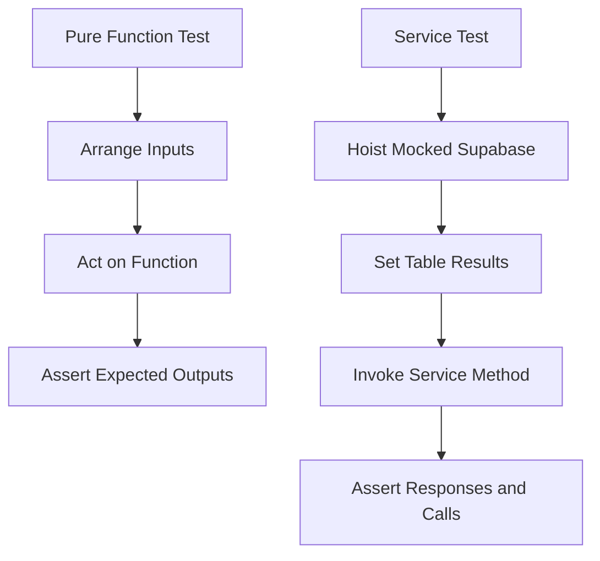
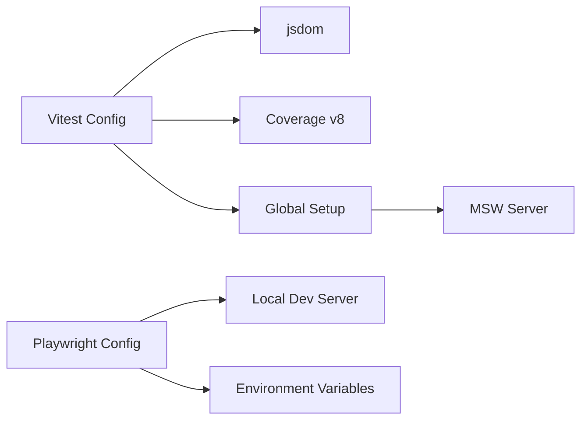

# Testing & Quality Assurance

<cite>
**Referenced Files in This Document**
- [vitest.config.ts](file://frontend/vitest.config.ts)
- [vitest.setup.ts](file://frontend/vitest.setup.ts)
- [package.json](file://frontend/package.json)
- [playwright.config.ts](file://frontend/playwright.config.ts)
- [shared/test/setup.ts](file://frontend/shared/test/setup.ts)
- [shared/test/authedQuerySetup.tsx](file://frontend/shared/test/authedQuerySetup.tsx)
- [shared/test/msw/server.ts](file://frontend/shared/test/msw/server.ts)
- [e2e/dashboard.spec.ts](file://frontend/e2e/dashboard.spec.ts)
- [e2e/login.spec.ts](file://frontend/e2e/login.spec.ts)
- [modules/employees/model/employeeUtils.test.ts](file://frontend/modules/employees/model/employeeUtils.test.ts)
- [modules/salaries/lib/salaryDomain.test.ts](file://frontend/modules/salaries/lib/salaryDomain.test.ts)
- [services/employeeService.test.ts](file://frontend/services/employeeService.test.ts)
</cite>

## Table of Contents
1. [Introduction](#introduction)
2. [Project Structure](#project-structure)
3. [Core Components](#core-components)
4. [Architecture Overview](#architecture-overview)
5. [Detailed Component Analysis](#detailed-component-analysis)
6. [Dependency Analysis](#dependency-analysis)
7. [Performance Considerations](#performance-considerations)
8. [Troubleshooting Guide](#troubleshooting-guide)
9. [Conclusion](#conclusion)
10. [Appendices](#appendices)

## Introduction
This document defines the testing and quality assurance strategy for MuhimmatAltawseel’s frontend. It covers unit tests with Vitest, integration tests via MSW, and end-to-end tests with Playwright. It also documents test configuration, mocking strategies, test utilities, patterns across modules and services, assertion approaches, coverage requirements, continuous integration testing, quality gates, environment setup, debugging techniques, and performance testing approaches.

## Project Structure
The testing stack is organized as follows:
- Unit and integration tests powered by Vitest with jsdom, configured to run in threads for stability on Windows.
- MSW (Mock Service Worker) provides network mocking for HTTP requests.
- Playwright drives end-to-end tests against a local dev server.
- Coverage is generated via v8 and exported in multiple formats, including LCOV for CI.
- Test utilities centralize React Query wrappers and global polyfills.

**Diagram sources**
- [vitest.config.ts:1-75](file://frontend/vitest.config.ts#L1-L75)
- [vitest.setup.ts:1-6](file://frontend/vitest.setup.ts#L1-L6)
- [shared/test/setup.ts:1-129](file://frontend/shared/test/setup.ts#L1-L129)
- [shared/test/msw/server.ts:1-5](file://frontend/shared/test/msw/server.ts#L1-L5)
- [shared/test/authedQuerySetup.tsx:1-25](file://frontend/shared/test/authedQuerySetup.tsx#L1-L25)
- [playwright.config.ts:1-50](file://frontend/playwright.config.ts#L1-L50)
- [e2e/dashboard.spec.ts:1-33](file://frontend/e2e/dashboard.spec.ts#L1-L33)
- [e2e/login.spec.ts:1-13](file://frontend/e2e/login.spec.ts#L1-L13)
- [package.json:1-103](file://frontend/package.json#L1-L103)

**Section sources**
- [vitest.config.ts:1-75](file://frontend/vitest.config.ts#L1-L75)
- [playwright.config.ts:1-50](file://frontend/playwright.config.ts#L1-L50)
- [package.json:1-103](file://frontend/package.json#L1-L103)

## Core Components
- Vitest configuration and setup:
  - Threads pool for stability on Windows.
  - jsdom environment with global setup importing MSW and polyfills.
  - Coverage enabled with v8, HTML, JSON summary, and LCOV reporters.
  - Exclusions for UI, pages, providers, layouts, types, and components to focus on logic coverage.
- MSW server:
  - Centralized Node server for request mocking across unit/integration tests.
- React Query test utilities:
  - Helper to wrap hooks under test with a fresh QueryClient and disabled retries.
- Playwright configuration:
  - Loads environment variables from .env.local and .env with fallbacks.
  - Runs a local dev server and sets base URL and browser device.
  - Uses GitHub reporter in CI and HTML/list reporters locally.

**Section sources**
- [vitest.config.ts:8-66](file://frontend/vitest.config.ts#L8-L66)
- [vitest.setup.ts:1-6](file://frontend/vitest.setup.ts#L1-L6)
- [shared/test/setup.ts:1-129](file://frontend/shared/test/setup.ts#L1-L129)
- [shared/test/authedQuerySetup.tsx:1-25](file://frontend/shared/test/authedQuerySetup.tsx#L1-L25)
- [playwright.config.ts:16-48](file://frontend/playwright.config.ts#L16-L48)

## Architecture Overview
The testing architecture separates concerns:
- Unit tests validate pure functions and small logic units.
- Integration tests validate service-layer logic with mocked Supabase client and MSW.
- End-to-end tests validate user journeys against a real dev server.

**Diagram sources**
- [shared/test/setup.ts:73-83](file://frontend/shared/test/setup.ts#L73-L83)
- [shared/test/msw/server.ts:1-5](file://frontend/shared/test/msw/server.ts#L1-L5)
- [vitest.config.ts:13-64](file://frontend/vitest.config.ts#L13-L64)

## Detailed Component Analysis

### Unit Testing Strategy with Vitest
- Environment and setup:
  - jsdom environment simulates DOM APIs.
  - Global setup mocks Supabase client auth and query builder methods, and provides a mock AuthContext and auth gate hook.
  - Polyfills for ResizeObserver, IntersectionObserver, matchMedia, and blob URL creation are injected globally.
- Coverage:
  - v8 provider with multiple reporters; CI uses LCOV.
  - Local thresholds are intentionally low to encourage broader coverage without blocking local iteration.
- Test patterns:
  - Pure function tests assert deterministic outputs given inputs.
  - Example: filtering employees by multiple criteria validates text search, platform assignment, date equality, and exact status match.

**Diagram sources**
- [shared/test/setup.ts:10-71](file://frontend/shared/test/setup.ts#L10-L71)
- [shared/test/setup.ts:85-129](file://frontend/shared/test/setup.ts#L85-L129)

**Section sources**
- [vitest.config.ts:13-64](file://frontend/vitest.config.ts#L13-L64)
- [shared/test/setup.ts:10-71](file://frontend/shared/test/setup.ts#L10-L71)
- [shared/test/setup.ts:85-129](file://frontend/shared/test/setup.ts#L85-L129)

### Integration Testing with MSW and Mocked Services
- MSW server:
  - Centralized Node server initialized before all tests and reset after each.
- Mocked Supabase client:
  - Query chain methods return fluent mocks; auth methods return predictable sessions.
- Service tests:
  - Hoist and mock the Supabase client per test module.
  - Use a table-results registry to simulate paginated data and error scenarios.
  - Validate error conversion via a service error utility.

**Diagram sources**
- [shared/test/setup.ts:73-83](file://frontend/shared/test/setup.ts#L73-L83)
- [shared/test/msw/server.ts:1-5](file://frontend/shared/test/msw/server.ts#L1-L5)
- [services/employeeService.test.ts:12-28](file://frontend/services/employeeService.test.ts#L12-L28)

**Section sources**
- [shared/test/setup.ts:73-83](file://frontend/shared/test/setup.ts#L73-L83)
- [shared/test/msw/server.ts:1-5](file://frontend/shared/test/msw/server.ts#L1-L5)
- [services/employeeService.test.ts:12-28](file://frontend/services/employeeService.test.ts#L12-L28)

### Component Testing Methodologies
- React Query hooks:
  - Use the shared QueryClient wrapper to avoid cross-test cache leakage and disable retries for determinism.
- Rendering and assertions:
  - Prefer Testing Library patterns to assert on roles, labels, and visibility.
- Example utilities:
  - Fresh QueryClient per test via a factory wrapper.
  - Auth-ready environment via mocked AuthContext and auth gate.

**Diagram sources**
- [shared/test/authedQuerySetup.tsx:16-24](file://frontend/shared/test/authedQuerySetup.tsx#L16-L24)
- [shared/test/setup.ts:49-71](file://frontend/shared/test/setup.ts#L49-L71)

**Section sources**
- [shared/test/authedQuerySetup.tsx:16-24](file://frontend/shared/test/authedQuerySetup.tsx#L16-L24)
- [shared/test/setup.ts:49-71](file://frontend/shared/test/setup.ts#L49-L71)

### End-to-End Testing with Playwright
- Configuration:
  - Loads environment variables with fallbacks for Supabase URL and key.
  - Launches a local dev server and sets base URL and device.
  - Uses GitHub reporter in CI and HTML/list reporters locally.
- Test examples:
  - Login page smoke test asserts presence of headings, inputs, and button.
  - Dashboard smoke test verifies redirect for unauthenticated users and authenticated dashboard UI when credentials are provided.

**Diagram sources**
- [playwright.config.ts:24-48](file://frontend/playwright.config.ts#L24-L48)
- [e2e/login.spec.ts:3-12](file://frontend/e2e/login.spec.ts#L3-L12)
- [e2e/dashboard.spec.ts:8-32](file://frontend/e2e/dashboard.spec.ts#L8-L32)

**Section sources**
- [playwright.config.ts:16-48](file://frontend/playwright.config.ts#L16-L48)
- [e2e/login.spec.ts:3-12](file://frontend/e2e/login.spec.ts#L3-L12)
- [e2e/dashboard.spec.ts:8-32](file://frontend/e2e/dashboard.spec.ts#L8-L32)

### Examples of Test Implementations and Patterns
- Pure function tests:
  - Filtering employees by English name, platform assignments, date equality, and status.
- Domain logic tests:
  - Salary domain functions validate inclusion rules, warning generation, and row building with preview and saved data precedence.
- Service tests:
  - Mocked Supabase client with hoisted table results to simulate pagination and errors; service error conversion verified via assertions.

**Diagram sources**
- [modules/employees/model/employeeUtils.test.ts:13-84](file://frontend/modules/employees/model/employeeUtils.test.ts#L13-L84)
- [modules/salaries/lib/salaryDomain.test.ts:38-84](file://frontend/modules/salaries/lib/salaryDomain.test.ts#L38-L84)
- [modules/salaries/lib/salaryDomain.test.ts:174-436](file://frontend/modules/salaries/lib/salaryDomain.test.ts#L174-L436)
- [services/employeeService.test.ts:38-75](file://frontend/services/employeeService.test.ts#L38-L75)

**Section sources**
- [modules/employees/model/employeeUtils.test.ts:13-84](file://frontend/modules/employees/model/employeeUtils.test.ts#L13-L84)
- [modules/salaries/lib/salaryDomain.test.ts:38-84](file://frontend/modules/salaries/lib/salaryDomain.test.ts#L38-L84)
- [modules/salaries/lib/salaryDomain.test.ts:174-436](file://frontend/modules/salaries/lib/salaryDomain.test.ts#L174-L436)
- [services/employeeService.test.ts:38-75](file://frontend/services/employeeService.test.ts#L38-L75)

## Dependency Analysis
- Vitest depends on:
  - React plugin for JSX support.
  - jsdom environment and global setup.
  - Coverage provider v8.
- MSW is a shared dependency for network mocking across unit/integration tests.
- Playwright depends on local dev server and environment variables for Supabase endpoints.

**Diagram sources**
- [vitest.config.ts:8-66](file://frontend/vitest.config.ts#L8-L66)
- [shared/test/setup.ts:73-83](file://frontend/shared/test/setup.ts#L73-L83)
- [playwright.config.ts:38-48](file://frontend/playwright.config.ts#L38-L48)

**Section sources**
- [vitest.config.ts:8-66](file://frontend/vitest.config.ts#L8-L66)
- [playwright.config.ts:38-48](file://frontend/playwright.config.ts#L38-L48)

## Performance Considerations
- Unit/integration tests:
  - Use threads pool to avoid IPC timeouts on Windows.
  - Keep tests fast by mocking I/O and avoiding real network calls.
- Coverage:
  - Exclude UI-heavy files to reduce noise and improve signal.
  - Use LCOV for CI to integrate with SonarQube or similar tools.
- E2E tests:
  - Run in parallel with a single project for speed.
  - Use trace on first retry to capture failure context without slowing down normal runs.

[No sources needed since this section provides general guidance]

## Troubleshooting Guide
- Missing environment variables in E2E:
  - Ensure .env.local exists with VITE_SUPABASE_URL and VITE_SUPABASE_PUBLISHABLE_KEY; fallbacks are applied otherwise.
- Supabase client mocking:
  - Verify that mocked methods (select, insert, update, rpc, functions.invoke) are called as expected.
- Auth and gate mocks:
  - Confirm AuthContext and useAuthQueryGate return expected values for tests relying on authenticated state.
- MSW lifecycle:
  - Ensure server.listen is called before tests and server.resetHandlers after each test.
- React Query hooks:
  - Wrap tests with the QueryClient provider to avoid stale cache and enable deterministic retries.

**Section sources**
- [playwright.config.ts:16-17](file://frontend/playwright.config.ts#L16-L17)
- [playwright.config.ts:7-8](file://frontend/playwright.config.ts#L7-L8)
- [shared/test/setup.ts:32-47](file://frontend/shared/test/setup.ts#L32-L47)
- [shared/test/setup.ts:63-71](file://frontend/shared/test/setup.ts#L63-L71)
- [shared/test/setup.ts:73-83](file://frontend/shared/test/setup.ts#L73-L83)
- [shared/test/authedQuerySetup.tsx:16-24](file://frontend/shared/test/authedQuerySetup.tsx#L16-L24)

## Conclusion
MuhimmatAltawseel’s testing strategy combines focused unit tests, robust integration tests with MSW and mocked services, and practical end-to-end tests with Playwright. The configuration emphasizes reliability, maintainability, and clear quality signals through coverage and CI-friendly reporting. Adhering to the documented patterns and utilities ensures consistent, fast, and trustworthy tests across modules and services.

[No sources needed since this section summarizes without analyzing specific files]

## Appendices

### Test Commands and Scripts
- Run unit tests: npm run test
- Watch mode: npm run test:watch
- Coverage: npm run test:coverage
- E2E tests: npm run test:e2e
- E2E UI mode: npm run test:e2e:ui
- Full verification: npm run verify
- Audit with coverage and build: npm run audit:frontend

**Section sources**
- [package.json:6,18-23](file://frontend/package.json#L6,L18-L23)

### Coverage Configuration Highlights
- Provider: v8
- Reporters: text, html, json-summary, lcov
- Reports directory: coverage
- Exclusions: test/spec files, shared/test, types, providers, layout, pages, components, hooks, and UI components
- Local thresholds: low to encourage growth; undefined in CI to enforce stricter checks

**Section sources**
- [vitest.config.ts:25-64](file://frontend/vitest.config.ts#L25-L64)